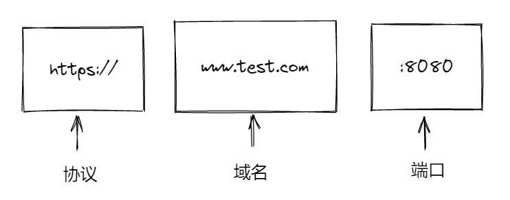
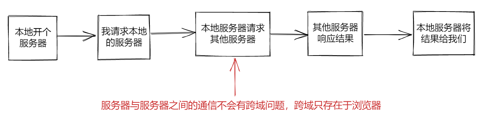

# vite3

## 使用 vite 创建一个 vue 项目

- pnpm：`pnpm create vite`
- npm：`npm init vite@latest`

## vite 配置文件的处理细节

分环境进行配置：

1. 创建四个文件：

   1. `vite.config.js`：用来管理整个项目的完整配置
   2. `vite.base.config.js`：用来处理项目的基础配置
   3. `vite.dev.config.js`：用来处理项目的开发环境的配置
   4. `vite.prod.config.js`：用来处理项目的生产环境的配置

2. 分别在不同文件中进行编写配置，最后在 `vite.config.js` 文件中进行集中配置：

   1. `vite.base.config.js` ：

      ```js
      import { defineConfig } from "vite"

      export default defineConfig({
      	optimizeDeps: {
      		exclude: [], // 指定数组中的依赖不进行依赖预构建
      	},
      })
      ```

   2. `vite.dev.config.js` ：

      ```js
      import { defineConfig } from 'vite'

      export default defineConfig({ ... })
      ```

   3. `vite.prod.config.js` ：

      ```js
      import { defineConfig } from 'vite'

      export default defineConfig({ ... })
      ```

   4. `vite.config.js` ：

      ```js
      import { defineConfig } from "vite"
      import viteBaseConfig from "./vite.base.config"
      import viteDevConfig from "./vite.dev.config"
      import viteProdConfig from "./vite.prod.config"

      // 策略模式
      const envResolver = {
      	build: () => {
      		console.log("生产环境")
      		return { ...viteBaseConfig, ...viteProdConfig }
      	},
      	serve: () => {
      		console.log("开发环境")
      		return { ...viteBaseConfig, ...viteDevConfig }
      	},
      }

      export default defineConfig(({ command, mode }) => {
      	// 这个文件执行的是生产环境的配置还是开发环境的却决于我们在终端敲的命令是build还是serve
      	//

      	const env = loadEnv(mode, process.cwd(), "")
      	return envResolver[command]()
      })
      ```

## vite 环境变量配置

环境变量：会根据当前代码环境而改变自身值的变量

代码环境：一般来说有生产环境、开发环境、测试环境等，更多也许有预发布环境、灰度环境

为什么需要环境变量：如调用不同环境下调用的后端 api 就有不同的前缀域名，如果每次改变代码环境时都需要手动修改这些变量，则会让工作变得很繁琐，而且还**会有忘记修改的风险**。

### 在 vite 中使用环境变量

1. 服务端：

   vite 内置了一个第三方库：`dotenv` ，这个库会自动读取 `.env` 文件，并解析这个文件中对应的环境变量，并将其注入到 `process` 对象下，**但是 vite 考虑到和其他配置的一些冲突问题，并不会直接将其注入到 process 对象下**。

   同时，vite 也提供给我们一些补偿措施：我们可以调用 vite 的 `loadEnv` 方法来手动确认 env 文件。

   ```js
   /* vite.config.js */

   ...

   export default defineConfig(({ command, mode }) => {
     /*
     	mode: 是我们在终端中敲的命令中 --mode 后携带的字符串，默认情况下，我们并没有在终端中输入 --mode 等字符，因为 vite 默认将开发环境命名为 development，将生产环境命名为 production。我们可以使用 --mode 开修改传入进来的 mode 的值。
     	process.cwd()：这个方法会返回当前 node 进程的工作目录，即，我们在哪个文件夹下输入命令启动服务，则返回哪个文件夹目录。这个方法作为第二个参数是不固定的，因为默认情况下我们都将环境变量的文件(.env.development, .env.production)直接放在工程文件根目录下，但是，如果这些文件不在这个位置，则需要手动传递其文件目录。
     	"": 这个参数是需要传入文件名，它默认的是 .env ，我们在命名是也使用 .env 所以这里可以不传。
     */
     const env = loadEnv(mode, process.cwd(), "")
     // 当使用 loadEnv 这个方法时，它会直接找到 .env 文件，并解析其中的环境变量，将其放入一个对象中。然后将传进来的 mode 这个变量的值进行拼接：.env.[mode](如这个的 mode 是 development，则拼接后为 .env.development) ，并根据我们提供的目录去取对应的配置文件，然后进行解析，最后放进一个对象中
     return envResolver[command]()
   })
   ```

2. 客户端：

   vite 会将对应的环境变量注入到 `import.meta.env` 中去。

   同样的，vite 在这里也做了一个拦截，**是为了防止我们将隐私性的变量直接放进 import.meta.env 中**。如果在文件中写入的变量不是以 `VITE_` 开头的，就不会注入到其中，如果我们要修改这个前缀，则需要在配置文件中修改 `envPrefix` 的值。

3. 开发环境和生产环境的环境变量例子：

   ```
   # .env 这个文件是所有环境都能读到的
   VITE_BASE_URL = ''
   ```

   ```
   # .env.development 开发环境
   VITE_BASE_URL = 'https://test.api/'
   ```

   ```
   # .env.production 生产环境
   VITE_BASE_URL = 'https://api/'
   ```

## 在 vite 中处理 css

```js
/* vite.base.config.js */

import { defineConfig } from "vite"

export default defineConfig({
	// envPrefix: '', // 指定环境变量以什么字符串开头命名，默认为 VITE_
	css: {
		// 对 css 模块化的配置
		// modules 配置最终会丢给 postcss modules
		modules: {
			localsConvention: "camelCase",
			// 修改生成的配置对象的 key 的展示形式，驼峰式还是横线连接(-)，它有四个值：
			// camelCase: 驼峰式
			// camelCaseOnly: 只展示驼峰式
			// dashes: 横线连接
			// dashesOnly: 只展示横线
			scopeBehaviour: "local",
			// 配置当前模块化行为是模块化还是全局（有hash字符串就是开启了模块化），默认为 local，如果要关闭模块化则将其设置为 global
			generateScopedName: "[name]_[local]_[hash:5]",
			// https://github.com/webpack/loader-utils#interpolatename
			// 设置模块化处理类名的规则，一般不需要修改，这里表示类名规则为 css 文件名+原始类名+5位长度的hash
			hashPrefix: "hello",
			// 生成hash会根据你的类名 + 一些其他的字符串(文件名 + 他内部随机生成一个字符串)去进行生成, 如果你想要你生成hash更加的独特一点, 你可以配置hashPrefix, 你配置的这个字符串会参与到最终的hash生成, （hash: 只要你的字符串有一个字不一样, 那么生成的hash就完全不一样, 但是只要你的字符串完全一样, 生成的hash就会一样）
			globalModulePaths: ["./componentB.module.css"],
			// 代表你不想参与到css模块化的路径
		},
	},
})
```

## vite 配置文件中 css 配置流程，preprocessorOptions

主要是用来配置 css 预处理器的一些全局参数

```js
/* vite.base.config.js */

import { defineConfig } from 'vite'

export default defineConfig({
  css: {
  	modules: { ... },
    preprocessorOptions: {
    	less: {
      	// 整个配置对象都会给到 less 的执行参数（全局参数）中
      	math: "always", // 怎么处理数学表达式，always 表示不论是否在括号中，都进行运算
        globalVars: { // 全局变量
        	mainColor: "red",
          // 相当于在 less 文件中定义的全局变量
        }
      }
    },
    devSourcemap: true, // 开启文件索引，即在浏览器中查看样式时，会标注这个样式是哪个文件中的哪一行的
	}
})
```

## vite 中配置 postcss

1. 在 vite 的配置文件中配置：

   ```js
   /* vite.base.config.js */

   import { defineConfig } from "vite"
   // 导入 postcss 预设环境
   const postcssPresetEnv = require("postcss-preet-env")
   export default defineConfig({
   	postcss: {
   		// 这里配置 postcss
   		plugins: [
   			postcssPresetEnv({
   				importFrom: path.resolve(__dirname, "./variable.css"), // 让postcss去知道，有一些全局变量它需要记下来
   			}),
   		],
   		// postcssPresetEnv() 是 postcss 的预设环境，支持 css 变量和一些未来的 css 语法，以及 css 兼容性自动补全等
   		// 其他一些配置可以在 postcss 的官网进行查看
   	},
   })
   ```

2. 使用 `postcss.config.js` 文件进行配置，这样即使没有在 vite 的配置文件中书写 postcss 的相关配置，vite 也会自动找到 `postcss.config.js` 这个文件，并根据其中的配置进行处理：

   ```js
   /* postcss.config.js */

   const postcssPresetEnv = require("postcss-preset-env")
   const path = require("path") // 做路径处理的

   module.exports = {
   	plugins: [
   		postcssPresetEnv({
   			importFrom: path.resolve(__dirname, "./variable.css"),
   		}),
   	],
   }
   ```

   > ##### 注
   >
   > 如果在 vite 的配置文件中书写了 postcss 的相关配置，那么 postcss.config.js 这个文件中的配置就不会生效了，因为 vite 不会去搜索这个文件了

## path 路径处理模块

path 本质上就是一个字符串处理模块，它包含很多对路径字符串处理的方法。

`path.resolve()`：

```js
// const path = require("path")
import path from "path"

const filepath = path.resolve(__dirname, "./test.js")
// 这里就能获取到 test.js 这个文件的绝对路径
```

为什么使用 path 模块：node 端读写文件的时候，如果发现我们使用的文件路径为相对路径，则会使用 `process.cwd()` 来拼接这个文件的绝对路径。而 `process.cwd()` 获取到的是当前 node 的执行目录，即我们敲击启动服务的文件目录，那么这个是有就有可能造成文件路径错误。并且不同地方使用的文件拼接不一样，有的是 `/` ，有的是 `\` ，而 path 模块会对这些进行处理。

`__dirname`：这个是 node 内置的一个变量，获取到的就是当前文件的文件目录的绝对路径。

`__filename`：这个和 `__dirname` 一致，但是它获取到的是文件的绝对路径，相当于：`__dirname + '/文件'` 。

## vite 加载静态资源

vite 对静态资源基本上是开箱即用的，除了一些特殊情况。

vite 配置某些特定文件夹的别名，方便我们进行一个静态资源的引入：

```js
/* vite.base.config.js */

import { defineConfig } from "vite"
import path from "path"

export default defineConfig({
	resolve: {
		alias: {
			"@": path.resolve(__dirname, "./src"),
			// 配置 src 文件夹的别名，这样我们以后在使用时可以用 @ 来代替 src 这个目录，如：src/assets 写作 @/assets
		},
	},
})
```

## resolve.alias 设置别名的原理

它会通过我们配置的别名和实际目录去查找到其他文件中的别名，然后对实际目录进行拼接完整路径后将别名替换为实际目录。

即本质上来说就是一个字符串替换的过程。

## vite 在生产环境对静态资源的处理

打包后的静态资源为什么包含 hash ：因为浏览器的缓存机制是，只要文件名没有修改，哪怕文件内容进行了修改，他也会直接使用缓存中的文件，而不会向服务器发起请求。这个 hash 保证了每次打包后，被修改了的文件的文件名与上一次不一样，则可以让浏览器读取到最新的文件内容。

```js
/* vite.prod.config.js */

import { defineConfig } from "vite"

export default defineConfig({
	base: "./", // 配置打包后文件读取路径，这里是相对路径，也可以使用 / 即为绝对路径，或者使用网络路径也行
	build: {
		rollupOptions: {
			// 配置 rollup 的一些构建策略
			output: {
				// 控制输出
				assetFileNames: "[hash]-[name]-[ext]",
				// 控制输出的文件的文件名的构成，hash + 原文件名 + 原文件后缀。这里默认为 [name]-[hash]-[ext]
			},
		},
		assetsInlineLimit: 4096000, // 4000kb大小内的静态资源都进行处理
		outDir: "dist", // 配置打包后的文件保存目录，默认为 dist
		assetsDir: "static", // 配置输出目录中的静态资源目录，默认为 assets
		emptyOutDir: true, // 清除输出目录中的所有文件，默认为 true
	},
})
```

## vite 插件

插件、中间件等其实就是在程序的生命周期中不同阶段执行一些操作。

## vite 和 ts 的结合

在默认状态下，编辑器的识别到的某些 ts 语法上的错误并不会影响项目的正常运行，如给 number 类型赋值 string 类型等。这样我们某些时候可能会忽视这样的一个错误，但是这样可能会导致后面的代码出现其他无法正常运行的问题，因此，我们需要在出现这样的错误时，就让这些错误直接阻塞项目运行，以鞭策我们重视这个错误并修改这个错误以防止后续的连锁反应。

这样我们需要使用一个 vite 插件：`vite-plugin-checker` ：

1. 安装插件：选择相对应的管理包方法进行安装即可

   ```
   pnpm add vite-plugin-checker -D
   yarn add vite-plugin-checker -D
   npm i vite-plugin-checher -D
   ```

2. 在 vite 的配置文件中使用：

   ```js
   /* vite.dev.config.js */

   import checker from "vite-plugin-checher"
   import { defineConfig } from "vite"

   export default defineConfig({
   	plugins: [
   		checker({ typescript: true }), // 开启 ts 的检查
   	],
   })
   ```

3. 在 `tsconfig.json` 文件中去配置相关的 ts 检查规则：

   ```json
   {
   	"compilerOptions": {
   		"skipLibCheck": true // 是否跳过对 node_modules 目录的检查
   	}
   }
   ```

同样的，vite 在默认情况下，这样类型的错误也不会导致我们项目打包失败，但是我们不希望这样的情况存在，我们希望在出现错误时，我们无法打包成功，以避免线上项目因为这些错误而崩溃。

在 `package.json` 文件中对 build 命令进行修改：

```json
// package.json

{
	"scripts": {
		"bulid": "tsc --noEmit && vite build"
		// 这表示要先执行 tsc 命令，在执行这个命令不出错的情况下才会执行打包命令
	}
}
```

### ts 和环境变量

1. 在默认情况下，使用 `import.meta.env` 程序会报错，因为这是更为高级的 es 语法。而在默认情况下，ts 文件会被编译成 es3，所以我们需要在 `tsconfig.js` 文件中配置将 ts 文件编译成更高级的 es 标准。

   ```json
   // tsconfig.js

   {
   	"compilerOptions": {
   		"module": "ESNext"
   	}
   }
   ```

2. 在完成第一步之后使用 `import.meta.env` 依然会出问题，在 env 后面无法点出语法提示，因为我们还需要一个**声明文件`env.d.ts`**去声明环境变量：

   ```ts
   /* env.d.ts */
   // 三斜线指令
   /// <reference types="vite/client" />

   interface ImportMetaEnv {
   	readonly VITE_APP_TITLE: string
   	// 更多环境变量...
   }

   interface ImportMeta {
   	readonly env: ImportMetaEnv
   }

   // 这个文件的文件名也是约定熟成的，当 vite 发现这个文件后，就会将这个文件中我们声明的类型与其原有类型进行合并
   ```

[官方文档](https://cn.vitejs.dev/guide/env-and-mode.html#env-files)

## 性能优化

1. 开发时态的构建速度优化：从敲下 dev 命令后到项目最终启动的时间。

   因为 vite 是按需加载的，因此我们并不需要太过关注这方面。

2. 页面性能指标：和我们怎么写代码有关

   - 首屏渲染时长
     1. 懒加载：写代码实现
     2. http 优化：强缓存和协商缓存
        - 强缓存：服务器给响应头追加一些字段(expires)，客户端会记住这些字段，在 expires 失效前，无论怎么刷新页面，浏览器都不会重新请求页面，而会从缓存中取
        - 协商缓存：是否使用缓存要和后端商量，当服务端打上协商缓存的标记后，客户端在下次刷新页面需要重新请求资源时会发送一个协商请求给服务端，如果服务端说需要变化，则会相应具体内容，否则会响应 304
   - 页面中最大元素的渲染时长

3. js 逻辑：

   - 要注意副作用的清除：如计时器

   - 在写法上的注意事项：如 requestAnimationFrame、requestIdleCallback

     1. 浏览器是一秒 60 帧，即 16.67ms 更新一次（执行 js 逻辑、重绘重排等），而这两个 API 就可以卡浏览器帧率，在这两个 API 传进去的回调函数会在这期间去执行，以避免画面造成卡顿

   - 防抖节流：如果技术力不是很强的情况下，不建议自己手写防抖节流，可以使用 lodash 中的，这是别人已经写好的最优的效果。

   - 数组循环方法，同样的，如果数据量较大的情况下，可以不使用数组原生的 forEach 之类的方法，使用 lodash 中的，它会做一些其他的事情来优化整个执行过程。

   - 对作用域的控制，如 for 循环：

     ```js
     let arr = [1, 2, 3]

     for (let i = 0; i < arr.length; i++) {
       // 因为在 for 循环本身的作用域中不存在 arr，所以它会去找父级作用域要，那么每次 for 循环的 i 变化时，这个 arr.length 都会执行一次，会对性能造成一定的影响
     }

     for (let i = 0, let len = arr.length; i < len; i++) {
       // 这样，在 for 循环本身的作用域中就会存在 len 这个变量，那么当 i 每次变化时就只会与 len 进行比对，而不会重复执行 arr.length，在数据量大的情况下对性能会有一定程度的优化
     }
     ```

   - 等

4. css：

   - 多关注继承属性，能继承的属性就不要重复书写
   - 尽量避免过深的 css 嵌套等

5. 构建优化：vite(rollup)、webpack

   - 优化体积
     1. 压缩
     2. treeshaking
     3. 图片资源压缩
     4. cdn 加载
     5. 分包
     6. 等

6. 等

## vite 构建优化-分包策略

因为 vite 每次打包的文件会自带 hash，这样就会导致每次的文件名都不一样，而浏览器的缓存策略是只要静态资源的文件名变化了就会重新请求，没变化则直接从缓存中取，这样就会导致我们在代码中引用的一些库，它一般情况下是不会变化的，但是因为在打包后放入了一个会变化的文件中，那么每次这些不会常规更新的代码都会重复请求，影响浏览器性能，因此就需要进行分包。

分包就是将一些不会常规更新的文件进行单独打包。

```js
/* vite.prod.config.js */

import { defineConfig } from "vite"

export default defineConfig({
	build: {
		rollupOptions: {
			output: {
				manualChunks: (id) => {
					console.log("id", id)
					if (id.includes("node_modules")) {
						return "vendor"
						// 这会将 node_modules 下我们引用的模块打包到一个叫 vendor.[hash].js 文件中，其他的 js 文件会从这个 js 文件中导入需要的方法，因此这个文件在浏览器第一次请求时缓存下来了，而我们后续一般也不会对 node_modules 中的源代码进行修改，因此在打包后这个文件名也不会变化，所以浏览器并不会重新请求这个文件，这样就优化了性能
					}
				},
			},
		},
	},
})
```

## vite 构建优化-gzip 压缩

将所有的静态文件进行压缩，以达到减少体积的目的。

使用 gzip 压缩后的文件会携带一个 `.gz` 后缀，浏览器通过响应头知道有 gzip 压缩的文件后，识别到这个后缀的文件后就会对其进行解压，但是浏览器解压也是需要时间的，所有，如果打包后的文件如果不是很大的话，尽量不要使用 gzip 压缩，也许会适得其反。

使用一个插件：`vite-plugin-compression`

`npm i vite-plugin-compression -D`

```js
/* vite.prod.config.js */

import { defineConfig } from "vite"
import viteCompression from "vite-plugin-compression"

export default defineConfig({
	plugins: [viteCompression()],
})
```

## vite 构建优化-动态导入

动态导入是 es6 的新特性。

一般用在路由部分。

vite 支持使用特殊的 `import.meta.glob` 函数从文件系统导入多个模块。这种导入形式匹配到的文件默认是懒加载的，通过动态导入实现的。

[Glob 导入](https://cn.vitejs.dev/guide/features.html#glob-import)

[动态导入](https://cn.vitejs.dev/guide/features.html#dynamic-import)

## 性能优化-cdn 加速

cdn 的好处在于，在请求时，它会找离自己最近的服务器要资源，而不是找我们的服务器要资源，因此能减少与我们的服务器的交互，减小服务器压力，减小打包体积，并且也能优化浏览器加载程序的速度。

我们可以将依赖的第三方模块全部写为 cdn 的形式，保证自己代码的一个小体积。

使用插件：`vite-plugin-cdn-import`

`npm i vite-plugin-cdn-import -D`

```js
/* vite.prod.config.js */

import { defineConfig } from "vite"
import viteCDNPlugin from "vite-plugin-cdn-import"

export default defineConfig({
	plugins: [
		viteCDNPlugin({
			modules: [
				{
					name: "lodash", // 要使用 cdn 的模块名，即我们 import 的时候写的模块名称
					var: "_", // 这个是模块全局导出的变量名，如 lodash 为 _ ，JQuery 为 $
					path: "https://cdn.jsdelivr.net/npm/lodash@4.17.21/lodash.min.js", // cdn 地址
				},
			],
		}),
	],
})
```

这里使用的 cdn 为 jsdelivr 。

## vite 处理跨域



当我们在 https://www.baidu.com:443/index.html 这个站点里面要访问 https://www.baidu.com:444/api/userinfo 这个 api 时是会跨域的，因为它们的端口号不相同，这就叫跨域。

协议、域名、端口号，这三个中的任意一个或多个不相同即会造成跨域。跨域是服务器响应了，但是浏览器拿到结果后不交给我们。

```js
/* vite.config.js */

import { defineConfig } from "vite"

export default defineConfig({
	server: {
		proxy: {
			"/api": {
				// 以后遇到 /api 头的请求时，将其代理到 https://www.baidu.com
				target: "https://www.baidu.com",
				changeOrigin: true,
				rewrite: (path) => path.replace(/^\/api/, ""), // 是否要重写 api 路径
			},
		},
	},
})
```



这就是代理的流程，这样可以解决请求跨域问题。

## vite 分析打包后各个文件大小

因为 vite 打包是基于`rollup`的，因此我们可以使用`rollup-plugin-visualizer`插件来生成打包后的内容大小。如图：


1. 下载依赖

   ```
   npm install rollup-plugin-visualizer
   ```

2. 在 vite 文件中进行配置

   ```js
   /* vite.config.js */

   import { visualizer } from 'rollup-plugin-visualizer'

   plugins: [
       visualizer({
         	open:true
    	})
   ],
   ```

上面两步完成后，使用`npm run build`类似的命令后，项目就会自动打开上图的页面到浏览器，以便我看查看哪些文件打包后偏大，可以针对性进行优化。

## vite 打包的部分优化配置

```js
build:{
       chunkSizeWarningLimit: 2000, // 规定触发警告的 chunk 大小。（以 kbs 为单位）
       cssCodeSplit: true, // css 拆分
       sourcemap: false, // 不生成sourcemap
       minify: false, // 是否禁用最小化混淆，esbuild打包速度最快，terser打包体积最小。
       assetsInlineLimit: 4096 // 小于这个值的导入或引用资源将被转换为 base64 编码，以避免额外的 http 请求。设置为 0 可以完全禁用此项。 4096 为 4kb
},
```
