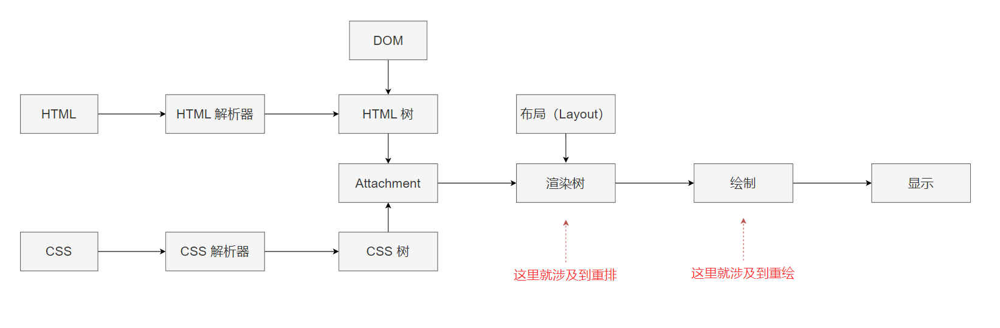

# CSS

## 1、flex布局的一些属性

这些东西虽然很基础，但是时间长了，被问时一紧张还是容易说不上来，虽然写的时候可能很流畅，因此还是记录下，常温习比较好。

```less
.father {
  // 设定盒子为弹性盒子
  display: flex;
  // 设定主轴方向
  flex-direction: row | row-reverse | column | column-reverse;
  // 设定换行
  flex-wrap: wrap | nowrap | wrap-reverse;
  // flex-direction 和 flex-wrap 的简写
  flex-flow: row nowrap;
  // 设定主轴的对齐方式
  justify-content: flex-start | flex-end | center | space-between | space-around;
  // 设定副轴的对齐方式，如主轴为 x，则副轴为 y
  align-items: flex-start | flex-end | center | baseline | stretch;
  // 定义多根轴线的对齐方式，如果只有一个轴线，不起作用
  align-content: flex-start | flex-end | center | space-between | space-around | strecth;
  
  .son {
    // 定义排列顺序，数值越小越靠前，默认0
    order: 0;
    // 定义放大比例，默认为0
    flex-grow: 0;
    // 定义缩小比例，默认为1
    flex-shrink: 1;
    // 定义在分配多余空间前，这个元素占据的主轴空间，默认 auto
    flex-basis: auto;
    // flex-grow flex-shrink flex-basis 的简写，auto => 1 1 auto; none => 0 0 auto;
    flex: 0 1 auto;
    // 语序这个子元素有与其他子元素不同的对齐方式
    align-self: auto;
  }
}
```

## 2、水平垂直居中方式

这个就不写代码了，比较简单，应该不会忘记：

1. display: flex + justify-content: center + align-items: center
2. position: absolute + left + right + top + bottom + transform: translate()
3. position: absolute + left + right + top + bottom + margin: auto

一般就这三种常用

## 3、position 的属性

这个虽然之前用得多，但是有些还是容易一时脑抽就忘记，真见鬼了😒，看来还是记得不牢。

1. static：默认值，表示没有定位。
2. initial：设置该属性为默认值。
3. relative：相对定位，相对于自身定位，不脱离文档流，会占据原先的位置。
4. absolute：绝对定位，相对于第一个有 relative 的父元素进行定位，脱离文档流，不会占据原先的位置，必须有left、right、top、bottom。
5. fixed：固定定位，相对于浏览器窗口进行定位。
6. sticky：粘性定位。
7. inherit：规定应该从父元素继承 position 的值。

## 4、px 和 em 的区别

px：像素，是相对于屏幕分辨率的，是绝对单位，不同设备上的像素所代表的长度是不同的。

em：是一个相对单位，它的大小相对于父元素计算，比如父元素为 10px，则子元素的 1em = 10px。

## 5、BFC 及其应用

BFC：指的是一个独立的布局环境，其中的元素布局与外部互不影响

设置 BFC：

- 设置浮动：float
- overflow 设置为 auto、scroll、hidden
- position 设置为 absolute、fixed
- display 设置为 inline-block、table-cell、...

应用：

- 解决浮动元素让父元素高度塌陷问题
- 解决非浮动元素被浮动元素覆盖问题
- 解决外边距垂直方向重合问题

## 6、用 css 或 js 实现文本溢出省略效果，考虑兼容性

css：

- 单行：

  ```css
  overflow: hidden;
  text-overflow: ellipsis;
  white-space: nowarp;
  ```

- 多行：

  ```css
  display: -webkit-box;
  -webkit-box-orient: vertical;
  -webkit-line-clamp: 3; // 行数
  overflow: hidden;
  ```

- 兼容性：设置省略的部分内容最大高度，并将超出部分隐藏，然后使用伪元素设置覆盖最后的文本，并填充伪元素内容为"..."。

  ```css
  p {
    position: relative;
    line-height: 20px;
    max-height: 40px;
    overflow: hidden;
  }
  
  p::after {
    content: "...";
    position: absolute;
    bottom: 0;
    right: 0;
    padding-left: 40px;
    background: -webkit-linear-gradient(left, transparend, #fff 55%);
    background: -o-linear-gradient(right, transparent, #fff 55%);
    background: -moz-linear-gradient(right, transparent, #fff 55%);
    background: linear-gradient(to right, transparent, #fff 55%);
  }
  ```

  

js：

1. 使用 split + 正则切割文本长度，并在截取的部分后面添加"..."。
2. 判断 scrollHeight 和 clientHeight，超过部分就从截取的文本中 pop 一个出来。

## 7、居中为什么要使用 transform 而不是 margin-left/top

transform 属性值的变化不会导致重绘，而 margin 属性值的变化会导致重排，而重排会导致重绘。

## 8、介绍粘性布局（sticky）

通过设置 position: sticky 后即可将元素设置为粘性定位。它不会受到定位（top、left）影响，当这个元素的位置要移出便宜范围时，定位又会变成 fixed，根据设置的 left、top 等属性成固定位置的效果。

## 9、transition 和 animation 的属性分别有哪些

transition：

- transition-property：设置要过渡的属性
- transition-duration：设置过渡时间
- transition-timing-function：设置过渡曲线
- transition-delay：设置延迟时间

animation：

- animation-name：设置动画名称（使用哪个关键帧@keyframes）
- animation-duration：设置动画完成所需时间
- animation-timing-function：设置动画曲线
- animation-delay：设置延迟时间
- animation-iteration-count：设置动画执行次数
- animation-direction：设置是否反向播放动画
- animation-fill-mode：设置动画不播放时，元素的样式
- animation-play-state：设置动画运行或停止

## 10、png8、png24、png32的区别，png压缩原理

1. png8：8指的是8bits，即使用2^8大小来存储一张图片的颜色种类。一张图片如果颜色种类少，则可以将其设置为png8。
2. png24：24 = 3 * 8，即表示用r、g、b三个通道分别使用一个8bits来存储，它能展示的色彩更加丰富，但是占用空间也更大。
3. png32：32 = 4 * 8，它表示 rgba，每个通道用一个8bits存储，多了一个透明通道，展示颜色最多，占用空间也最大。

png压缩：

1. 预解析：对png图片进行一个预处理，方便后续压缩
2. 压缩：执行Deflate压缩，这个算法结合了LZ77算法和Huffman算法对图片进行编码

## 11、清除浮动

- 触发BFC

- clear 清除浮动（添加空 div 法），在浮动元素下方添加空 div，并给该元素赋予以下样式：`{clear: both;height: 0;overflow: hidden;}`

- 使用 ::after 伪元素清除浮动（主流方法，推荐使用）

  ```css
  ul::after {
    content: "";
    display: block;
    clear: both;
  }
  ```

## 12、盒模型

css盒子模型分为标准盒子模型和IE盒子模型。

W3C 盒模型（标准盒子模型）：宽高不包含内边距和边框。

IE 盒模型：宽高包含内边距和边框。

通过 box-sizing: border-box 设置为 IE 盒模型，content-box 设置为标准盒子模型。

## 13、重绘和重排

重绘：元素的某些几何属性或样式发生改变，如颜色等，屏幕上的部分内容需要更新，表现为某些元素外观被改变。

重排：渲染树需要重新分析并且节点尺寸需要重新计算，表现为重新生成布局或者重新排列元素。

重绘不一定重排，重排必定重绘。

## 14、优化图片

1. 某些装饰类的图片，可以尽量使用 css 代替
2. 对于移动端而言，因为屏幕本身就不大，因此可以根据屏幕尺寸去加载（cdn加载）不同裁切的图片，避免使用原图浪费带宽。
3. 小图可以将其转换为 base64 格式。
4. 图标可以使用雪碧图。
5. 选择合适的图片格式：
   - WebP格式：更好的图像数据压缩算法，能带来更小的图片体积，并且肉眼无法识别图像质量，就是兼容性差
   - png：小图片如图标，可以使用，当然也可以使用 svg 代替
   - jpge：照片使用 jpge

## 15、渐进增强、优雅降级

渐进增强：针对低版本浏览器构建页面，先保证基本功能，然后针对高版本浏览器添加功能

优雅降级：一开始就构建完整的功能，然后针对低版本浏览器进行兼容

## 16、css3 新增内容

这里列出一些关键内容：

1. 选择器
2. 盒子模型属性：border-radius、box-shadow、border-image
3. 背景：background-size、background-origin、background-clip
4. 文本效果：text-shadow、word-wrap
5. 颜色：新增 rgba、hsla 模式
6. 渐变：线性渐变、径向渐变
7. 字体：@font-face
8. 2d/3d转换：transform、transform-origin
9. 过渡和动画：transition、animation、@keyframes
10. 多列布局
11. 媒体查询

## 17、隐藏元素方法

1. display: none
2. opacity: 0
3. visibility: hidden
4. 移出页面视口

> `display:none`和`visibility:hidden`的区别：
>
> 1. `display:none`不占位置；`visibility:hidden`会占用原先的位置。
> 2. `display:none`会产生一次回流（重排），然后页面会重绘；`visibility:hidden`不会造成回流，会直接造成重绘。

## 18、重绘和重排的区别

- 重绘（回流）：布局引擎会根据所有的样式计算出盒模型在页面上的位置和大小。对DOM的样式进行修改，如color、background-color，浏览器不需要重新计算几何属性的时候，直接绘制该元素的新样式，这就是重绘。
- 重排：计算好盒模型的位置、大小、和其他一些属性后，浏览器就会根据每个盒模型的特性进行绘制。对DOM的大小、位置进行修改后，浏览器需要重新计算元素的几何属性，就叫重排。



上图就是DOM渲染的一个流程，从上我们可以看到，重绘不一定重排，重排一定重绘。

> 触发回流：删除、添加DOM元素；修改元素位置、大小；内容发生改变

## 19、css那些属性可以继承

1. 字体的一些属性：font-size、font-weight、color、line-height
2. 文本的一些属性：lint-height、color等
3. 元素可见性：visibility: hidden
4. 表格布局的属性：border-spacing
5. 列表属性：list-style
6. 页面样式属性：page
7. 声音的样式属性

## 20、line-height和height的区别

- line-height：表示的是盒子中每一行文本的高度
- height：表示的是盒子的高度

## 21、css选择器

1. 通配符选择器
2. id选择器
3. 类选择器
4. 标签选择器
5. 相邻选择器（+）
6. 后代选择器（ul li）
7. 子元素选择器 （>）
8. 属性选择器
9. ...

## 22、opacity和rgba的区别

1. opacity的取值范围为0~1；rgba(红色, 绿色, 蓝色, 透明度)，色值的取值为0~255或者百分比，a的取值范围为0~1。
2. opacity会造成整个盒子透明，包括其中的内容；rgba只会造成该元素的颜色的透明，不会造成内容的透明。


