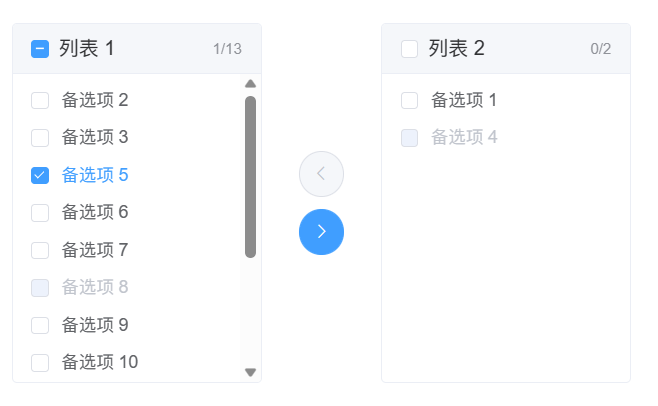

# Element-UI

## 1、使用穿梭组件，数据量大时导致卡顿

穿梭组件：`transfer`

当数据量大时，渲染起来会卡顿，所以懒加载和分页是基本操作。

但是做了懒加载或分页操作后，用户点击依然会卡顿，这是因为 transfer 的源码中*全选*判断代码性能差的原因，因此**方案一就是修改源码**。

具体可看这篇博客：[关于Element-UI的穿梭框数据量大时，点击‘全选’卡顿的解决方案 - 绵雨唤 - 博客园 (cnblogs.com)](https://www.cnblogs.com/raintoway/p/13469997.html) 

## 2、表单验证

1. 在表单中加`rules`属性，然后在data中写校验规则
2. 内部添加规则
3. 自定义函数校验