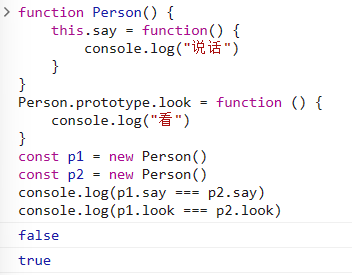
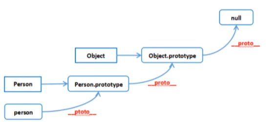

# JS

## 1、es6 新特性

这些在日常开发中常用，但是一问起来还是容易堵住脑子说不出话。

1. 新增`let | const`
2. 新增`...`，拓展运算符
3. 新增`Promise`
4. 新增`symbol`原始数据类型
5. 新增`解构赋值`，`const { name } = person`
6. 新增`Map | Set`
7. 新增`Object.assign()`和`Object.is()`
8. 新增`str.includes() | str.startsWith() | str.endsWith() | str.repeat() | str.padStart() | str.padEnd()`
9. 新增`arr.of() | arr.from() | arr.find() | arr.findIndex() | arr.fill() | arr.copyWithin() | arr.includes() `
10. 新增`函数参数默认值`，`function(a = 1, b = 2) { return (a + b) }`
11. 新增`箭头函数`，`() => {}`
12. 新增`class`
13. 新增`导入导出`，`import xxx from "xxx" | export {}`

## 2、闭包

简单说就是在一个内部函数（这个内部函数被外部函数返回）中能访问外部函数的变量，如：

```js
function fn() {
  let text = 123
  
  return function() {
    let mytext = text
  }
}
```

它所造成的影响就是外部函数中被内部函数访问的变量不会被[垃圾回收](https://blog.csdn.net/weixin_50936255/article/details/118501200)，因此就可能造成内存泄漏。

但他也有一些应用场景，比如我们的[防抖节流](../js/js知识要点.md#防抖和节流)函数，这其中外部的`timer`就被内部函数访问了，这就会导致我们每次调用这个函数时，这个`timer`都是同一个变量，以达到我们需要的效果。

## 3、深拷贝和浅拷贝

- `浅拷贝`只复制指向对象的指针，不复制对象本身，因此，虽然我们使用时可能使用的是两个不同的变量，但是它们其实读取的是同一个内存地址，这样就会导致我们使用某个变量时会影响到另一个变量。
- `深拷贝`会创造另一个跟被拷贝的对象一模一样的对象，然后将其放置到一个新的内存地址中，这样两个对象之间就不会相互影响。

实现深拷贝：

1. 扩展运算符：这个方法只能实现第一层的深拷贝，当有多层的时候还是浅拷贝

2. JSON：使用`JSON.parse(JSON.stringify(boj))`，但是它不能处理函数

   

3. 递归的方式：[递归实现深拷贝](../js/js方法.md#传统深克隆方法) 

4. 使用`MessageChannel()`：[使用 MessageChannel 实现深拷贝](../js/js方法.md#使用-messagechannel-方法) 

5. 使用`lodash`库

## 4、将下面代码使用闭包改为从 0 - 9 的输出

题干

```js
var funcs = []
for (var i = 0; i < 10; i++) {
  funcs.push(function() { console.log(i) })
}
funcs.forEach(func => {
  func()
})
```

- 用闭包的方式：

  ```js
  var funcs = []
  for (var i = 0; i < 10; i++) {
    // 闭包
    (function(j) {
      funcs.push(function() { console.log(j) })
    })(i)
  }
  funcs.forEach(func => {
    func()
  })
  ```

## 5、箭头函数与普通函数的区别

1. 箭头函数没有自己的 this
2. 箭头函数不能作为构造函数
3. 箭头函数不绑定 arguments，取而代之使用`...`解决
4. 箭头函数不具备 prototype 原型对象
5. 箭头函数不能使用 Generator 函数，不能使用 yeild 关键字
6. 箭头函数不具备 super
7. 箭头函数不具有 new.target

## 6、隐式转换

这个我们在书写代码时可能都不太会注意到，因为其实一些转换我们都能知道，但是要突然问起然后让说这个，可能会突然脑抽不知从何说起😢

原始值 => 转换数值类型 => 转换字符串类型 => 转换 Boolean 类型

1. false => 0 => "false" => false
2. true => 1 => "true" => true
3. 0 => 0 => "0" => false
4. 1 => 1 => "1" => true
5. "" => 0 => "" => false
6. "0" => 0 => "0" => false
7. "1" => 1 => "1" => true
8. "hh" => NaN => "hh" => true
9. [] => 0 => "" => true
10. [10] => 10 => "10" => true
11. [10, 11] => NaN => "10,20" => true
12. {} => NaN => "[object Object]" => true
13. null => 0 => "null" => false
14. undefined => NaN => "undefined" => false
15. function(){} => NaN => "function(){}" => true
16. NaN => NaN => "NaN" => false
17. Infinity => Infinity => "Infinity" => true
18. -Infinity => -Infinity => "-Infinity" => true

## 7、js的三个组成部分

1. ECMAScript：js的核心内容，描述了语言的基础语法，如 var、if、for，function、数据类型等；
2. 文档对象模型（DOM）：DOM把整个HTML页面规划为元素构成文档，我们可以使用一些API操作HTML页面
3. 浏览器对象模型（BOM）：对浏览器窗口进行访问和操作

## 8、js对数据类型检测的方法

1. typeof：对基本数据类型没问题，遇到引用数据类型就会出问题

2. instanceof：对引用数据类型没问题，基本数据类型会出问题

3. constructor：几乎可以判断基本数据类型和引用数据类型，但是也有局限性

   局限性：如果声明了一个构造函数，并把它的原型指向了Array，这样它就检测不出来了

4. Object.prototype.toString.call()：完美解决所有问题

## 9、内存泄漏

js中已经分配内存地址的对象，但是由于长时间没有释放或者没办法清除，造成长期占用内存的现象，会让内存资源答复浪费，最终导致运行速度慢，甚至崩溃的情况。

因素：一些未声明直接赋值的变量，一些未清空的定时器，过度闭包，一些引用元素没有被清除。

## 10、事件委托是什么

又叫事件代理，原理就是利用了事件冒泡的机制来实现，也就是将子元素的事件绑定到了父元素身上。

如果子元素阻止了事件冒泡，那么委托失效。

阻止事件冒泡：

1. event.stopPropagation()
2. addEventListener("", 函数, Boolean)，这个布尔值默认为false（事件冒泡），true（事件捕获）。

## 11、基本数据类型和引用数据类型

1. 基本数据类型：保存在栈内存中，保存的就是一个具体的值

   `Number | String | Boolean | null | undefined | Symbol`

2. 引用数据类型：保存在堆内存中，声明一个引用类型的变量，它保存的是这个引用类型数据的地址

   `Object | Array | Function`

## 12、原型链

- 原型就是一个普通对象，它是为构造函数的实例共享属性和方法，所有的实例中引用的原型都是同一个对象。使用`prototype`可以将方法挂载到原型上。



- 原型链：一个实例对象在调用属性和方法时，会依次从实例本身、构造函数原型、原型的原型上去查找，这样的一个链式查询方式就叫做原型链。

  `prototype是显示原型，__proto__是隐式原型`



## 13、new 操作符具体做了什么

1. 先创建一个空对象
2. 把空对象和构造函数通过原型链进行连接
3. 把构造函数的`this`绑定到新的空对象上
4. 根据构造函数返回的类型判断，如果是值类型，则返回对象；如果是引用类型，则返回这个引用类型

```js
function newFun(Fun, ...args) {
  // 步骤一
  let obj = {}
  // 步骤二
  obj.__proto__ = Fun.prototype
  // 步骤三
  const result = Fun.apply(obj, args)
  // 步骤四
  return result instanceof Object ? result : obj
}

function Person(name) {
  this.name = name
}

Person.prototype.say = function() {
  console.log("haha")
}

const p = newFun(Person, "zhangsan")
p.say() // haha
console.log(p) // {name: "zhangsan"}
```

## 14、js是如何实现继承的

1. 原型链继承：让一个构造函数的原型是另一个构造函数的实例，那么这个构造函数new出来的实例就具有该实例的属性

   - 优点：写法方便简洁，容易理解
   - 缺点：对象实例共享所有继承的属性和方法，无法向父类构造函数传参

2. 借用构造函数继承：在子类构造函数内部调用父类构造函数：使用`apply | call`方法将父类的构造函数绑定在子对象上

   - 优点：解决了原型链实现继承的不能传参的问题和父类原型共享的问题
   - 缺点：方法都在构造函数中定义，因此无法实现函数的复用。在父类的原型中定义的方法，对子类而言也是不可见的，结果所有类型都只能使用构造函数模式。

3. 组合式继承：将原型链和借用构造函数两种方法组合到一起。使用原型链实现对原型属性和方法阿德继承，使用借用构造函数来实现对实例属性的继承。这样既通过在原型上定义方法实现了函数复用，又能保证每个实例都有自己的属性。

   - 优点：解决了原型链继承和借用构造函数继承两种方式造成的影响
   - 缺点：无论在什么情况下，都会调用两次父类构造函数

4. ES6的class类继承：class 通过 extends 关键字实现继承。其实质是先创造出父类的this对象，然后通过子类的构造函数修改this。

   > **子类的构造函数（constructor）中必须调用 super 方法，且只有调用了 super 之后才能使用 this**，因为子类的 this 对象是继承父类的 this 对象，然后对其进行加工，而 super 方法表示的是富力湾i的构造函数，用来创建父类的 this 对象。

   - 优点：语法简单易懂，操作方便
   - 缺点：浏览器兼容性问题

## 15、js的设计原理

1. js引擎：编译js脚本，将其转换为电脑可执行的代码的引擎，如现在最流行的v8引擎
2. 运行上下文：浏览器中可调用的一些API，如 window，document等
3. 调用栈：单线程，
4. 事件循环：就是一个无限循环，它会持续的调用消息队列中的事件来执行
5. 回调：

## 16、this指向问题

1. 全局对象的this：指向 window
2. 全局作用域或普通函数中的this：指向全局 window
3. 在不是箭头函数的情况下，this永远指向最后调用它的那个对象
4. new 关键词改变了this的指向
5. apply、call、bind 可以改变this的指向，但前提是不是箭头函数
6. 箭头函数的this：它的指向在定义的时候就确定了，它没有this，看外层是否有函数，有就是外层函数，没有就是window
7. 匿名函数中的this：永远指向 window，匿名函数的执行环境具有全局性

## 17、script中的async和defer

- 没有async和defer时，它会立刻加载资源，会阻塞后续资源的加载
- async的情况下：加载和渲染后面元素的过程将和script的加载和执行并行进行（异步）
- defer的情况下：加载和渲染后面元素的过程将和script的加载并行进行（异步），但是执行要等到所有元素解析完成后才会执行

## 18、setTimeout和setInterval最小执行时间

1. setTimeout：4ms
2. setInterval：10ms

## 19、Promise

解决回调地狱的问题。

自身有 call、reject、resolve、race方法，原型上有 then、catch方法。

它自身有三种状态：pending、fulfilled、rejected，只能从pending转变到fulfilled或者rejected，且状态只能转换一次。

## 20、call、apply、bind的区别

1. 相同点：都是改变this指向和函数的调用
2. 不同：
   - call：第一个参数是this的指向，第二个参数传递的是一个参数列表，它的性能比apply更好
   - apply：第一个参数是this的指向，第二个参数传递的是一个数组
   - bind：第一个参数是this的指向，第二个参数传递的是一个参数列表，传参后不会立刻执行，会返回一个改变了this指向的函数，这个函数还是可以传参的

## 21、事件循环

事件循环又叫做消息循环，是浏览器渲染主线程的工作方式。

在 Chrome 的源码中，它开启一个不会结束的 for 循环，每次循环从消息队列中取出第一个任务执行，而其他线程只需要在合适的时候将任务加入到队列末尾即可。

过去把消息队列简单分为宏队列和微队列，这种说法目前已经无法满足复杂的浏览器环境，取而代之的是一种更加灵活多变的处理方式。

根据 W3C 官方的解释，每个任务有不同的类型，同类型的任务必须在同一个队列中，不同的任务可以属于不同的队列。不同的任务队列有不同的优先级，在一次事件循环中，由浏览器自行决定取哪一个队列的任务。**但浏览器必须有一个微队列，微队列的任务一定具有最高的优先级，必须优先调度执行。**

## 22、ajax

- ajax：ajax是创建交互式网页应用的网页开发技术，在不重新加载整个网页的前提下，与服务器交换数据并更新部分内容。
- 实现原理：通过XMLHttpRequest对象向服务器发送异步请求，然后从服务器拿到数据，最后通过js操作DOM更新页面。
- 实现步骤：
  1. 创建XMLHttpRquest对象，xhr
  2. 通过xhr对象里的`open()`方法和服务器建立连接
  3. 构建请求所需的数据，并通过xhr对象的`send()`发送给服务器
  4. 通过xhr对象的`onreadstate，change`事件监听服务器和页面的通信状态
  5. 接收并处理服务器响应的数据结果
  6. 把处理的数据更新到HTML页面上

## 23、get、post的区别

- get：一般用来获取数据
- post：一般用来提交数据

1. GET参数通过URL传递，POST放在Request body中。
2. GET比POST更不安全，因为参数直接暴露在URL上，所以不能用来传递敏感信息。
3. GET请求在URL中传送的参数是有长度限制的，而POST没有。
4. GET在浏览器回退时是无害的，而POST会再次提交请求。
5. GET请求会被浏览器主动缓存，而POST不会，除非手动设置。
6. GET请求参数会被完整保留在浏览器历史记录里，而POST中的参数不会被保留。
7.  GET请求只能进行url编码，而POST支持多种编码方式。
8.  对参数的数据类型，GET只接受ASCII字符，而POST没有限制。

::: details get和post的原理

我们都知道，get和post只是http协议中的两种发送请求的方法，那么，http是什么呢？

http是基于`TCP/IP`的关于数据如何在万维网中通信的协议。这里我们就可以看出来，http底层是`TCP/IP`，所以get和post的底层也是如此。所以你要给get加上body，给post带上url参数也是完全莫得问题滴。

那么，它们在底层到底有什么区别呢？

首先，TCP在网络世界中就类似汽车，它用来运输数据，它很可靠，不会出现丢件少件的问题，但是，如果路上的汽车都长一个样，那么看起来就会很混乱，我们无法从外观上分辨出它们内部的货物的区别，因此，http就诞生了，它给这些汽车贴上了集中标签：get、post、delete、put等，这就是这些不同请求方式的由来。

get就相当于将货物放在了车顶，post将货物放在车厢中，这就可以看出get为什么有长度限制，而post相对来说就没有限制了，你总不能将1吨的货物放在车顶吧，这样看起来会很蠢。

但是除了上面我们提到的get和post的一些区别，它俩还有一个很重要的区别：get只会产生一个TCP数据包，而post会产生两个TCP数据包。

也就是说，get将header和data一起打包，一次性运输完成（`服务器响应200`）；而post会先运输一次header（`服务器响应100，表示等待`），告诉收货方，我等下要运货物来了，你开门等着，然后在运输一次data（`服务器响应200`）。

因为post需要两次运货，所以感官上来说，它会更慢。但是不能为了优化性能就用get来替换post，原因如下：

1. get和post都有自己的语义，不能混用
2. 在网络环境好时，get和post的时间差可以忽略不计；在网络环境差时，传输两次包这种方式在验证数据完整性上有很大优势
3. 其实不是所有浏览器的post都会发两个包，Firefox就只发一次

:::


