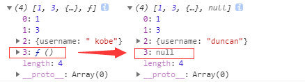

# JS

## 1、es6 新特性

这些在日常开发中常用，但是一问起来还是容易堵住脑子说不出话。

1. 新增`let | const`
2. 新增`...`，拓展运算符
3. 新增`Promise`
4. 新增`symbol`原始数据类型
5. 新增`解构赋值`，`const { name } = person`
6. 新增`Map | Set`
7. 新增`Object.assign()`和`Object.is()`
8. 新增`str.includes() | str.startsWith() | str.endsWith() | str.repeat() | str.padStart() | str.padEnd()`
9. 新增`arr.of() | arr.from() | arr.find() | arr.findIndex() | arr.fill() | arr.copyWithin() | arr.includes() `
10. 新增`函数参数默认值`，`function(a = 1, b = 2) { return (a + b) }`
11. 新增`箭头函数`，`() => {}`
12. 新增`class`
13. 新增`导入导出`，`import xxx from "xxx" | export {}`

## 2、闭包

简单说就是在一个内部函数中能访问外部函数的变量，如：

```js
function fn() {
  let text = 123
  
  return function() {
    let mytext = text
  }
}
```

它所造成的影响就是外部函数中被内部函数访问的变量不会被[垃圾回收](https://blog.csdn.net/weixin_50936255/article/details/118501200)，因此就可能造成内存泄漏。

但他也有一些应用场景，比如我们的[防抖节流](../js/js知识要点.md#防抖和节流)函数，这其中外部的`timer`就被内部函数访问了，这就会导致我们每次调用这个函数时，这个`timer`都是同一个变量，以达到我们需要的效果。

## 3、深拷贝和浅拷贝

- `浅拷贝`只复制指向对象的指针，不复制对象本身，因此，虽然我们使用时可能使用的是两个不同的变量，但是它们其实读取的是同一个内存地址，这样就会导致我们使用某个变量时会影响到另一个变量。
- `深拷贝`会创造另一个跟被拷贝的对象一模一样的对象，然后将其放置到一个新的内存地址中，这样两个对象之间就不会相互影响。

实现深拷贝：

1. 简单的可以使用`JSON.parse(JSON.stringify(boj))`，但是它不能处理函数

   

2. 递归的方式：[递归实现深拷贝](../js/js方法.md#传统深克隆方法) 

3. 使用`MessageChannel()`：[使用 MessageChannel 实现深拷贝](../js/js方法.md#使用-messagechannel-方法) 

4. 使用`lodash`库

## 4、将下面代码使用闭包改为从 0 - 9 的输出

题干

```js
var funcs = []
for (var i = 0; i < 10; i++) {
  funcs.push(function() { console.log(i) })
}
funcs.forEach(func => {
  func()
})
```

- 用闭包的方式：

  ```js
  var funcs = []
  for (var i = 0; i < 10; i++) {
    // 闭包
    (function(j) {
      funcs.push(function() { console.log(j) })
    })(i)
  }
  funcs.forEach(func => {
    func()
  })
  ```

## 5、箭头函数与普通函数的区别

1. 箭头函数没有自己的 this
2. 箭头函数不能作为构造函数
3. 箭头函数不绑定 arguments，取而代之使用`...`解决
4. 箭头函数不具备 prototype 原型对象
5. 箭头函数不能使用 Generator 函数，不能使用 yeild 关键字
6. 箭头函数不具备 super
7. 箭头函数不具有 new.target

## 6、隐式转换

这个我们在书写代码时可能都不太会注意到，因为其实一些转换我们都能知道，但是要突然问起然后让说这个，可能会突然脑抽不知从何说起😢

原始值 => 转换数值类型 => 转换字符串类型 => 转换 Boolean 类型

1. false => 0 => "false" => false
2. true => 1 => "true" => true
3. 0 => 0 => "0" => false
4. 1 => 1 => "1" => true
5. "" => 0 => "" => false
6. "0" => 0 => "0" => false
7. "1" => 1 => "1" => true
8. "hh" => NaN => "hh" => true
9. [] => 0 => "" => true
10. [10] => 10 => "10" => true
11. [10, 11] => NaN => "10,20" => true
12. {} => NaN => "[object Object]" => true
13. null => 0 => "null" => false
14. undefined => NaN => "undefined" => false
15. function(){} => NaN => "function(){}" => true
16. NaN => NaN => "NaN" => false
17. Infinity => Infinity => "Infinity" => true
18. -Infinity => -Infinity => "-Infinity" => true


