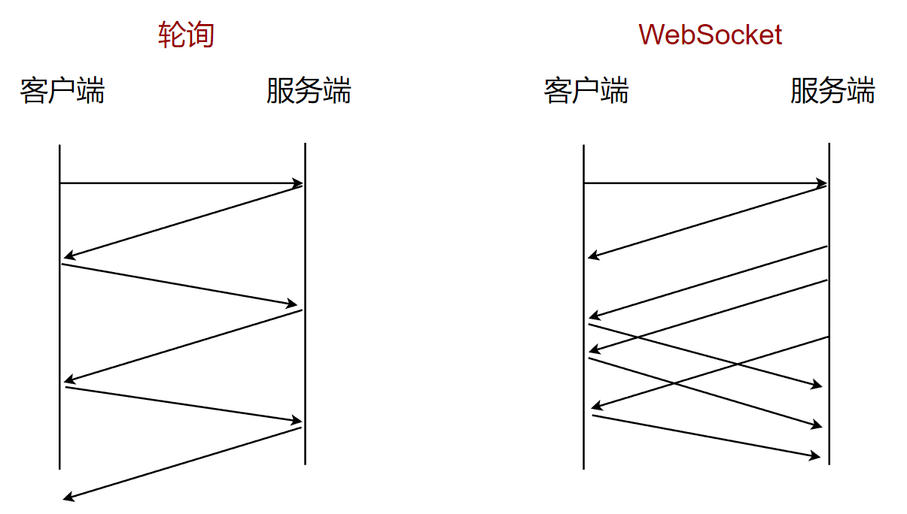

# WebSocket

为了解决[轮询](./轮询.md)带来的一些问题，`HTML5`定义了`WebSocket`协议，它能更好的节省服务器资源和带宽，并且能够更实时的进行通讯。

`WebSocket`使用`ws | wss`的统一资源标志符（URI），其中`wss`使用了[TLS](https://baike.baidu.com/item/TLS/2979545)的`WebSocket`。如：

> ws://echo.websocket.org
>
> wss://echo.websocket.org

`WebSocket`与`HTTP`和`HTTPS`使用相同的`TCP`端口，可以绕过大多数防火墙的限制。

默认情况下：

- `WebSocket`使用 80 端口
- 如果运行在`TLS`上，则默认使用 443 端口

## WebSocket简介

`WebSocket`允许**服务端主动向客户端发送信息**。在`WebSocket API`中，客户端与服务端只需要完成一次握手，两者之间就能创建持久性的连接，并进行双向数据传输。

下图表明轮询与`WebSocket`的区别：



## WebSocket优点

一般来说，`WebSocket`有以下几个优点：

1. 较少的开销控制：在创建连接后，客户端与服务端之间交换数据时，用于协议控制的数据包头部相对较小
2. 更强的实时性：由于客户端和服务端是双端联通的，所以服务端可以随时给客户端发送消息，相较于服务端被动等待客户端请求的方式，明显延迟更低
3. 保持连接状态：与`HTTP`不同的是，`WebSocket`需要先创建链接，这就使得其成为一种有状态的协议，之后通信时可以省略部分状态信息
4. 更好的二进制支持：`WebSocket`定义了二进制帧，相对于`HTTP`可以更轻松的处理二进制内容
5. 可以支持扩展：`WebSocket`定义了扩展，用户可以扩展协议、实现部分自定义的子协议

因为以上的一些优点，因此它被广泛应用于即时通讯/IM、实时音视频、在线教育和游戏等领域。

## WebSocket API 学习

首先，关于`WebSocket`的兼容性，我们可以到这个网站进行查阅：https://caniuse.com/

### 构造函数

我们可以使用`new`来创建一个`websocket`实例：

```js
/**
 * @param {string} url 表示连接的 url
 * @param {string | Array<string>} protocols 可选，一个协议字符串或包含协议字符串的数组
 */
const websocket = new WebSocket(url, protocols)
```

::: tip 注

`protocols`这些字符串用于指定子协议，这样单个服务器可以实现多个`WebSocket`子协议。

如你可能希望一台服务器能够根据指定的协议处理不同类型的交互。如果不指定协议字符串，则假定为空字符串。

使用`WebSocket`构造函数时，当尝试连接的端口被阻止时，会抛出`SECURITY_ERR`异常。

:::

### 属性

`websocket`对象包含以下属性，每个属性具体含义如下：

- `binaryType`：使用二进制的数据类型连接；
- `bufferedAmount`（只读）：未发送至服务器的字节数；
- `extensions`（只读）：服务器选择的扩展；
- `onclose`：用于指定连接关闭后的回调函数；
- `onerror`：用于指定连接失败后的回调函数；
- `onmessage`：用于指定当从服务器接受到信息时的回调函数；
- `onopen`：用于指定连接成功后的回调函数；
- `protocol`（只读）：用于返回服务器端选中的子协议的名字；
- `readyState`（只读）：返回当前 WebSocket 的连接状态，共有 4 种状态：
  - ***CONNECTING** — 正在连接中，对应的值为 0* 
  - ***OPEN** — 已经连接并且可以通讯，对应的值为 1* 
  - ***CLOSING** — 连接正在关闭，对应的值为 2* 
  - ***CLOSED** — 连接已关闭或者没有连接成功，对应的值为 3* 
- `url`（只读）：返回值为当构造函数创建 WebSocket 实例对象时 URL 的绝对路径。

### 方法

`websocket`主要方法有两个：

1. `send(data)`：该方法将需要通过`websocket`传输的数据排入队列，并根据所需要传输的数据的大小来增加***bufferedAmount***的值。若数据无法传输（如数据需要缓存而缓冲区已满）时，套接字会自动关闭。
2. `close(code, reason)`：该方法用于关闭`websocket`连接，如果连接已经关闭，此方法不会执行任何操作。

### 事件

使用`addEventListener()`或将一个事件监听器赋值给`websocket`对象的`oneventname`属性，来监听下面的事件。

- `close`：当一个`websocket`连接被关闭时触发，也可以通过**onclose**属性来设置；
- `error`：当一个`websocket`连接因错误而关闭时触发，也可以通过**onerror**属性来设置；
- `message`：当通过`websocket`收到数据时触发，也可以通过**onmessage**属性来设置；
- `open`：当一个`websocket`连接成功时触发，也可以通过**onopen**属性来设置。

[WebSocket 接口参考 | MDN](https://developer.mozilla.org/zh-CN/docs/Web/API/WebSocket) 
