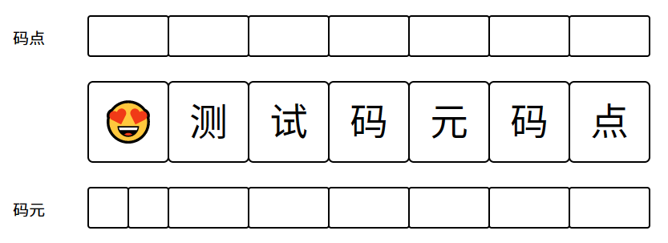

# js 方法

## 1、手机号分割

将手机号 `12345678900` 转换为 `123 4567 8900` 。

```js
function formateTel(tel) {
	const reg = /(\d{3})(\d{4})(\d{4})/g // 将手机号分割为三个部分
	return String(tel).replace(reg, "$1 $2 $3") // $1, $2, $3 分别为正则表达式分割的三个部分
}
```

## 2、检验密码是否合规

如这里有个要求：密码格式位： `长度为 8-16 位，且必须包含大小写字母、数字、特殊字符@、#、$ ` 。

```js
function checkPassword(password) {
	const reg = /^(?=.*\d)(?=.*[a-z])(?=.*[A-Z])(?=.*[@#$])[a-zA-Z0-9@#$]{8,16}$/g
	return reg.test(password)
}
```

> 这里使用 `正向肯定预查` 模式，并使用 `.` 排除换行符，使用 `*` 匹配 0 次或多次。

## 3、千分位分隔符

```js
function formateNumThousand(num) {
	const reg = /(?!^)(?=(\d{3})+$)/g
	return String(num).replace(reg, ",")
}
```

> `/(?=(\d{3})+$)/g` 表示每三位一匹配，但是会有一个问题，它会在数字最前方也加上一个逗号，因此需要使用 `(?!^)` 去除头部逗号，它表示忽略开头。

## 4、初始化数组

### 初始化一个一维数组

```js
/* 
	params: 
		len: 数组长度
		content: 填充内容
*/
function initArray1(len, content) {
	return Array(len).fill(content)
}
```

### 初始化一个二维数组

```js
/* 
	params: 
		len1: 第一层数组长度
		len2: 第二层数组长度
		content: 填充内容
*/
function initArray2(len1, len2, content) {
	return Array(len1)
		.fill(content)
		.map(() => Array(len2).fill(content))
}
```

## 5、计算代码运行时间

```js
function codeRunTime(cb) {
	const startTime = performance.now()
	cb && cb()
	const endTime = performance.now()
	return endTime - startTime
}
```

## 6、检验手机号

```js
function checkTel(tel) {
	const reg = /^(13[0-9]|14[01456879]|15[0-35-9]|16[2567]|17[0-8]|18[0-9]|19[0-35-9])\d{8}$/g
	return reg.test(tel)
}
```

## 7、检验身份证号

身份证号(15 位、18 位数字)，最后一位是校验位，可能为数字或字符 X|x

```js
function checkIdCard(id) {
	const reg = /(^\d{15}$)|(^\d{18}$)|(^\d{17}(\d|X|x)$)/g
	return reg.test(id)
}
```

## 8、检验 QQ 号

腾讯 QQ 号从 10000 开始

```js
function checkQQ(QQ) {
	const reg = /[1-9][0-9]{4,}/g
	return reg.test(QQ)
}
```

## 9、检验邮政编码

中国邮政编码为 6 位数字

```js
function checkPostalCode(code) {
	const reg = /[1-9]\d{5}(?!\d)/g
	return reg.test(code)
}
```

## 10、检验邮箱地址

```js
function checkEmail(email) {
	const reg = /^\w+([-+.]\w+)*@\w+([-.]\w+)*\.\w+([-.]\w+)*$/g
	return reg.test(email)
}
```

## 11、检验中文

只检验中文，就算包含中文符号如逗号都返回 false

```js
function checkChinese(str) {
	const reg = /^[\u4e00-\u9fa5]*$/g
	return reg.test(str)
}
```

## 12、字典顺序

将一些字符按照字典中的顺序进行排列

```js
/*
	params: 
		arr: 纯字符串数组
*/
function orderByDictionary(arr) {
	return arr.sort((a, b) => a.localeCompare(b))
}

const arr = ["上海", "北京", "广州", "杭州", "深圳", "武汉"]
console.log(orderByDictionary(arr)) // ['北京', '广州', '杭州', '上海', '深圳', '武汉']
```

> **`a.localeCompare(b)`** 方法返回一个 **数字** 来表示 a 的排序在 b 的前面或后面。

## 13、深克隆

### 传统深克隆方法

```js
function deepClone(obj) {
	const objectMap = new Map()
	const _deepClone = (value) => {
		const type = typeof value
		if (type !== "object" || type === null) {
			return value
		}
		if (objectMap.has(value)) {
			return objectMap.get(value)
		}
		const result = Array.isArray(value) ? [] : {}
		objectMap.set(value, result)
		for (const key in value) {
			result[key] = _deepClone(value[key])
		}
		return result
	}
	return _deepClone(obj)
}
```

### 使用 `MessageChannel()` 方法

```js
function deepClone(obj) {
	return new Promise((resolve) => {
		const { port1, port2 } = new MessageChannel()
		port1.postMessage(obj)
		port2.onmessage = (msg) => {
			resolve(msg.data)
		}
	})
}
```

> Channel Messaging API 的 `MessageChannel` 接口允许我们创建一个新的消息通道，并通过它的两个[`MessagePort`](https://developer.mozilla.org/zh-CN/docs/Web/API/MessagePort) 属性发送数据。
>
> **`MessagePort`** 接口代表 [`MessageChannel`](https://developer.mozilla.org/zh-CN/docs/Web/API/MessageChannel) 的两个端口之一，它可以让你从一个端口发送消息，并在消息到达的另一个端口监听它们，即使用 `port1.postMessage(value)` 用以发送 value，`port2.onmessage = msg => msg.data` 用来接收 value。
>
> MessageChannel.port1 和 MessageChannel.port2 这两个属性是只读的。

## 14、禁用复制或者更改复制内容

```js
function changeCopy() {
	document.addEventListener("copy", (e) => {
		e.preventDefault() // 禁用复制功能
		// e.clipboardData.setData("text/plain", window.getSelection().toString() + '哈哈哈哈') // 更改用户复制内容
	})
}
```

> `e.clipboardData.setData("text/plain", value)` 向用户剪切板写入内容。
>
> `window.getSelection().toString()` 获取用户复制的内容。

## 15、监听 localStorage 值的变化

```js
window.addEventListener("storage", function (e) {
	console.log(e)
})
```

## 16、取消请求

```js
let controller = null
input.oninput = async () => {
	controller && controller.abort() // 取消前面的请求
	controller = new AbortController() // 给本次请求创建一个 controller
	try {
		const list = await fetch(
			url,
			{ signal: controller.signal } // 标记本次请求
		).then((res) => console.log(res))
		// 其他代码
	} catch {
		console.log("已取消")
	}
}
```

> 类似在短期内多次快速进行网络请求时，就可以用到取消请求，如搜索框中实时展示用户输入内容相关联的搜索内容时。
>
> 需要用到的原因是：网络请求为异步操作，而短时间内的多次请求时，我们需要展示用户最后一次请求的内容，而由于请求响应时间的问题，我们实际最后返回的响应内容可能不是用户最后一次请求的响应，而是被响应时间较长的前次请求的结果覆盖了，导致展示内容与实际需要内容不符合的情况。
>
> 代码中使用 try catch 是因为每个被取消掉的请求都会进行报错，因此使用 trt catch 来获取错误，不让其显示在控制台中。
>
> 请求中的 signal 是进行标记请求的，因为 controller 需要知道取消的是哪一个请求。

### axios 取消请求

从 `v0.22.0` 开始，Axios 支持以 fetch API 方式—— [`AbortController`](https://developer.mozilla.org/en-US/docs/Web/API/AbortController) 取消请求：

```js
let controller = null
input.oninput = async () => {
	controller && controller.abort()
	controller = new AbortController()
	try {
		const list = await axios.get(url, { signal: controller.signal }).then((res) => console.log(res))
		// 其他代码
	} catch {
		console.log("已取消")
	}
}
```

> Axios 的 cancel token API 取消请求从 `v0.22.0` 开始被弃用，不应在新项目中使用。

## 17、fetch 分块加载大数据

```js
const response = await fetch("flower.jpg")
const reader = response.body.getReader()
while (true) {
	/*
  	done: 返回布尔值，表示请求是否结束
  	value: 返回一个 arrayBuffer 数组，表示内容块的内容
  */
	const { done, value } = await reader.read()
	if (done) {
		break
	}
	console.log(value)
}
```

> `Response.body`属性是 Response 对象暴露出的底层接口，返回一个 ReadableStream 对象，供用户操作。
>
> 它可以用来分块读取内容，应用之一就是显示下载的进度。
>
> 上面示例中，`response.body.getReader()`方法返回一个遍历器。这个遍历器的`read()`方法每次返回一个对象，表示本次读取的内容块。

## 18、字符串截取，码点和码元

解决某些特殊情况下，使用 slice 等字符串截取方法返回的值包含乱码

```js
const str = "😍测试码元码点"

String.prototype.sliceByPoint = function (pStart, pEnd) {
	let result = "" // 截取的结果
	let pIndex = 0 // 码点的指针
	let cIndex = 0 // 码元的指针
	while (true) {
		// 当截取到用户输入的结束的index 或者 截取到了整个字符串长度时，跳出循环
		if (pIndex >= pEnd || cIndex >= this.length) {
			break
		}
		// 返回值是在字符串中的给定索引的 Unicode 编码点值的非负整数
		const point = this.codePointAt(cIndex)
		// 当循环到用户输入的开始截取的 index 时，开始截取字符串
		if (pIndex >= pStart) {
			// 返回使用指定的 Unicode 编码位置创建的字符串
			result += String.fromCodePoint(point)
		}
		// 码点指针指向下一个
		pIndex++
		// 码元指针指向下一个，通过当前这个字符的编码是否大于4位16进制值来判断其占一个码元还是两个码元
		cIndex += point > 0xffff ? 2 : 1
	}
	return result
}

console.log(str.sliceByPoint(0, 1)) // 😍
console.log(str.slice(0, 1)) // �
console.log(str.substring(0, 1)) // �
```

> '哈' 这个字的 length 为 1，即它的码元为 1，但是它的码点为 1
>
> '𠮷' 这个字的 length 为 2，即它的码元为 2，但是它的码点为 1
>
> '😍' 这个字符的 length 为 2，即它的码元为 2，但是它的码点为 1
>
> `码元` ：js 对字符的编码一开始使用的规范是`ucs-2`。 **ucs-2 规定每一个字符对应 16 位（二进制编码）的空间** ，这 **16 位的空间被称之为码元** ，即一个文字对应一个码元。但是随着生僻字越来越多，还加入了 emoji 表情，16 位的空间不够用了。于是 js 把编码方式换成了`utf-16`， **utf-16 允许一个字符可以占用 16 位空间，即一个码元，也可以占用 32 位（二进制编码）的空间，也就是两个码元** 。这样一来，这些 **生僻字或者 emoji 表情就占用了两个码元** 。
>
> `码点` ：码点可以对应 16 位空间，也可以对应 32 位空间， **一个字符就是一个码点** 。
>
> 字符串的 length 其实统计的就是码元，而 js 的截取字符串的方法也是截取的码元位置，因此在一些特殊情况下，截取内容可能会包含乱码。



## 19、将下载链接转换为迅雷下载链接，触发迅雷下载

```js
function turnLinkToThunder(link) {
	// 在原链接前后两端添加特殊字符，然后进行 base64 编码，最后加上迅雷下载协议
	const newLink = `thunder://${btoa(`AA${link}ZZ`)}`
	return newLink
}
```

> 在使用上述方法将链接转换为迅雷下载协议链接后，还需要在点击下载的元素上加上 `data-thunder` 属性，如：
>
> `<a data-thunder herf="转换后的下载链接"></a>`

## 20、前端文件下载的几种方式

### a 标签

通过 `a` 标签的 `download` 属性来实现文件下载

```html
<a href="下载链接" download="文件名称">下载</a>
```

> 缺点：`a` 标签只能下载同源的文件，如果是跨域的文件，包括图片、音频、视频等媒体文件，都只能预览，无法下载。

### window.open

这种方法与使用 `a` 标签效果一样

```js
window.open("下载链接", "_blank")
```

> 缺点：类似 `a` 标签不能下载跨域文件、媒体文件，同时也不能下载`.html .htm .xml .xhtml` 等文件，因为这些文件会被当成 `.html` 文件来处理，会直接在当前页面打开预览。

### location.href

这种方式和`window.open(url)`是一样的

```js
location.href = "下载链接"
```

> 缺点：这种方式拥有`window.open`的所有缺陷

### location.? 其他属性

这里的其他指代的都是能跳转页面的属性，比如`location.assign`、`location.replace`、`location.reload`等，这些属性都是可以实现文件下载

```js
location.assign("下载链接")
location.replace("下载链接")
location.reload("下载链接")
```

> 这里的`location.reload`是有点特殊的，它的作用是重新加载当前页面，但是它也可以接受一个参数，这个参数就是要跳转的页面，所以也可以实现文件下载。
>
> 缺点：当然同`location.href`一样，这些方式的缺点都一样，同时还有属于每个属性自身的特性，这里只当拓展知识，不做过多的讲解。

### XMLHttpRequest

这种方式就是常说的 `ajax` 下载，包括 `axios | fetch` 等都是相同的

```js
const xhr = new XMLHttpRequest()
xhr.open("GET", "下载链接")
xhr.send()

xhr.onload = function () {
	/*
  	
  	这里获取文件的类型有两种办法：
  		1、和接口提供者进行协商
  		2、通过 response 的 header 来获取文件的 type
  */
	// 这里通过 response 的 header 来获取文件的type
	// const type = xhr.response.headers["content-type"]
	const blob = new Blob([xhr.response], { type: "text/html" })
	const a = document.createElement("a")
	a.href = URL.createObjectURL(blob)
	a.download = "文件名称"
	a.click()
}
```

> `Blob`：Blob 对象表示一个不可变、原始数据的类文件对象。它的数据可以按文件或二进制的格式进行读取，也可以转换成 `ReadableStream` 来用于数据操作。Blob 表示的不一定是 js 原生格式的数据。`File` 接口基于 Blob，继承了 Blob 的功能并将其扩展以支持用户系统上的文件。
>
> `URL.createObjectURL`：URL.createObjectURL() 静态方法会创建一个 DOMString，其中包含一个表示参数中给出的对象的 URL。这个 URL 的生命周期和创建它的窗口中的 document 绑定。这个新的 URL 对象表示指定的 File 对象或 Blob 对象。
>
> `URL.createObjectURL(blob)`：这个方法的作用就是把一个 blob 对象转换为一个 url ，这个 url 可以用来下载文件，也可以用来预览文件。

- 注：blob 中的 type 为文件类型，这里是写死的，但是如果文件类型没有确定，我们就需要获取文件的 type。

  这里获取文件的类型有两种办法：

  1. 和接口提供者进行协商

  2. 通过 response 的 header 来获取文件的 type

     ```js
     const type = response.headers["content-type"]

     const blob = new Blob([response.data], { type })
     ```

  3. `content-type` 也可能是 `application/octet-stream` ，这个时候就需要通过 `file-type` 来获取文件的 type

     ```js
     import { fileTypeFromStream } from "file-type"

     const type = await fileTypeFromStream(response.body)
     const blob = new Blob([response.data], { type })
     ```

     > `file-type` 要通过 npm 安装

## 21、平滑滚动到特定元素

`Element.scrollIntoView()` 方法将指定元素滚动到窗口显示部分。

```js
const element = document.getElementById("element-id")

element.scrollIntoView({
	behavior: "smooth",
})
```
