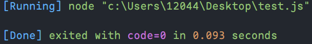

# js 知识要点

## 手写 Promise 核心功能

### 1、初始结构

1. 原生的 Promise 一般都会用 new 来创建一个实例，即我们在创建 Promise 时可以用构造函数或者 class 来创建，这里选择使用 class

   ```js
   class MyPromise {}
   ```

2. 原生 Promise 在创建时，会传入一个函数作为参数，并且这个函数会立即执行

   ```js
   class MyPromise {
   	constructor(func) {
   		func()
   	}
   }
   ```

3. 在传入这个函数参数后，这个函数也有自己的参数，即 resolve 和 reject ，成功和拒绝这两个状态的函数。

   ```js
   class MyPromise {
   	constructor(func) {
   		func(resolve, reject)
   	}
   }
   ```

4. 上面在传入 resolve 和 reject 后，能看出来是有问题的，因为这两个参数并没有在 class 中被我们创建，因此是不存在的，这里我们就需要创建 resolve 和 reject

   ```js
   class MyPromise {
   	constructor(func) {
   		func(this.resolve, this.reject)
   	}

   	resolve() {}

   	reject() {}
   }
   ```

   > 这里可以看出来，在创建 resolve 和 reject 后，我们上面调用的时候在其前面添加了 this 关键字，这是因为在 class 中，我们需要使用 this 关键字来调用自身 class 的方法。

5. 在完成创建 resolve 和 reject 后，我们就需要调用并执行它们。在原生的 Promise 中，调用 resolve 还是 reject 是通过状态来判断的。原生 Promise 有三种状态：pending(待定)、fulfilled(成功)、rejected(拒绝)。因此我们需要提前先定义好这些状态。创建了状态属性后，还需要为每一个实例添加一个状态属性，且默认为 pending，然后在 resolve 或 reject 后对其进行修改。

   ```js
   class MyPromise {
   	static PENDING = "待定"
   	static FULFILLED = "成功"
   	static REJECTED = "拒绝"

   	constructor(func) {
   		this.status = MyPromise.PENDING // 给每个实例添加默认状态
   		func(this.resolve, this.reject)
   	}

   	resolve() {
   		if (this.status === MyPromise.PENDING) {
   			this.status = MyPromise.FULFILLED
   		}
   	}

   	reject() {
   		if (this.status === MyPromise.PENDING) {
   			this.status = MyPromise.REJECTED
   		}
   	}
   }
   ```

6. 在原生 Promise 中，在执行 resolve 或 reject 时，都可以传入一个参数，以便后面进行使用。

   ```js
   class MyPromise {
   	static PENDING = "待定"
   	static FULFILLED = "成功"
   	static REJECTED = "拒绝"

   	constructor(func) {
   		this.status = MyPromise.PENDING // 给每个实例添加默认状态
   		this.result = null // 执行 Promise 后的结果属性
   		func(this.resolve, this.reject)
   	}

   	resolve(result) {
   		if (this.status === MyPromise.PENDING) {
   			this.status = MyPromise.FULFILLED
   			this.result = result
   		}
   	}

   	reject(result) {
   		if (this.status === MyPromise.PENDING) {
   			this.status = MyPromise.REJECTED
   			this.result = result
   		}
   	}
   }
   ```

### 2、this 指向

- 在上面的第 6 步完成后，我们先执行一次 MyPromise，这里会发现它报错了

  ```js
  let myPromise = new MyPromise((resolve, reject) => {
  	resolve("执行测试")
  })
  ```

  

  > 这里报错 status 为 undefined 的，但是上面的代码中我们的 status 是定义了的，并且也使用了 this 关键字。那么就说明这里的 this 的指向出了问题，即我们在 resolve 中使用的 this.status，它并没有使用 constructor 中的 this.status。
  >
  > 我们回到执行 MyPromise 中的 resolve，这里看着像是在创建实例时执行了 resolve，其实不然，就相当于 resolve 中的这个 this 并不是指向 class，所以我们需要对其进行强制绑定，这里可以使用 class、apply、bind。

  ```js
  class MyPromise {
  	static PENDING = "待定"
  	static FULFILLED = "成功"
  	static REJECTED = "拒绝"

  	constructor(func) {
  		this.status = MyPromise.PENDING // 给每个实例添加默认状态
  		this.result = null // 执行 Promise 后的结果属性
  		func(this.resolve.bind(this), this.reject.bind(this))
  	}

  	resolve(result) {
  		if (this.status === MyPromise.PENDING) {
  			this.status = MyPromise.FULFILLED
  			this.result = result
  		}
  	}

  	reject(result) {
  		if (this.status === MyPromise.PENDING) {
  			this.status = MyPromise.REJECTED
  			this.result = result
  		}
  	}
  }
  ```

### 3、then 方法实现

- 创建一个 class 方法 then，在原生 Promise 中，then 可以接收两个参数，分别表示 fulfilled 和 rejected 状态。

  ```js
  class MyPromise {
  	static PENDING = "待定"
  	static FULFILLED = "成功"
  	static REJECTED = "拒绝"

  	constructor(func) {
  		this.status = MyPromise.PENDING // 给每个实例添加默认状态
  		this.result = null // 执行 Promise 后的结果属性
  		func(this.resolve.bind(this), this.reject.bind(this))
  	}

  	resolve(result) {
  		if (this.status === MyPromise.PENDING) {
  			this.status = MyPromise.FULFILLED
  			this.result = result
  		}
  	}

  	reject(result) {
  		if (this.status === MyPromise.PENDING) {
  			this.status = MyPromise.REJECTED
  			this.result = result
  		}
  	}

  	then(onFULFILLED, onREJECTED) {
  		if (this.status === MyPromise.FULFILLED) {
  			onFULFILLED(this.result)
  		}

  		if (this.status === MyPromise.REJECTED) {
  			onREJECTED(this.result)
  		}
  	}
  }
  ```

### 4、执行异常

1. 在原生 Promise 中，直接抛出错误是可以输出的内容的，而我们这里却会直接报错

   

   ```js
   let promise = new Promise((resolve, reject) => {
   	throw new Error("抛出错误")
   }).then(
   	(result) => {
   		console.log(result)
   	},
   	(result) => {
   		console.log(result.message)
   	}
   )
   ```

   

   ```js
   let myPromise = new MyPromise((resolve, reject) => {
   	throw new Error("抛出错误")
   }).then(
   	(result) => {
   		console.log(result)
   	},
   	(result) => {
   		console.log(result.message)
   	}
   )
   ```

   > 要解决这个问题，那么我们就可以在执行 resolve 和 reject 之前，使用 try/catch 来捕获错误，并进行处理。

   ```js
   class MyPromise {
   	static PENDING = "待定"
   	static FULFILLED = "成功"
   	static REJECTED = "拒绝"

   	constructor(func) {
   		this.status = MyPromise.PENDING // 给每个实例添加默认状态
   		this.result = null // 执行 Promise 后的结果属性
   		// 解决直接在 Promise 中抛出错误会报错的问题
   		try {
   			func(this.resolve.bind(this), this.reject.bind(this))
   		} catch (error) {
   			this.reject(error)
   		}
   	}

   	resolve(result) {
   		if (this.status === MyPromise.PENDING) {
   			this.status = MyPromise.FULFILLED
   			this.result = result
   		}
   	}

   	reject(result) {
   		if (this.status === MyPromise.PENDING) {
   			this.status = MyPromise.REJECTED
   			this.result = result
   		}
   	}

   	then(onFULFILLED, onREJECTED) {
   		if (this.status === MyPromise.FULFILLED) {
   			onFULFILLED(this.result)
   		}

   		if (this.status === MyPromise.REJECTED) {
   			onREJECTED(this.result)
   		}
   	}
   }
   ```

2. 原生 Promise 中，如果 then 里面的两个参数如果不是函数的话就要被忽略，而我们这里却会报错。

   

   ```js
   let promise = new Promise((resolve, reject) => {
   	resolve("执行测试")
   }).then(undefined, (result) => {
   	console.log(result.message)
   })
   ```

   

   ```js
   let myPromise = new MyPromise((resolve, reject) => {
   	resolve("执行测试")
   }).then(undefined, (result) => {
   	console.log(result.message)
   })
   ```

   > 这里我们就需要在 then 中进行判断，如果传入的是函数，则不做变化，如果不是函数，则将其转换为函数。

   ```js
   class MyPromise {
   	static PENDING = "待定"
   	static FULFILLED = "成功"
   	static REJECTED = "拒绝"

   	constructor(func) {
   		this.status = MyPromise.PENDING // 给每个实例添加默认状态
   		this.result = null // 执行 Promise 后的结果属性
   		// 解决直接在 Promise 中抛出错误会报错的问题
   		try {
   			func(this.resolve.bind(this), this.reject.bind(this))
   		} catch (error) {
   			this.reject(error)
   		}
   	}

   	resolve(result) {
   		if (this.status === MyPromise.PENDING) {
   			this.status = MyPromise.FULFILLED
   			this.result = result
   		}
   	}

   	reject(result) {
   		if (this.status === MyPromise.PENDING) {
   			this.status = MyPromise.REJECTED
   			this.result = result
   		}
   	}

   	then(onFULFILLED, onREJECTED) {
   		// 解决传入的参数不是函数的问题
   		onFULFILLED = typeof onFULFILLED === "function" ? onFULFILLED : () => {}
   		onREJECTED = typeof onREJECTED === "function" ? onREJECTED : () => {}

   		if (this.status === MyPromise.FULFILLED) {
   			onFULFILLED(this.result)
   		}

   		if (this.status === MyPromise.REJECTED) {
   			onREJECTED(this.result)
   		}
   	}
   }
   ```

### 5、异步

1. 先简单看下原生 Promise 和 我们目前的 MyPromise 之间代码执行顺序的区别

   ```js
   console.log("1")
   let myPromise = new MyPromise((resolve, reject) => {
   	console.log("2")
   	resolve("MyPromise")
   }).then(
   	(result) => {
   		console.log(result)
   	},
   	(result) => {
   		console.log(result.message)
   	}
   )
   console.log("3")

   console.log("=========================================================")

   console.log("1")
   let promise = new Promise((resolve, reject) => {
   	console.log("2")
   	resolve("Promise")
   }).then(
   	(result) => {
   		console.log(result)
   	},
   	(result) => {
   		console.log(result.message)
   	}
   )
   console.log("3")
   ```

   

   > 可以看出来，在执行 resolve 这一步时，原生的 Promise 和 MyPromise 是有区别的，这是因为我们这里还没有对 MyPromise 进行异步操作，这里我们使用 setTimeout 将 resolve 包裹起来，就可以实现异步操作了。

   ```js
   class MyPromise {
   	static PENDING = "待定"
   	static FULFILLED = "成功"
   	static REJECTED = "拒绝"

   	constructor(func) {
   		this.status = MyPromise.PENDING // 给每个实例添加默认状态
   		this.result = null // 执行 Promise 后的结果属性
   		// 解决直接在 Promise 中抛出错误会报错的问题
   		try {
   			func(this.resolve.bind(this), this.reject.bind(this))
   		} catch (error) {
   			this.reject(error)
   		}
   	}

   	resolve(result) {
   		if (this.status === MyPromise.PENDING) {
   			this.status = MyPromise.FULFILLED
   			this.result = result
   		}
   	}

   	reject(result) {
   		if (this.status === MyPromise.PENDING) {
   			this.status = MyPromise.REJECTED
   			this.result = result
   		}
   	}

   	then(onFULFILLED, onREJECTED) {
   		// 解决传入的参数不是函数的问题
   		onFULFILLED = typeof onFULFILLED === "function" ? onFULFILLED : () => {}
   		onREJECTED = typeof onREJECTED === "function" ? onREJECTED : () => {}

   		if (this.status === MyPromise.FULFILLED) {
   			// 解决异步问题1
   			setTimeout(() => {
   				onFULFILLED(this.result)
   			})
   		}

   		if (this.status === MyPromise.REJECTED) {
   			// 解决异步问题1
   			setTimeout(() => {
   				onREJECTED(this.result)
   			})
   		}
   	}
   }
   ```

### 6、回调保存

1. 解决了上面的问题后，依旧有别的问题，这里我们在 new Promise 时，使用 setTimeout 将 resolve 进行包裹，看看原生的 Promise 和 MyPromise 之间的区别

   ```js
   console.log("1")
   let myPromise = new MyPromise((resolve, reject) => {
   	console.log("2")
   	setTimeout(() => {
   		resolve("MyPromise")
   		console.log("4")
   	})
   }).then(
   	(result) => {
   		console.log(result)
   	},
   	(result) => {
   		console.log(result.message)
   	}
   )
   console.log("3")

   console.log("=========================================================")

   console.log("1")
   let promise = new Promise((resolve, reject) => {
   	console.log("2")
   	setTimeout(() => {
   		resolve("Promise")
   		console.log("4")
   	})
   }).then(
   	(result) => {
   		console.log(result)
   	},
   	(result) => {
   		console.log(result.message)
   	}
   )
   console.log("3")
   ```

   

   > Promise 这里输出了两个 4，是因为 MyPromise 中的 4 在这里输出了。从上我们也能看出，MyPromise 中的 resolve 没有执行，那么很可能是 MyPromise 没有执行 then 方法导致的，而没有执行 then 方法则说明 MyPromise 的状态在 resolve 执行时没有变成 fulfilled，即此时的状态为 pendding，因此我们需要在 then 方法中对 pendding 状态进行处理：
   >
   > 1、then 中传入的 resolve 和 reject 函数分别保存
   >
   > 2、在 resolve 和 reject 时，分别执行保存起来的函数
   >
   > 在以上两步修改完之后，我们再执行代码会发现，虽然 MyPromise 输出了，但是输出顺序却有问题，因此我们就如法炮制异步那个步骤的解决办法，将 resolve 和 reject 中的代码使用 setTimeout 包裹起来。

   ```js
   class MyPromise {
   	static PENDING = "待定"
   	static FULFILLED = "成功"
   	static REJECTED = "拒绝"

   	constructor(func) {
   		this.status = MyPromise.PENDING // 给每个实例添加默认状态
   		this.result = null // 执行 Promise 后的结果属性
   		this.resolveCallbacks = [] // 保存传入的 resolve 方法，以便后续使用
   		this.rejectCallbacks = [] // 保存传入的 reject 方法，以便后续使用

   		// 解决直接在 Promise 中抛出错误会报错的问题
   		try {
   			func(this.resolve.bind(this), this.reject.bind(this))
   		} catch (error) {
   			this.reject(error)
   		}
   	}

   	resolve(result) {
   		// 解决异步2
   		setTimeout(() => {
   			if (this.status === MyPromise.PENDING) {
   				this.status = MyPromise.FULFILLED
   				this.result = result
   				this.resolveCallbacks.forEach((callback) => {
   					callback(result)
   				})
   			}
   		})
   	}

   	reject(result) {
   		// 解决异步2
   		setTimeout(() => {
   			if (this.status === MyPromise.PENDING) {
   				this.status = MyPromise.REJECTED
   				this.result = result
   				this.rejectCallbacks.forEach((callback) => {
   					callback(result)
   				})
   			}
   		})
   	}

   	then(onFULFILLED, onREJECTED) {
   		// 解决传入的参数不是函数的问题
   		onFULFILLED = typeof onFULFILLED === "function" ? onFULFILLED : () => {}
   		onREJECTED = typeof onREJECTED === "function" ? onREJECTED : () => {}

   		// 在 pedding 状态时，存储传入的函数，以便后续执行
   		if (this.status === MyPromise.PENDING) {
   			this.resolveCallbacks.push(onFULFILLED)
   			this.rejectCallbacks.push(onREJECTED)
   		}

   		if (this.status === MyPromise.FULFILLED) {
   			// 解决异步问题1
   			setTimeout(() => {
   				onFULFILLED(this.result)
   			})
   		}

   		if (this.status === MyPromise.REJECTED) {
   			// 解决异步问题1
   			setTimeout(() => {
   				onREJECTED(this.result)
   			})
   		}
   	}
   }
   ```

### 7、链式

then 方法返回一个新的 MyPromise，这样就可以链式调用 then 方法

```js
class MyPromise {
	static PENDING = "待定"
	static FULFILLED = "成功"
	static REJECTED = "拒绝"

	constructor(func) {
		this.status = MyPromise.PENDING // 给每个实例添加默认状态
		this.result = null // 执行 Promise 后的结果属性
		this.resolveCallbacks = [] // 保存传入的 resolve 方法，以便后续使用
		this.rejectCallbacks = [] // 保存传入的 reject 方法，以便后续使用

		// 解决直接在 Promise 中抛出错误会报错的问题
		try {
			func(this.resolve.bind(this), this.reject.bind(this))
		} catch (error) {
			this.reject(error)
		}
	}

	resolve(result) {
		// 解决异步2
		setTimeout(() => {
			if (this.status === MyPromise.PENDING) {
				this.status = MyPromise.FULFILLED
				this.result = result
				this.resolveCallbacks.forEach((callback) => {
					callback(result)
				})
			}
		})
	}

	reject(result) {
		// 解决异步2
		setTimeout(() => {
			if (this.status === MyPromise.PENDING) {
				this.status = MyPromise.REJECTED
				this.result = result
				this.rejectCallbacks.forEach((callback) => {
					callback(result)
				})
			}
		})
	}

	then(onFULFILLED, onREJECTED) {
		return new MyPromise((resolve, reject) => {
			// 解决传入的参数不是函数的问题
			onFULFILLED = typeof onFULFILLED === "function" ? onFULFILLED : () => {}
			onREJECTED = typeof onREJECTED === "function" ? onREJECTED : () => {}

			// 在 pedding 状态时，存储传入的函数，以便后续执行
			if (this.status === MyPromise.PENDING) {
				this.resolveCallbacks.push(onFULFILLED)
				this.rejectCallbacks.push(onREJECTED)
			}

			if (this.status === MyPromise.FULFILLED) {
				// 解决异步问题1
				setTimeout(() => {
					onFULFILLED(this.result)
				})
			}

			if (this.status === MyPromise.REJECTED) {
				// 解决异步问题1
				setTimeout(() => {
					onREJECTED(this.result)
				})
			}
		})
	}
}
```

## 类 class

### 定义一个 class

```js
class MyClass {
	constructor(width, height) {
		this.width = width
		this.height = height
	}
}

// 下面这种声明方式也可以
// let MyClass = class {
//   constructor(width, height) {
//     this.width = width
//     this.height = height
//   }
// }
```

上面使用 `class` 定义了一个类，实际上在 js 中，`class` 就是一个**特殊的函数**，我们可以使用 typeof 来进行证明：

```js
console.log(typeof MyClass === "function") // true
```

### 提升

我们知道，在 js 中，函数是会进行提升的，但是上面两种声明方式是不会进行提升的：

```js
console.log(typeof MyClass === "function")
// ReferenceError: Cannot access 'MyClass' before initialization

class MyClass {
	constructor(width, height) {
		this.width = width
		this.height = height
	}
}
```

### 构造函数

[constructor](https://developer.mozilla.org/zh-CN/docs/Web/JavaScript/Reference/Classes/constructor)方法是一个特殊的方法，这种方法用于创建和初始化一个由`class`创建的对象。一个类只能拥有一个名为“constructor”的特殊方法

### 继承 extends

当我们需要一个新的类，这个类又是 MyClass 的子类时，我们就可以使用继承，但是原先 MyClass 中有一些属性，我又不想重新书写一次，那么我们就需要使用`super`关键字来继承父类的构造函数，**因为我们写子类的构造函数时，就是在覆盖原来父类的构造函数**。

```js
class MyNewClass extends MyClass {
	constructor(width, height, color) {
		super(width, height)
		this.color = color
	}
}
```

### 自定义方法

在`class`中，我们可以定义除 constructor 以外的其他方法，这些自定义的方法也可以被子类继承：

```js
class MyClass {
	constructor(width, height) {
		this.width = width
		this.height = height
	}

	show() {
		console.log("MyClass", this.width, this.height)
	}
}

class MyNewClass extends MyClass {
	constructor(width, height, color) {
		super(width, height)
		this.color = color
	}

	newShow() {
		console.log("MyNewClass", this.width, this.height, this.color)
	}
}

let myClass = new MyClass(10, 10)
myClass.show() // MyClass 10 10
let myNewClass = new MyNewClass(10, 10, "red")
myNewClass.show() // MyClass 10 10
myNewClass.newShow() // MyNewClass 10 10 red
```

### static

`class`通过 static 关键字定义静态方法或静态属性，这些静态方法或静态属性**不能在类的实例上调用静态方法，而应该通过类本身调用**。

```js
class MyClass {
	static name = "二师弟"
	static sayName() {
		console.log("name", this.name)
	}

	constructor(width, height) {
		this.width = width
		this.height = height
	}

	show() {
		console.log("MyClass", this.width, this.height)
	}
}

let myClass = new MyClass(10, 10)
MyClass.sayName() // name 二师弟
myClass.sayName() // TypeError: myClass.sayName is not a function
```

### 私有字段

私有字段**只能在类的内部引用，外部无法引用**。私有字段通过`#`区分

```js
class MyClass {
	// Private
	#age = 10
	age = 20
	static name = "二师弟"
	static sayName() {
		console.log("name", this.name)
	}

	static sayAge() {
		console.log("age", this.#age)
	}

	constructor(width, height) {
		this.width = width
		this.height = height
		console.log("age", this.#age)
	}

	show() {
		console.log("MyClass", this.width, this.height)
	}
}

let myClass = new MyClass(10, 10) // age 10
console.log("age", myClass.age) // age 20
console.log("#age", MyClass.sayAge()) // TypeError: Cannot read private member #age from an object whose class did not declare it
console.log("#age", MyClass.#age) // SyntaxError: Private field '#age' must be declared in an enclosing class
console.log("#age", myClass.#age) // 编译器会报错，红色波浪线
```

> 注：js 的`class`中的私有变量不是通过 private 关键字声明的，在 ts 中才是。

## ajax

浏览器自身的`XMLHttpRequest`构造函数用来连接服务器，即常说的网络请求。`XMLHttpRequest`的简写为 xhr。

它有如下几个方法

- `open()`接收三个参数：请求方法、url、是否异步请求
- `send()`接收请求体
- `onreadyStateChange()`用来监控 readyState 属性值的变化

readState 属性值，用来表示各个响应过程：

- 0：未调用 open 方法
- 1：调用了 open 未调用 send
- 2：调用了 send 但还未收到响应
- 3：收到部分响应
- 4：响应接收完了

### 创建 ajax

```js
const xhr = new XMLHttpRequest()
xhr.open("get", "https://api.covid19india.org/v4/min/timeseries.min.json", true)
xhr.onreadystatechange = () => {
	if (xhr.readyState == 4) {
		if (xhr.status == 200) {
			console.log(xhr.response)
		}
	}
}
xhr.send(null)
```

### 使用 promise 封装 ajax

```js
function ajaxPromise() {
	const promsie = new Promise((resolve, reject) => {
		const xhr = new XMLHttpRequest()
		xhr.open("get", "https://api.covid19india.org/v4/min/timeseries.min.json", true)
		xhr.onreadystatechange = () => {
			if (xhr.readyState == 4) {
				if ((xhr.status >= 200 && xhr.status <= 300) || xhr.status == 304) {
					// console.log(xhr.response);
					resolve(xhr.response)
				} else {
					reject(new Error(xhr.statusText))
				}
			}
		}
		xhr.send(null)
	})
	return promsie
}
```

## 图片懒加载

### 方法一：监听 scroll 滚动事件，通过高度判断

```js
const images = document.querySelectorAll("img")

window.addEventListener("scroll", () => {
	images.forEach((image) => {
		// getBoundingClientRect() 方法返回元素的大小及其相对于视口的位置。该方法返回一个 DOMRect 对象，包含了一组用于描述边框的只读属性：left、top、right和bottom，单位为像素。
		if (image.getBoundingClientRect().top < window.innerHeight) {
			// 将图片资源放置在 data-src 属性中，当图片元素出现在视口中时，将 data-src 中的资源赋值给 src 以加载图片资源
			const data_src = image.getAttribute("data-src")
			image.setAttribute("src", data_src)
		}
	})
})
```

> 这种方法有一个缺点：
>
> scroll 事件会触发很多次，如果页面内容很多，会导致内容堆积，且图片资源加载完成后也会持续触发 scroll 事件，对性能有一定影响。

### 方法二：使用 IntersectionObserver

IntersectionObserver 是一种新技术，**可以检测元素是否已出现在视口，并在发生变化时发出通知**。它通常被用于做出更高效的延迟加载、广告曝光追踪或懒加载资源，并**可以帮助减少无意义的加载和渲染资源**。

IntersectionObserver 接受一个回调函数，这个回调函数在被观察的元素进入视口和离开视口时都会被触发。它接收一个参数，这个参数是一个数组，其中包含每个被观察的元素的信息。

- `observer.observe(DOM节点)`：观察这个传入的 DOM 节点
- `observer.unobserve(DOM节点)`：结束观察这个传入的 DOM 节点

```js
const images = document.querySelectorAll("img")
const observer = new IntersectionObserver(callback)

// 观察每个 img 元素
images.forEach((image) => {
	observer.observe(image)
})

// 编写回调函数，这个回调函数在元素进入视口和离开视口时各触发一次
// 这个回调函数接收一个参数，它是一个数组，其中包含每个被观察的元素的信息
const callback = (entries) => {
	entries.forEach((entry) => {
		// isIntersecting 表示这个元素是否进入了视口
		if (entry.isIntersecting) {
			// target 表示这个元素本身
			const image = entry.target
			const data_src = image.getAttribute("data-src")
			image.setAttribute("src", data_src)
			// 给已经进入视口的元素移除观察，以免事件重复触发
			observer.unobserve(image)
		}
	})
}
```

## 防抖和节流

简单点说，防抖就好比电梯的开门关门按钮，在一段时间内你按很多次，但它只会执行一次；节流就像游戏中的技能 CD，隔一段时间就执行一次。

### 防抖

```js
/**
 * 防抖函数
 * @param  {Function} fn    [执行函数]
 * @param  {Number}   delay [间隔时间]
 * @return {Funciton}
 **/
function debounce(fn, delay) {
	let timer = null
	return function () {
		let context = this
		let args = arguments
		clearTimeout(timer)
		timer = setTimeout(function () {
			fn.apply(context, args)
		}, delay)
	}
}
```

### 节流

1. 写法一

   ```js
   /**
    * 节流函数
    * @param  {Function} fn    [执行函数]
    * @param  {Number}   delay [间隔时间]
    * @return {Funciton}
    **/
   function throttle(fn, delay) {
   	let timer = null
   	return function () {
   		let context = this
   		let args = arguments
   		if (timer) {
   			return
   		}
   		timer = setTimeout(function () {
   			fn.apply(context, args)
   			timer = null
   		}, delay)
   	}
   }
   ```

2. 写法二

   ```js
   /**
    * 节流函数
    * @param  {Function} fn    [执行函数]
    * @param  {Number}   delay [间隔时间]
    * @return {Funciton}
    **/
   function throttle(fn, delay) {
   	let preTime = 0
   	return function () {
   		let nowTime = new Date()
   		let context = this
   		let args = arguments
   		if (nowTime - preTime > delay) {
   			fn.apply(context, args)
   			preTime = nowTime
   		}
   	}
   }
   ```
