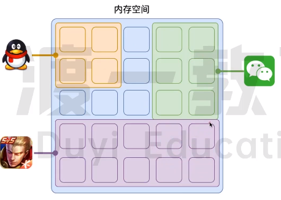
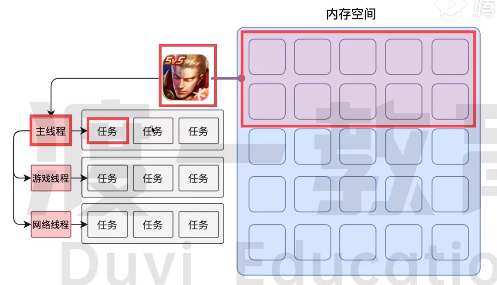
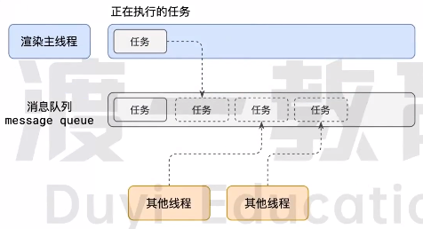
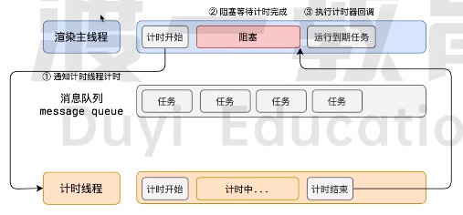
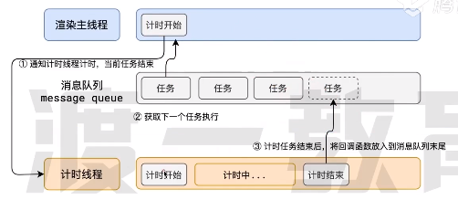

# 事件循环

## 浏览器的进程模型

### 进程

程序运行需要自己专属的内存孔家，可以把这块内存空间简单理解为进程。每个应用至少有一个进程，进程之间相互独立，即便要通信，也需要双方同意。

## 线程

有了进程后，就可以运行程序代码了。运行程序代码的东西就被称之为线程。

一个进程至少需要有一个线程，所以在进程开启时就会自动创建一个线程运行代码，这个线程称之为主线程。

当程序需要执行的代码很多时，主线程就会启动更多的线程来执行这些代码，所以一个进程可以包含多个线程。

### 浏览器的进程和线程

**浏览器是一个多进程多线程的应用程序**

浏览器主要进程：

1. 浏览器进程：

   主要负责界面展示(浏览器标签、后退刷新等按钮、地址栏输入框等)、用户交互、子进程管理等。浏览器进程内部会启动该多个线程处理不同任务。

2. 网络进程：

   负责加载网络资源。网络进程内部会启动多个线程来处理不同的网络任务。

3. 渲染进程：

   渲染进程启动后，会开启一个**渲染主线程**，主线程负责执行 HTML、CSS、JS 代码。

   默认情况下，浏览器会为每一个标签页开启一个新的渲染进程，以保证不同标签页之间相互独立、互不影响。

   > 这种模式的渲染进程在将来可能会改变。

## 渲染主线程

渲染主线程是浏览器中最繁忙的进程，需要它处理的任务如下：

`解析 HTML | 解析 CSS | 计算样式 | 布局 | 处理图层 | 执行 JS 等`

> 为什么渲染进程不使用多个线程来处理这些事情？

在处理这些事情时，浏览器会遇到很多问题，如当其中一个任务在执行阶段时，它里面产生了一个新的任务，那么此时应该继续当前这个任务，还是应该执行新任务。因此**为了更好的调度任务，浏览器主线程使用了一个办法：排队**

1. 在最开始，渲染主线程会进入一个无限循环
2. 每一次循环会检查消息队列中是否有任务存在。如果有，就取出第一个任务执行，完成后再进入下一个循环；如果没有，则进入休眠状态。
3. 其他所有线程(包括其他线程的线程)可以随时向消息队列添加任务。新任务会添加到消息队列的最后。在添加新任务时，如果主线程是休眠状态，则会将其唤醒以执行任务。
4. 以上整个过程，被称为事件循环，也成为消息循环。

## 其他

### 异步

代码在执行时，会遇到一些无法立即执行的任务，如：

- setTimeout、setInterval
- XHR、Fetch
- addEventListener

如果让渲染主线程等待这些任务，就会导致主线程长期处于 **阻塞** 状态，从而导致浏览器 **卡死** 。如以下模型：

浏览器为了防止渲染主线程堵死，选择使用 **异步** 操作来执行。如以下模型

> 任务没有优先级，在消息队列中先进先出。
>
> 但是，**消息队列有优先级** 。
>
> 根据 W3C 最新解释：
>
> - 每个任务都有一个任务类型，同一个类型的任务必须在一个队列，不同类型的任务可以分属于不同的队列。在一次事件循环中，浏览器可以根据实际情况从不同的队列中取出任务执行。
> - 浏览器必须准备一个微队列，**微队列中的任务优先于所有其他任务执行** 。
>
> `随着浏览器的复杂度急剧提升，W3C 不再使用宏队列的说法`
>
> 在目前 chrome 实现中，至少包含下面的队列：
>
> - 延时队列：用于存放计时器到达后的回调任务，优先级中等。
> - 交互队列：用于存放用户操作后产生的事件处理任务，优先级高。
> - 微队列：用户存放需要最快执行的任务，优先级最高。

## 面试题

### 如何理解 JS 的异步

- JS 是一门**单线程语言**，这是因为它运行在浏览器的**渲染主线程**中，而渲染主线程只有一个。

  渲染主线程承担着许多工作，渲染页面、执行 JS 都在其中。

  如果使用**同步**的方式，就有可能导致主线程产生**阻塞**，从而导致消息队列中的很多其他任务无法得到执行。

  这样一来，一方面会导致繁忙的主线程白白浪费时间，另一方面导致页面无法及时更新，给用户造成卡死现象。

  所以浏览器采用异步的方式来避免。具体做法是当某些任务发生时，比如计时器、网络、事件监听，主线程将任务交给其他线程去处理，自身立即结束任务的执行，转而执行后续代码。当前其他线程完成时，将事先传递的回调函数包装成任务，加入到消息队列的末尾排队，等待主线程调度执行。

  在这种异步模式下，浏览器永不阻塞，从而最大限度的保证了单线程的流畅运行。

### 阐述 JS 的事件循环

- 事件循环又叫做消息循环，是浏览器渲染主线程的工作方式。

  在 Chrome 的源码中，它开启一个不会结束的 for 循环，每次循环从消息队列中取出第一个任务执行，而其他线程只需要在合适的时候将任务加入到队列末尾即可。

  过去把消息队列简单分为宏队列和微队列，这种说法目前已经无法满足复杂的浏览器环境，取而代之的是一种更加灵活多变的处理方式。

  根据 W3C 官方的解释，每个任务有不同的类型，同类型的任务必须在同一个队列中，不同的任务可以属于不同的队列。不同的任务队列有不同的优先级，在一次事件循环中，由浏览器自行决定取哪一个队列的任务。但浏览器必须有一个微队列，微队列的任务一定具有最高的优先级，必须优先调度执行。

### JS 中的计时器能做到精确计时吗？为什么？

- 不行
- 计算机硬件没有原子钟，无法做到精确计时。
- 操作系统的计时函数本身就有少量偏差，由于 JS 的计时器最终调用的是操作系统的函数，也就同时拥有这些偏差。
- 按照 W3C 的标准，浏览器实现计时器时，如果嵌套层数超过 5 层，则会带有 4 毫秒的最少时间，这样在计时时间少于 4 毫秒时又带来了偏差。
- 受事件循环的影响，计时器的回调函数只能在主线程空闲时运行，因此又带来了偏差。
