# 浏览器渲染原理

## 渲染 render

将 html 字符串变换成 屏幕上的像素点，这即为渲染。

## 渲染时间点

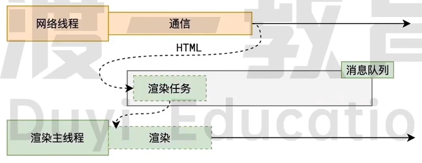

## 渲染流水线

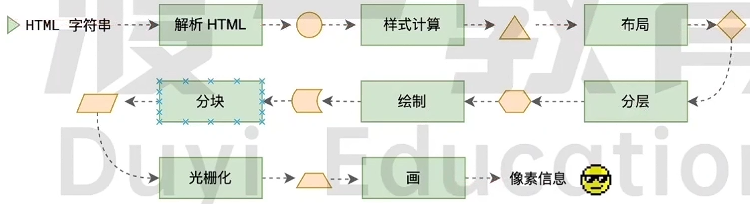

## 解析 HTML

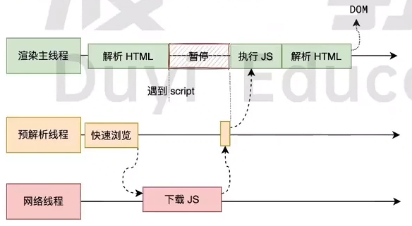

## 样式计算

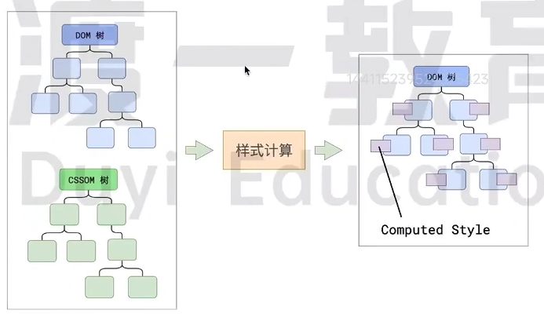

## 布局

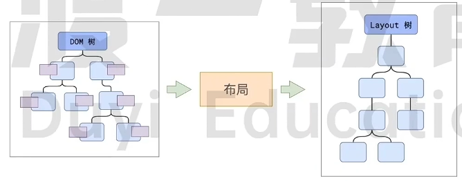

## 分层

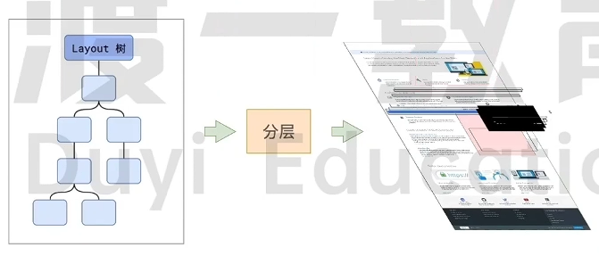

## 绘制

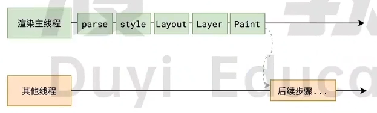

## 分块

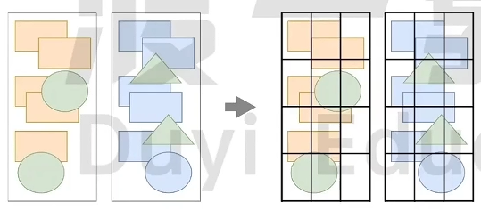

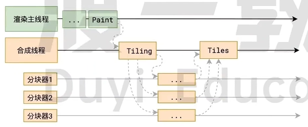

## 光栅化

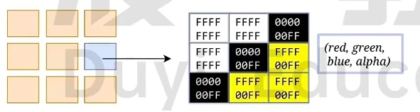

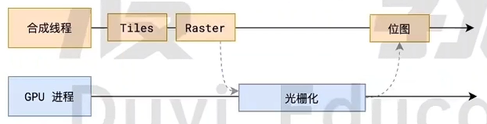

## 画(屏幕成像)

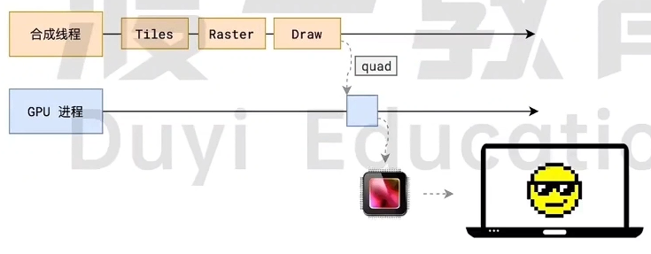

## 绘制的完成过程

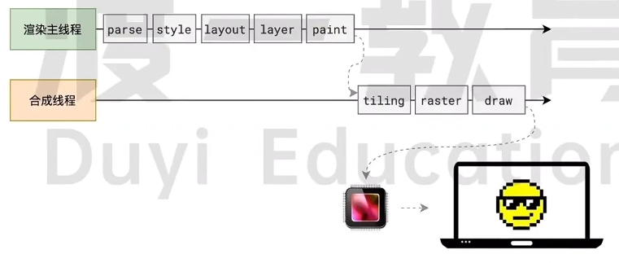

## 面试题

### 浏览器是如何渲染页面的

1. 当浏览器的网络线程收到 HTML 文档后，会产生一个渲染任务，并将其传递给渲染主线程的消息队列。在事件循环机制的作用下，渲染主线程取出消息队列中的渲染任务，开始渲染流程。
2. 整个渲染流程分为多个阶段，分别是：解析 HTML、计算样式、布局、分层、绘制、分块、光栅化、画出内容。每个阶段都有明确的输入输出、上一个阶段的输出成为下一个阶段的输入，这样，整个渲染流程就形成了一套组织严密的生产流水线。
3. 渲染的第一步是解析 HTML 。解析过程中遇到 CSS 解析 CSS，遇到 JS 就执行 JS。为了提高解析效率，浏览器在开始解析前，会启动一个预解析的线程，率先下载 HTML 中的外部 CSS 文件和外部的 JS 文件。
   - 如果主线程解析到 `link` 位置，此时外部的 CSS 文件还没下载解析好，主线程不会等待，继续解析后续的 HTML。这是因为下载和解析 CSS 的工作是在预解析线程中进行的。这就是 CSS 不会阻塞 HTML 解析的根本原因。
   - 如果主线程解析到 `script` 位置，会停止解析 HTML，转而等待 JS 文件下载好，并将全局代码解析执行完成后，才能继续解析 HTML。这是因为 JS 代码的执行过程可能会修改当前的 DOM 树，所以 DOM 树的生成必须暂停。这就是 JS 会阻塞 HTML 解析的根本原因。
   - 在第一步完成后，会得到 DOM 树和 CSSOM 树，浏览器的默认样式、内部样式、外部样式、行内样式均会包含在 CSSOM 树中。
4. 渲染的第二步是样式计算。主线程会遍历得到的 DOM 树，依次为树中的每个节点计算出它最终的样式，称之为 Computed Style。在这一过程中，很多预设值会变成绝对值，比如 `red --> rgb(255, 0, 0)` ；相对单位会变成绝对单位，比如 `2em --> 24px` 。这一步完成后，会得到一个带有样式的 DOM 树。
5. 渲染的第三步是布局，布局完成后会得到布局树。布局阶段会依次遍历 DOM 树的每一个节点，计算每个节点的几何信息。例如节点的宽高、相对包含快的位置。大部分时候，DOM 树和布局树并非一一对应。比如 `display: none` 的节点没有集合信息，因此不会生成到布局树；又比如使用了伪元素选择器，虽然 DOM 树中不存在这些伪元素节点，但它们拥有几何信息，所以会生成到布局树中。还有匿名行盒、匿名块盒等等都会导致 DOM 树和布局树无法一一对应。
6. 渲染的第四步是分层。主线程会使用一套复杂的策略对整个布局树中进行分层。分层的好处在于，将来某一层改变时，仅会对该层进行处理，从而提升效率。滚动条、堆叠上下文、transform、opacity 等样式都会或多或少的影响分层结果，也可以通过`will-change` 属性更大程度的影响分层效果。
7. 渲染的第五步是绘制。主线程会为每个层单独产生绘制指令集，用于描述这一层的内容该如何画出来。
8. 渲染的第六步是分块。完成绘制后，主线程将每个图层的绘制信息提交给合成线程，剩余工作将由合成线程完成。合成线程首先对每个图层进行分块，将其划分为更多的小区域。它会从线程池中拿取多个线程来完成分块工作。
9. 渲染的第七步是光栅化。分块完成后，进入光栅化阶段。合成线程会将块信息交给 GPU 进程，以极高的速度完成光栅化。GPU 进程会开启多个线程来完成光栅化，并且优先处理靠近视口区域的块。光栅化的结果，就是一块一块的 [位图](https://blog.csdn.net/ETalien_/article/details/90752420) 。
10. 渲染的第八步是画。合成线程拿到每个层、每个块的位图后，生成一个个 quad(指引) 信息。指引会标识出每个位图应该画到屏幕的哪个位置，以及会考虑到旋转、缩放等变形。变形发生在合成线程，与渲染主线程无关，这就是 `transform` 效率高的本质原因。合成线程会把 quad 提交给 GPU 进程，由 GPU 进程产生系统调用，提交给 GPU 硬件，完成最终的屏幕成像。

## 什么是 reflow(回流)

- reflow 的本质就是重新计算 layout 树。当进行了会影响布局树的操作后，需要重新计算布局树，会引发 layout。为了避免连续的多次操作导致布局树反复计算，浏览器会合并这些操作，当 JS 代码全部完成后再进行统一计算。所以，改动属性造成的 reflow 是异步完成的。也同样因为如此，当 JS 获取布局属性时，就可能造成无法获取到最新的布局信息。浏览器在反复权衡下，最终决定获取属性立即 reflow。

## 什么是 repaint(重绘)

- repaint 的本质就是重新根据分层信息计算了绘制指令。当改动了可见样式后，就需要重新计算，会引发 repaint。由于元素的布局信息也属于可见样式，所以 reflow 一定会引起 repaint。

## 为什么 transform 的效率高

- transform 发生在合成线程，与渲染主线程无关，这就是 transform 效率高的本质原因。

