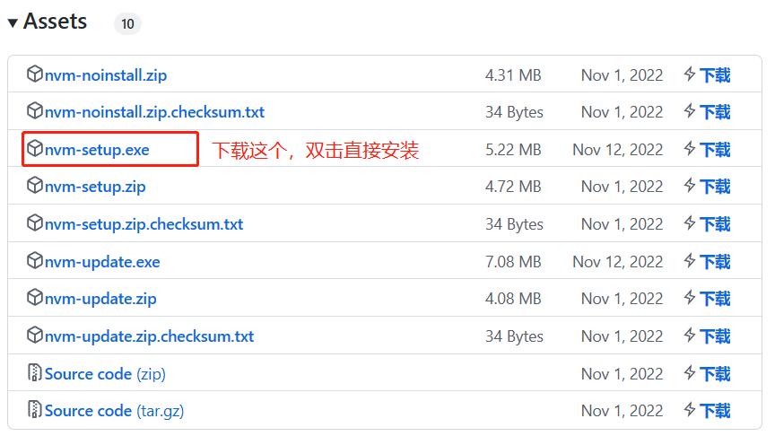

# nvm

## nvm 下载地址

[Releases · coreybutler/nvm-windows (github.com)](https://github.com/coreybutler/nvm-windows/releases)

## 注意事项

如果在安装 nvm 前就已经安装过 nodejs，那么在安装过程中(选择 nvm 的安装路径后的下一步)，需要将已安装的 nodejs 的安装目录配置给 nvm，然后在后续安装过程中会有弹窗提示已经安装过了 nodejs，是否希望将这个 node 版本给 nvm 进行管理，点击确认即可。

如果没有安装过 nodejs，那么在 nvm 安装完成后，通过 nvm 命令安装对应版本 nodejs 即可。

## 使用

下面是一些常用的命令：

- `nvm list available`：查看当前所有的 nodejs 版本
- `nvm list`：查看当前电脑中已安装的 nodejs 版本
- `nvm install xxx`：安装指定版本的 nodejs
- `nvm uninstall xxx`：卸载指定版本的 nodejs
- `nvm use xxx`：将当前电脑的 nodejs 版本切换为指定版本，只能切换已安装过的版本
- `nvm on`：启用 nodejs 版本管理
- `nvm off`：禁用 nodejs 版本管理
