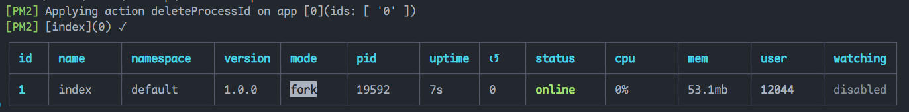

## pm2

```
npm install pm2 -g
```

## 常用命令

### 启动项目

```
pm2 start index.js
```

启动成功会看到如下信息



### 停止

```
pm2 stop 1
// 这个 1 也就是上图中的 id，也可以写 all，这样就是停止所有的
```

### 删除

```
pm2 del 1
pm2 delete 1
// 这个 1 也就是上图中的 id，也可以写 all，这样就是删除所有的
```

### 重启

```
pm2 restart 1
// 这个 1 也就是上图中的 id，也可以写 all，这样就是删除所有的
```

### 查看全部进程

```
pm2 list
```

### watch

```
pm2 start index.js --watch
// --watch 的意思就是监控，作用是当这个文件内容改变后，会自动更新
```

### 负载均衡

```
$ pm2 start app.js -i 3 // 开启三个进程
$ pm2 start app.js -i max // 根据机器CPU核数，开启对应数目的进程
```

[PM2 - Cluster Mode](https://pm2.keymetrics.io/docs/usage/cluster-mode/#automatic-load-balancing)

### 查看日志

```
pm2 logs
```

当然，也可以打开日志文件查看日志

### 监控

```
pm2 monit
```

这个命令可以查看当前通过 pm2 运行的进程的状态

## ts 相关配置

如果我们是使用的 ts 编写的文件，那么就需要一些相关配置，虽然我们可以使用`ts-node`启动项目，但是`ts-node`和`pm2`并不能很好的配合，而且`pm2`也只能启动 js 文件，因此我们就需要先使用`tsc`将 ts 文件转换为 js 文件，但是每次都要手动转换确实很麻烦，因此我们就可以将其写写到命令中

1. `tsconfig.json`：

   ```json
   {
   	"compilerOptions": {
   		"target": "es5", // 打包后的语法
   		"module": "commonjs", // 模块引入规范
   		"outDir": "./dist", // 打包后的文件夹
   		"rootDir": "./", // 参与打包的根目录
   		"strict": true, // 严格模式
   		"esModuleInterop": true,
   		"skipLibCheck": true,
   		"forceConsistentCasingInFileNames": true
   	}
   }
   ```

2. `package.json`：

   ```json
   "scripts": {
   	"test": "echo \"Error: no test specified\" && exit 1",
   	"dev": "ts-node index.ts",
   	"start": "tsc & pm2 start ./dist/index.js"
   },
   ```
