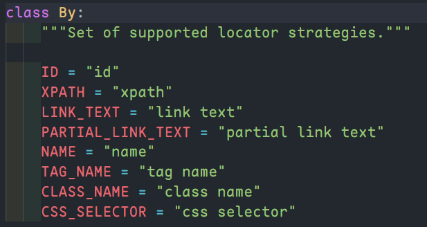

# Selenium

## 安装 selenium

`pip install selenium`

笔记编写时，selenium 版本为 4.9.1

## 下载浏览器驱动器

chrome 浏览器驱动：https://chromedriver.storage.googleapis.com/index.html

## 首先要导入的各个模块和其作用

```python
# 浏览器驱动模块
from selenium import webdriver
# 获取标签元素时，需要使用 By.ID | By.Class_Name 等，
# 这是版本4后的新写法
from selenium.webdriver.common.by import By
# 导入睡眠模块，可以让程序休眠一段时间
from time import sleep
```

## 第一个案例：自动使用百度搜索

```python
from selenium import webdriver
from selenium.webdriver.common.by import By
from time import sleep

# 这里书写驱动器的路径，相对路径或者绝对路径
# 如果将驱动器配置到了系统的环境变量中，也可以不写
driver = webdriver.Chrome(r"./chromedriver/chromedriver.exe")
driver.get("http://www.baidu.com")

input = driver.find_element(By.ID, "kw")
button = driver.find_element(By.ID, "su")

# 向文本框输入内容
input.set_keys("selenium")
button.click()

sleep(3)
# 关闭浏览器
driver.quit()
```

## By 有几种选择器



| 选择器名称        | 选择器内容          | 描述                                                                                                             |
| ----------------- | ------------------- | ---------------------------------------------------------------------------------------------------------------- |
| ID                | "id"                | id 选择器                                                                                                        |
| XPATH             | "xpath"             | xpath，具体看[学爬虫利器 XPath,看这一篇就够了](https://zhuanlan.zhihu.com/p/29436838)                            |
| LINK_TEXT         | "link text"         | 超链接                                                                                                           |
| PARTIAL_LINK_TEXT | "partial link text" | 超链接部分文本                                                                                                   |
| NAME              | "name"              | name 属性                                                                                                        |
| TAG_NAME          | "tag name"          | 标签选择器                                                                                                       |
| CLASS_NAME        | "class name"        | 类选择器                                                                                                         |
| CSS_SELECTOR      | "class selector"    | css 选择器，具体看[CSS 选择器 - CSS：层叠样式表](https://developer.mozilla.org/zh-CN/docs/Web/CSS/CSS_Selectors) |

## 最大化窗口

`driver.maximize_window()`

## 使用类（class），改写第一个案例

```python
from selenium import webdriver
from selenium.webdriver.common.by import By
from time import sleep

class TestCase():
  def __init__(self):
    self.driver = webdriver.Chrome(r"./chromedriver/chromedriver.exe")
    self.driver.get("http://www.baidu.com")
    self.driver.maximize_window()
    pass

  def TestId(self):
    self.driver.find_element(By.ID, "kw").send_keys("selenium")
    self.driver.find_element(By.ID, "kw").click()
    sleep(3)
    self.driver.quit()

if (__name__ == "__main__"):
  case = TestCase()
  case.TestId()
```

## 查找元素

```python
driver.find_element() # 返回找到的第一个匹配的元素
driver.find_elements() # 返回找到的所有匹配的元素
```

> id 只有唯一一个

## webDriver 常用属性

| 属性                  | 描述             |
| --------------------- | ---------------- |
| name                  | 浏览器名称       |
| current_url           | 当前 url         |
| title                 | 当前页面标题     |
| page_source           | 当前页面源码     |
| current_window_handle | 窗口句柄         |
| window_handles        | 当前窗口所有句柄 |

## webDriver 常用方法

| 方法                     | 描述           |
| ------------------------ | -------------- |
| back()                   | 浏览器后退     |
| forward()                | 浏览器前进     |
| refresh()                | 浏览器刷新     |
| close()                  | 关闭当前窗口   |
| quit()                   | 退出浏览器     |
| switch*to*.frame()       | 切换到 frame   |
| switch_to.alert()        | 切换到 alert   |
| switch_to.active_element | 切换到活动元素 |

## 元素的属性

使用`find_element`获取到元素后，可以读取的一些属性

| 属性     | 描述       |
| -------- | ---------- |
| id       | id         |
| size     | 宽高       |
| rect     | 宽高和坐标 |
| tag_name | 标签名称   |
| text     | 文本内容   |

## 元素的方法

使用`find_element`获取到元素后，可以使用的一些方法

| 方法                    | 描述       |
| ----------------------- | ---------- |
| send_keys()             | 输入内容   |
| clear()                 | 清空内容   |
| click()                 | 单击       |
| get_attribute()         | 获取属性值 |
| is_selected()           | 是否被选中 |
| is_enabled()            | 是否可用   |
| is_displayed()          | 是否显示   |
| value_of_css_property() | css 属性值 |

## 下拉列表操作

处理下拉列表，需要用到 Selenium 中的一个工具类 Select，下面列出常用方法和属性

| 方法/属性                  | 描述         |
| -------------------------- | ------------ |
| select_by_value()          | 根据值选择   |
| select_by_index()          | 根据索引选择 |
| select_by_visible_text()   | 根据文本选择 |
| deselect_by_value()        | 根据值反选   |
| deselect_by_index()        | 根据所有反选 |
| deselect_by_visible_text() | 根据文本反选 |
| deselect_all()             | 反选所有     |
| options                    | 所有选项     |
| all_selected_options       | 所有选中项   |
| firse_selected_option      | 第一个选中项 |

```python
from selenium.webdriver.support.select import Select

# 定位下拉列表
select_element = driver.find_element(By.TAG_NAME, "select")
# 实例化工具类 Select
select = Select(select_element)
# 根据值选择内容
select.select_by_value("具体value值")
```

## 操作弹窗，alert、confirm、prompt

```python
# 三种弹窗都使用这个方法获取
alert = driver.switch_to_alert
confirm = driver.switch_to_alert
prompt = driver.switch_to_alert

alert.accept() # 确定
confirm.accept() # 确定
confirm.dismiss() # 取消
prompt.accept() # 确定
prompt.dismiss() # 取消

alert.text # 文本内容
confirm.text # 文本内容
prompt.text # 文本内容
```

## Selenium 三种等待方式

1. sleep()：一般不建议使用，脚本调试时可以使用，更方便

2. implicitly_wait（隐式等待）：对整个 driver 周期都起作用，在最开始设置一次就可以了，不要当作固定等待使用

3. WebDriverWait（显示等待）：最常用的方式，使用的是 Selenium 提供的等待模块

   `from selenium.webdriver.support.wait import WebDriverWait`

WebDriverWait 参数：

1. dirver：传入 WebDriver 实例
2. timeout：设置超时时间
3. poll_frequency：调用 until 或 until_not 中的方法的间隔时间，默认 0.5s
4. ignored_exceptions：忽略的异常

这个模块只有两个方法：until 和 until_not。方法的参数如下：

1. method：等待期间，每隔一段时间调用传入的方法，知道返回值不是 False
2. message：如果超市，抛出 TimeoutException，将 message 传入异常

```python
from selenium.webdriver.support.wait import WebDriverWait
# 这个模块里面有一些期待的等待条件，后面详细解释
from selenium.webdriver.support import expected_conditions

wait = WebDriverWait(driver, 2)
wait.until(expected_conditions.title_is("百度一下，你就知道"))
```

## expected_conditions 模块中的一些等待条件

| 条件                                     | 描述                                                                | 返回值     |
| ---------------------------------------- | ------------------------------------------------------------------- | ---------- |
| title_is()                               | 判断 title 是否出现                                                 | boolean    |
| title_contains()                         | 判断 title 是否包含某些字符                                         | boolean    |
| presence_of_element_located()            | 判断某个元素是否被加入到了 DOM 树中，并不代表该元素一定可见         | WebElement |
| visibility_of_element_located()          | 判断某个元素是否被添加到了 DOM 树中，并且这个元素可见，宽高都大于 0 | WebElement |
| visibility_of()                          | 判断这个元素是否可见，可见就返回这个元素                            | WebElement |
| presence_of_all_elements_located()       | 判断是否至少有一个元素存在于 DOM 树中                               | 列表       |
| visibility_of_any_elements_located()     | 判断是否至少有一个元素在页面中可见                                  | 列表       |
| text_to_be_present_in_element()          | 判断指定的元素中是否包含预期的字符串                                | boolean    |
| text_to_be_present_in_element_value()    | 判断指定的元素的属性值中是否包含了预期的字符串                      | boolean    |
| frame_to_be_available_and_switch_to_it() | 判断该 frame 是否可以 switch 进去                                   | boolean    |
| invisibility_of_element_located()        | 判断某个元素是否存在于 DOM 中或者不可见                             | boolean    |
| element_to_be_clickable()                | 判断某个元素是否可见并且可以点击                                    | boolean    |
| staleness_of()                           | 等待某个元素从 DOM 树中移除                                         | boolean    |
| element_to_be_selected()                 | 判断某个元素是否被选中了，一般用在下拉列表                          | boolean    |
| element_selection_state_to_be()          | 判断某个元素的选中状态是否符合预期                                  | boolean    |
| element_located_selection_state_to_be()  | 判断某个元素的选中状态似乎否符合预期                                | boolean    |
| alert_is_present()                       | 判断页面上是否存在 alert                                            | alert      |

```python
# 引入模块
from selenium.webdriver.support import expected_conditions
# 或者给个别名，这样代码更加精简
# from selenium.webdriver.support import expected_conditions as EC

# 使用方法
expected_conditions.title_is("百度一下，你就知道")

# 别名使用
# EC.title_is("百度一下，你就知道")
```

## Selenium 鼠标和键盘事件

Selenium 中的鼠标和键盘事件被封装在`ActionChains`类中，需要先实例化这个类

它是一个动作链，可以使用很多方法，最后一起执行。

事件如下：

| 方法                                                      | 描述                                           |
| --------------------------------------------------------- | ---------------------------------------------- |
| click(on_element = None)                                  | 单击鼠标左键                                   |
| click_and_hold(on_element = None)                         | 点击鼠标左键，不松开                           |
| context_click(on_element = None)                          | 点击鼠标右键                                   |
| double_click(on_element = None)                           | 双击鼠标左键                                   |
| drag_and_drop(source, target)                             | 拖拽到某个元素，然后松开                       |
| drag_and_drop_by_offset(source, xoffset, yoffset)         | 拖拽到某个坐标，然后松开                       |
| key_down(value, element = None)                           | 按下某个键盘上的键                             |
| key_up(value, element = None)                             | 松开键盘上的某个键                             |
| move_by_offset(xoffset, yoffset)                          | 鼠标从当前位置，移动到某个坐标                 |
| move_to_element(to_element)                               | 鼠标移动到某个元素                             |
| move_to_element_with_offset(to_element, xoffset, yoffset) | 移动到距离某个元素（左上角坐标）多少距离的位置 |
| perform()                                                 | 执行链中的所有动作                             |
| release(on_element = None)                                | 在某个元素位置松开鼠标左键                     |
| send_keys(\*keys_to_send)                                 | 发送某个键到当前焦点的元素                     |
| send_keys_to_element(element, \*keys_to_send)             | 发送某个键到指定元素                           |

```python
# 导入ActionChains模块
from selenium.webdriver import ActionChains
# 导入键盘的 Keys 类
from selenium.webdriver.common.keys import Keys

# 使用一：链式写法
ActionChains(driver).click(btn).perform()

# 使用二：分步写法
action = ActionChains(driver)
action.click(btn)
action.perform()

# 键盘方法，这里是执行了 control + a 操作
input.send_keys(Keys.CONTROL, "a")
```

## Selenium 执行 js 脚本

这里分为同步和异步脚本

1. 同步：execute_script()
2. 异步：exrcute_async_script()

### 例子：滚动到页面底部

```python
js = """
      let scrollHeight = document.body.scrollHeight;
      window.scrollTo(0, scrollHeight);
    """
driver.execute_script(js)
```

## Selenium 屏幕截图

| 方法                             | 描述                                                                        |
| -------------------------------- | --------------------------------------------------------------------------- |
| save_screenshot(filename)        | 获取当前屏幕截图，并保存为指定文件，filename 为指定保存路径或者图片的文件名 |
| get_screenshot_as_base64()       | 获取当前屏幕截图 base64 编码字符串                                          |
| get_screenshot_as_file(filename) | 获取当前屏幕截图，使用完整的路径                                            |
| get_screenshot_as_png()          | 获取当前屏幕截图的二进制文件数据                                            |

## Selenium 定位 frame iframe

| 方法                        | 描述                                                                                                          |
| --------------------------- | ------------------------------------------------------------------------------------------------------------- |
| switch_to.frame(reference)  | 切换 frame，reference 是传入的参数，用来定位 frame，可以传入 id、name、index 以及 selenium 的 WebElement 对象 |
| switch_to.default_content() | 返回主文档                                                                                                    |
| switch_to.parent_frame()    | 返回父文档                                                                                                    |

## 使用 pytesseract 模块和 Pillow 模块实现验证码识别

一般用来识别一些简单的验证码，如下这类


- 安装 pytesseract 和 Pillow

  ```sh
  pip install pytesseract
  pip install Pillow
  # 我安装时提示已经存在这个模块
  ```

整体思路如下：

1. 截屏整个页面
2. 获取验证码的左上角和右下角坐标
3. 根据坐标抠图
4. 使用 pytesseract 模块进行验证

```python
import time
from PIL import Image
import os
from selenium.webdriver.common.by import By

def get_code_img(driver, id):
  # 先将浏览器全屏
  driver.maximize_window()
  # 获取验证码图片
  t = time.time()
  path = os.path.dirname(os.path.dirname(__file__)) + "\\screenshots"
  picture_name1 = path + "\\" + str(t) + ".png"
  # 截屏
  driver.save_screenshot(picture_name1)
  ce = driver.find_element(By.ID, id)
  # 获取坐标
  left = ce.location["x"]
  top = ce.location["y"]
  right = ce.location["weight"] + left
  bottom = ce.location["height"] + top
  # 从截图中抠出验证码
  im = Image.open(picture_name1)
  img = im.crop((left, top, right, bottom))
  # 保存抠出的验证码图片
  t = time.time()
  picture_name2 = path + "\\" + str(t) + ".png"
  img.save(picture_name2) # 这就是验证码图片
  return picture_name2
```

## 使用第三方的 API 来识别验证码

这个就看个人选择了

##
