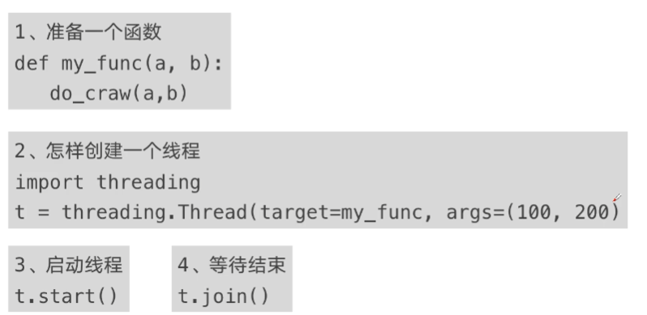

# 并发编程

## 程序提速方法

1. 单线程串行
2. 多线程并发
3. 多 CPU 并行
4. 多机器并行


## python 对并发编程的支持

- 多线程：threading，利用CPU和IO可以同时执行的原理，让CPU不会干巴巴等待IO完成
- 多进程：multiprocessing，利用多核CPU的能力，真正的并行执行任务
- 异步IO：asyncio，在单线程利用CPU和IO同时执行的原理，实现函数异步执行
- 使用Lock对资源加锁，防止冲突访问
- 使用Queue实现不同线程/进程之间的数据通信，实现生产者-消费者模式
- 使用线程池Pool/进程池Pool，简化线程/进程的任务提交、等待结束、获取结果
- 使用subprocess启动外部程序的进程，并进行输入输出交互

## 多线程Thread、多进程Process、多协程Coroutine

### CPU密集型计算、IO密集型计算

- CPU密集型（CPU-bound）：也叫计算密集型，简单来说就是程序中需要CPU进行大量的计算和处理，而I/O在很短时间内就能完成。特点是CPU占用率相当高。

  如：压缩解压缩、加密解密、正则表达式搜索、

- IO密集型（I/O bound）：指程序运行中，大部分情况都是CPU等待IO（硬盘/内存）的读写操作，CPU占用率很低。

  如：文件处理程序、网络爬虫程序、读写数据库程序

### 多线程、多进程、多协程的比较

多线程：

- 优点：可以利用多核CPU并行运算
- 缺点：占用资源最多、可启动数目比线程少
- 适合：CPU密集型计算

多进程：

- 优点：相比进程，更轻量、占用资源少
- 缺点：
  - 相比进程：多线程只能并发执行，不能利用多CPU（GIL）
  - 相比协程：启动数目有限制，占用内存资源，有线程切换开销
- 适合：IO密集型计算、同时运行的任务数目要求不多

多协程：

- 优点：内存开销最少、启动协程数量最多
- 缺点：支持的库有限制（aiohttp vs requests）、代码实现复杂
- 适合：IO密集型计算、需要超多任务运行、但有线程库支持的场景

> 一个进程中可以启动多个线程，一个线程中可以启动多个协程

## 创建多线程的方法



## 简单比较单线程和多线程的速度

创建爬取内容的文件

```python
# cnblog_spider.py

import requests

urls = [
  f"https://www.cnblogs.com#p{page}"
  for page in  range(1, 51)
]
def craw(url):
  r = requests.get(url)
  print(url, len(r.text))
```

1. 单线程：

   ```python
   from cnblog_spider import urls, craw
   import threading
   import time
   
   # 单线程爬取
   def single_thread():
     print("single_thread start")
     for url in urls:
       craw(url)
     print("single_thread end")
     
   if __name__ == "__main__":
     start = time.time()
     single_thread()
     end = time.time()
     print(f"sigle time: {end - start}")
     pass
   ```

   用时如下：

   

2. 多线程

   ```python
   from cnblog_spider import urls, craw
   import threading
   import time
     
   # 多线程爬取
   def multi_thread():
     print("multi_thread start")
     threads = []
     for url in urls:
       # 创建多线程
       threads.append(
         # 因为这个 args 是个元组，所以这里加了个逗号
         threading.Thread(target=craw, args=(url,))
       )
     # 开启多线程
     for thread in threads:
       thread.start()
     # 等待多线程结束
     for thread in threads:
       thread.join()
     print("multi_thread end")
     
   if __name__ == "__main__":
     start = time.time()
     multi_thread()
     end = time.time()
     print(f"multi time: {end - start}")
     pass
   ```

   用时如下：

   

> 可以看到，多线程比单线程用时快了`8.29 / 0.28 = 29.6`倍。
>
> 测试时使用的CPU为：i5-12400f

## 实现生产者-消费者模式爬虫架构

### 多组件的Pipeline技术架构

复杂的事情不会一步到位，一般会有很多的中间步骤，用以降低整体的复杂度。

下面这个流程就叫Pipeline，其中的每个处理器就叫Processor：


上面这个流程中，处理器1就是生产者，它的作用是获取输入数据，然后生成结果给下一个处理器。最后一个处理器就是消费者，它的作用是获取中间数据，生成输出数据返回。

### 生产者-消费者爬虫架构


简单说就是：生产者通过读取待爬取的url列表，将内容下载下来，然后将下载好的网页队列给到中间处理器进行解析，最后将所有的解析结果给到消费者，它将这些内容存入文件或数据库。

### 多线程数据通信

queue.Queue可以用于多线程之间的、线程安全的数据通信。


> `q.put()`会阻塞主线程，即当q已经满了的情况下，它不会向其中put内容，直到有一个数据被取出，空出空间后才会继续put。
>
> `q.get()`也会阻塞主线程，即当q中没有数据时，它会卡住，直到q中有内容能获取，才会继续get。

### 生产者-消费者爬虫简单实例

爬虫程序

```python
# cnblog_spider.py

import requests
from bs4 import BeautifulSoup

urls = [
  f"https://www.cnblogs.com#p{page}"
  for page in  range(1, 51)
]
def craw(url):
  r = requests.get(url)
  # print(url, len(r.text))
  return r.text
  
def parse(html):
  soup = BeautifulSoup(html, "html.parser")
  links = soup.find_all("a", attrs={"class": "post-item-title"})
  return [(link["href"], link.get_text()) for link in links]
```

使用threading和queue实现生产者-消费者功能

```python
import queue
from cnblog_spider import craw, parse, urls
import time
import random
import threading

# 生产者线程执行函数
def do_craw(url_queue: queue.Queue, html_queue: queue.Queue):
  while True:
    url = url_queue.get()
    html = craw(url)
    html_queue.put(html)
    print(threading.current_thread().name, f"craw {url}", f"url_queue.size={url_queue.qsize()}")
    time.sleep(random.randint(1, 2))

# 消费者线程执行函数
def do_parse(html_queue: queue.Queue, fout):
  # fout 是写入内容的文件
  while True:
    html = html_queue.get()
    res = parse(html)
    for result in res:
      fout.write(str(result) + "\n")
    print(threading.current_thread().name, f"res.size {len(res)}", f"html_queue.size={html_queue.qsize()}")
    time.sleep(random.randint(1, 2))
    
if __name__ == "__main__":
  # 创建 url 队列和 html 队列
  url_queue = queue.Queue()
  html_queue = queue.Queue()
  
  # 向 url 队列存入 url 数据
  for url in urls:
    url_queue.put(url)

  # 生产者线程
  for idx in range(3):
    t = threading.Thread(target=do_craw, args=(url_queue, html_queue), name=f"craw{idx}")
    t.start()
  
  # 消费者线程
  fout = open("producer_consumer_spider.txt", "w")
  for idx in range(2):
    t = threading.Thread(target=do_parse, args=(html_queue, fout), name=f"parse{idx}")
    t.start()
```

## python 线程安全问题和解决方案

### 线程安全

线程安全指某个函数、函数库在多线程环境中被调用时，能够正确地处理多个线程之间的共享变量，使程序功能正确完成。

由于线程的执行随时会发生切换，就造成了不可预料的结果，出现线程不安全。

如一个 if 判断，在第一个线程中进入了 if，而还没执行 if 中的语句，第二个线程也进入了 if（但是实际想要的情况是第一个线程的 if 执行了后，第二个线程的 if 条件就不满足了，无法进入），这样就会导致出现错误。

### Lock 用于解决线程安全问题


- 没有加锁的情况

  ```python
  import threading
  from time import sleep
  
  class Account:
    def __init__(self, balance) -> None:
      self.balance = balance
      
  def draw(account, amount):
    if account.balance >= amount:
      # sleep 会导致线程的阻塞，从而切换线程
      sleep(0.1)
      print(threading.current_thread().name, "取钱成功")
      account.balance -= amount
      print(threading.current_thread().name, f"余额：{account.balance}")
    else:
      print(threading.current_thread().name, "取钱失败，余额不足")
      
  
  if __name__ == "__main__":
    account = Account(1000)
    # 创建两个线程
    ta = threading.Thread(name="ta", target=draw, args=(account, 800))
    tb = threading.Thread(name="tb", target=draw, args=(account, 800))
    
    ta.start()
    tb.start()
  ```

  

- 加锁的情况

  ```python
  import threading
  from time import sleep
  
  # 实例化线程锁
  lock = threading.Lock()
  
  class Account:
    def __init__(self, balance) -> None:
      self.balance = balance
      
  def draw(account, amount):
    # 添加线程锁
    with lock:
      if account.balance >= amount:
        # sleep 会导致线程的阻塞，从而切换线程
        sleep(0.1)
        print(threading.current_thread().name, "取钱成功")
        account.balance -= amount
        print(threading.current_thread().name, f"余额：{account.balance}")
      else:
        print(threading.current_thread().name, "取钱失败，余额不足")
      
  
  if __name__ == "__main__":
    account = Account(1000)
    # 启动两个线程
    ta = threading.Thread(name="ta", target=draw, args=(account, 800))
    tb = threading.Thread(name="tb", target=draw, args=(account, 800))
    
    ta.start()
    tb.start()
  ```

  

## python好用的线程池ThreadPoolExecutor

### 线程池的原理


上图是线程的生命周期图。

因为程序中可能会有很多的线程，因此每次新建线程时，就需要分配资源，每次终止线程时，就需要回收资源。这样新建和终止都有一些时间开销，如果一个线程我们可以拿来重用，则可以去除新建和终止的时间开销了，这就是线程池基于的原理。


### 使用线程池的好处

1. 提升性能：因为去掉了大量新建、终止线程的开销，重用了线程资源；
2. 适用场景：适合处理突发性大量请求或需要大量线程完成任务、但实际任务处理时间较短；
3. 防御功能：能有效避免系统因为创建线程过多，而导致系统负荷过大相应变慢等问题；
4. 代码优势：使用线程池的语法比自己新建线程执行线程更加简洁。

### ThreadPoolExecutor的使用语法


使用线程池的代码：

```python
import concurrent.futures
# 从前面的爬虫程序中导入方法和变量
from cnblog_spider import craw, parse, urls

# craw
with concurrent.futures.ThreadPoolExecutor() as pool:
  # urls 是一个列表
  htmls = pool.map(craw, urls)
  htmls = list(zip(urls, htmls))
  for url, html in htmls:
    print(url, len(html))
    
print("craw over")

# parse
with concurrent.futures.ThreadPoolExecutor() as pool:
  futures = {}
  for url, html in htmls:
    future = pool.submit(parse, html)
    futures[future] = url
  
  # 按顺序执行和输出
  for future, url in futures.items():
    print(url, future.result())
  
  # 谁先执行完，谁先输出，乱序的
  for future in concurrent.futures.as_completed(futures):
    url = futures[future]
    print(url, future.result())
```

## 在 Web 服务中使用线程池实现加速

```python
from fastapi import FastAPI
import uvicorn
from concurrent.futures import ThreadPoolExecutor
from time import sleep

app = FastAPI()
pool = ThreadPoolExecutor()

def read_file():
  sleep(0.1)
  return "file done"

def read_db():
  sleep(0.2)
  return "db done"

def read_api():
  sleep(0.3)
  return "api done"

@app.get("/")
def root():
  # 不使用线程池加速的情况下，这三个任务总耗时为三个任务之和，即大概 600ms
  # 使用线程池加速的情况下，这三个任务总耗时为三个任务中耗时最长的任务，即大概300ms
  res_file = pool.submit(read_file)
  res_db = pool.submit(read_db)
  res_api = pool.submit(read_api)
  return {
    "res_file": res_file.result(),
    "res_db": res_db.result(),
    "res_api": res_api.result(),
  }
  
if __name__ == "__main__":
  uvicorn.run(
    app="web_thread_pool:app",
    host="127.0.0.1",
    port=8000,
    reload=True
  )
```

## 使用多进程 multiprocessing 模块加速程序

### 为什么有了多线程，还要使用多进程


上图中的每个 check，都会增加性能损耗，导致减慢运行速度，因此需要多进程。

### 多进程知识梳理

多进程知识对比多线程，我们会发现除了类名之外，其他使用方式几乎一样：


## 在 web 服务中使用多进程加速

这跟使用多线程类似，但是有一个很关键的区别：**多进程创建进程池的代码必须写在 main 中（如果使用的是flask框架，我测试fastapi框架时没有问题）**，如下：

```python
import flask
from concurrent.futures import ProcessPoolExecutor

app = flask.Flask(__name__)
# 如果写在这里会报错
# pool = ProcessPoolExecutor()

# ... 这里省略其他业务代码

if __name__ == "__main__":
  # 写在这里就可以正常运行
	pool = ProcessPoolExecutor()
 	app.run()
```

## 异步IO实现并发爬虫

### 协程：在单线程中实现并发

核心原理：用一个超级循环，即 while True，配合IO多路复用原理（IO执行时，CPU可以执行其他任务）


### 异步IO库：asyncio


### 异步IO爬虫示例：

```python
import asyncio
# 因为 requests 不支持 asyncio，因此需要 aiohttp 这个库
import aiohttp
import time

async def async_craw(url):
  print(f"craw url: {url}")
  async with aiohttp.ClientSession() as session:
    async with session.get(url) as resp:
      # 这里的 await 等待时，会触发下一个任务的执行
      result = await resp.text()
      print(f"craw url: {url}, {len(result)}")
      
loop = asyncio.get_event_loop()
# url列表：包含所有要爬取的页面
urls = [
  f"https://www.cnblogs.com#p{page}"
  for page in  range(1, 51)
]
# 任务列表：给每个网页的爬取都创建一个任务
tasks = [
  loop.create_task(async_craw(url))
  for url in urls
]

start = time.time()
# 执行任务，直到全部完成
loop.run_until_complete(asyncio.wait(tasks))
end = time.time()
print(f"time is: {end - start}")
```


### 使用信号量控制异步IO的并发量


上面的代码的改造：

```python
import asyncio
import aiohttp
import time

async def async_craw(url):
  # 控制并发量
  async with sem:
    print(f"craw url: {url}")
    async with aiohttp.ClientSession() as session:
      async with session.get(url) as resp:
        result = await resp.text()
        print(f"craw url: {url}, {len(result)}")
      
loop = asyncio.get_event_loop()
# 控制并发量
sem = asyncio.Semaphore(10)
urls = [
  f"https://www.cnblogs.com#p{page}"
  for page in  range(1, 51)
]
tasks = [
  loop.create_task(async_craw(url))
  for url in urls
]

start = time.time()
loop.run_until_complete(asyncio.wait(tasks))
end = time.time()
print(f"time is: {end - start}")
```


