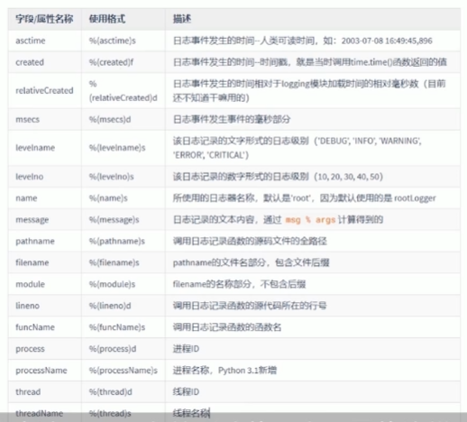
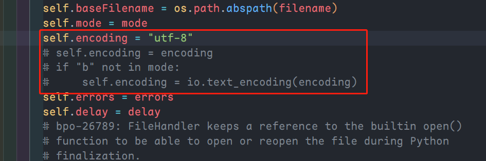

# 日志模块

## 导入模块

`import logging`

## 日志的级别

级别由低到高：

1. DEBUG：最详细的日志信息，经典应用changing是问题诊断
2. INFO：信息详细程度仅次于DEBUG，通常只记录关键节点信息，用于确定一切是按照我们预期的那样工作的
3. WARNING：当某些不期望的事情发生时记录的信息（如，磁盘可用空间较低），但是此时应用程序还是正常运行的
4. ERROR：由于一个更严重的问题导致某些功能不能正常运行时记录的信息
5. CRITICAL：当发生严重错误，导致应用程序不能继续运行时记录的信息

## 使用方式

### 方式一：使用logging提供的模块级别的函数

```python
import logging

# 设定日志输出的级别
logging.basicConfig(level = logging.INFO)

# 输出不同级别的日志
logging.debug("debug")
logging.info("info")
logging.warning("warning")
logging.error("error")
logging.critical("critical")

# 输出一条严重级别为 level 的日志记录，这是上面哪些方法的概括性使用
# logging.log(level, *args, **kwargs)
```

### 方式二：使用logging日志系统的四大组件

1. loggers：提供应用程序代码直接使用的接口
2. handlers：用于将日志记录发送到指定的目的位置
3. filters：提供更精细的日志过滤功能，用于决定哪些日志记录会被输出（其他日志记录将被忽略）
4. formatters：用于控制日志信息的最终输出格式

`logging.basicConfig()`函数说明：

| 参数名   | 描述                                                         |
| -------- | ------------------------------------------------------------ |
| filename | 指定日志输出目标文件的文件名，指定该设置项后，日志信息就不会输出到控制台了 |
| filemode | 指定日志文件的打开模式，默认为“a”。需要注意的是，该选项要在指定filename时才生效 |
| format   | 指定日志格式字符串，即日志输出时的各个字段信息和顺序         |
| datefmt  | 指定日期/时间格式。需要注意的是，改选共享需要在format中包含时间字段`%(asctime)s`时才有效 |
| level    | 指定日志级别                                                 |
| stream   | 指定日志输出目标stream，如sys.stdout、sys.stderr以及网络stream。需要说明的是，stream和filename不能同时提供，否则会出现`ValueError`异常 |
| style    | Python3.2中新添加的配置项。指定format格式字符串的风格，可取值为`"%"、"{}"、"$"`，默认为 % |
| handlers | Python3.3中新添加的配置项。该选项如果被指定，它应该是一个创建了多个Handler的可迭代对象，这些handler将会被添加到root logger。需要说明的是：filename、stream和handlers这三个配置项只能有一个存在，不能同时出现2个或3个，否则会出现`valueError`异常。 |

`logging`模块的格式字符串：



```python
import logging

# 设定日志输出路径
path = os.path.dirname(__file__) + "\\log.log"
# asctime为日志写入时间、filename为执行的文件、message为写入的信息
format_str = "%(asctime)s %(filename)s %(message)s"
logging.basicConfig(
  level=logging.INFO,
  filename=path,
  format=format_str
)
# “hahahah” 就是上面的 message
logging.info("hahahah")
```

## 解决日志中文乱码问题

1. 首先在代码中书写`logging.FileHandler()`
2. 然后按住 Control，点击 FileHandler，跳转到其源代码
3. 注释掉关于`self.encoding`相关的代码
4. 添加`self.encoding = 'utf-8'`
5. 保存文件，完成

