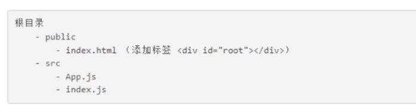
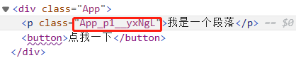
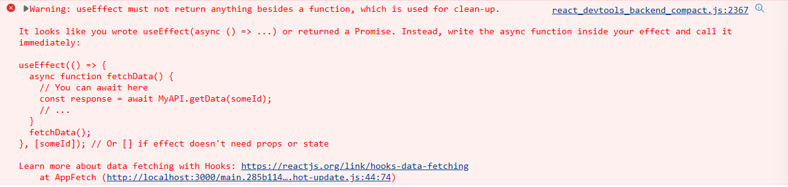

# react18

## 前言

这个学习笔记是学习[b 站 | 李立超老师 | React18 教程](https://www.bilibili.com/video/BV1bS4y1b7NV?p=13&vd_source=16ba8f2131220773e361fb00f3cb12fb)的记录。

## react 中三个常用的 api

1. `React.createElement()`：它用来创建一个 react 元素，这个 react 元素并不是真正的 DOM 元素。它有三个参数：

   1. 元素名/组件名：html 标签必须小写
   2. 元素的属性：如 id、class 等
      - 在设置事件时，属性名需要修改为驼峰命名法
      - class 属性需要使用 className 来设置
   3. 子元素/文本内容：可以有多个，多个使用逗号隔开

   ```js
   const button = React.createElement("button", {
     id: "btn",
     type: "button",
     className: "btn1",
     onClick: () => alert("haha")
   }, "点击")

   const div = React.createElement("div", {}, button, "点击前面的按钮")
   ```

2. `ReactDOM.createRoot()` ：它用来创建 react 根元素，需要一个 DOM 元素作为参数。

   ```js
   const root = ReactDOM.createRoot(document.querySelector("#root"))
   ```

3. `.render()`：它用来将 react 元素渲染到根元素中。

   - 一般一个页面中只有一个根元素
   - 它会清除根元素中的所有内容，然后用 react 元素替代
   - 当重复调用这个方法时，react 会将两次的渲染结果进行比较，然后只修改发生变化的部分（diff 算法/DOM 差分算法）

   ```js
   const button = React.createElement("button", {
     id: "btn",
     type: "button",
     className: "btn1",
     onClick: () => alert("haha")
   }, "点击")
   const div = React.createElement("div", {}, button, "点击前面的按钮")
   const root = ReactDOM.createRoot(document.querySelector("#root"))
   
   root.render(div)
   ```

`render`的旧版本用法如下：`ReactDOM.render(div, document.querySelector("#root"))`。

## JSX

在上一节，我们了解到了一个方法`React.createElement()`，它的作用如下：

```js
// 当我们写下这句话时，其实我们想要它实现的效果为：<button>我是按钮</button>
const button = React.createElement("button", {}, "我是按钮")
```

因此，react 在这里拓展了 jsx 语法。

```jsx
const button = <button>我是按钮</button>
```

在 react 中可以通过 jsx 来创建 react 元素，但是 jsx 需要被翻译为 js 代码才能被 react 执行，因此我们需要引入 babel。jsx 是 js 的拓展，或者说它是`Reqact.createElement()`的语法糖。

jsx 的注意事项：

1. jsx 不是字符串，不要加引号，可以使用()

   ```jsx
   const div = (
     <div>
       <button>我是按钮</button>
     </div>
   )
   ```

2. jsx 中的 html 标签应该小写，但是 react 组件应该以大写开头

3. jsx 中有且只有一个根组件

4. jsx 的标签必须正确结束（自结束标签必须写"/"）

5. 在 jsx 中，可以使用 {} 嵌入表达式

   - 如果表达式是`空值、boolean、undefined`，则不会显示

   ```jsx
   const div = <div>
     {name}
     <div>{1 + 1}</div>
     <div>{fn(0)}</div>
     <div>{true}</div>
   </div>
   ```

6. 在 jsx 中，属性可以直接在标签中设置

   - class 需要使用 className 设置
   - style 中必须使用对象设置，多单词组合需要使用驼峰形式，如`background-color => backgroundColor`

   ```jsx
   const div = <div
                 id="mydiv"
                 className="box"
                 style={{
             			color: "red",
                   backgroundColor: "gray"
           		}}></div>
   ```

## 渲染列表

jsx 会将数组中的内容自动提取出来进行填充，如：

```jsx
const arr = ["zhangsan", "lisi", "wangwu"]
const div = <div>{arr}</div>
// 这里的结果为 <div>zhangsanlisiwangwu</div>
```

因此，我们可以利用这个特点，依据原有的数组，生成一个新的数组，这个新的数组中的内容为 react 元素：

```jsx
const arr = ["zhangsan", "lisi", "wangwu"]
let lis = arr.map(item => <li>{item}</li>)
// 这个数组为 ["<li>zhangsan</li>", "<li>lisi</li>", "<li>wangwu</li>"]
const list = <ul>{lis}</ul>
// 这里结果为：<ul> <li>zhangsan</li> <li>lisi</li> <li>wangwu</li> </ul>
```

这样，就得到了我们想要的列表。

::: tip

在渲染列表时，每个列表元素都应该给一个唯一的 key。如下，这里的`item.key`只是示例，这个 key 也可以是其他的唯一标识：

`let lis = arr.map(item => <li key="item.key">{item}</li>)`

如果不指定 key，react 会按顺序从列表第一个对比到最后一个，有 key，则会根据 key 去进行比较。这样的区别在于，如果我们列表中的改变是某些元素的顺序变了（如在某个地方插入了一个属性），则没有 key 时，react 会更新从插入元素开始的所有元素，而有 key 时，则只会更新插入的元素。

:::

## 手动创建 react 项目

在创建 react 项目时，我们可以选择使用 npm 等作为包管理器来对项目进行管理。react 官方为了方便我们的开发，提供了`react-scripts`包，这里面提供了项目开发中的大部分依赖，大大简化了项目开发。

开发步骤如下：

1. 创建项目，目录结构如下：

   

2. 进入项目目录，执行命令初始化项目：`npm init -y`

3. 安装项目依赖：`npm install react react-dom react-scripts -S`

4. 在`public/index.html`中添加一个根元素`<div id="root"></div>`

5. 在`scr/index.js`中添加一点代码：

   ```js
   // 引入 ReactDOM
   import ReactDOM from "react-dom/client"

   // 创建一个 jsx
   const App = <div>
     <h1>这是一个 react 项目</h1>
     <p>这是手动创建的项目</p>
   </div>

   // 获取根元素
   const root = ReactDOM.createRoot(document.querySelector("#root"))
   root.render(App)
   ```

6. 然后在终端中使用`npx react-scripts start`或者`npx react-scripts build`可以启动项目或者打包项目。但是这样命令太长，因此我们可以在`package.json`中添加如下代码：

   ```json
   // 这里可以省略 npx，写上也是一样的效果
   "scripts": {
     "dev": "react-scripts start",
   	"build": "react-scripts build"
   },
   ```

7. 最后我们使用`npm run dev`或者`npm run build`就可以启动项目或者打包了

## 自动创建 react 项目

`npx create-react-app 项目名`

## react 组件

react 中定义组件的方式有两种：基于函数的组件和基于类的组件。

### 函数式组件

函数组件就是一个返回 jsx 的普通函数，简单示例如下：

```js
/* 在 App.js 中创建组件，并导出 */
const App = () => {
  return <div>我是一个函数组件</div>
}

export default App


/* 在 index.js 中引入组件，并使用 */
// 引入 ReactDOM
import ReactDOM from "react-dom/client"
// 引入样式
import "./index.css"
// 引入组件
import App from "./App"

// 获取根元素
const root = ReactDOM.createRoot(document.querySelector("#root"))
// 渲染 App 组件
root.render(<App />)
```

### 类组件

```js
import React from "react"

// 类组件必须要继承 React.Component
class App extends React.Component {
  // 类组件中，必须添加一个 render() 方法，且方法的返回值要是一个 jsx
  render() {
    return <div>我是一个类组件</div>
  }
}

export default App
```

::: tip

1. 相较于函数组件，类组件的书写要麻烦一些，但是它们的作用是一样的。
2. 我们一般会在`src`中创建一个文件夹`Components`专门用来放置组件文件。

:::

## 事件

在 react 中，事件需要通过元素的属性来设置，且事件的属性需要使用驼峰命名法，如：

- onclick => onClick
- onchange => onChange
- 不能使用类似`addEventListener`的方法给元素绑定事件，不会生效

属性值不能直接执行代码，而是需要一个回调函数，不能写此类代码：

- onClick="alert(123)"，这类代码在第一次渲染组件的时候就会直接执行
- onClick="{() => alert(123)}"，这类代码会在点击的时候才执行

::: tip 要给事件传递参数时

如果我们的事件需要传递一些参数，则应该使用如下写法，才能保证代码正常运行：

```jsx
<div onClick={(e) => addHandler(id)}></div>
```

:::

完整示例代码：

```jsx
const test = () => {
  // 事件
	const clickEvent = (event) => {
	  event.preventDefault() // 取消默认行为
	  event.stopPropagation() // 取消冒泡
	  alert(123)
	}

  // 绑定事件
  return <button onClick={clickEvent}>点我</button>
}

export default test
```

在 react 中，无法通过`return false`取消默认行为。

- react 事件中同样会传递事件对象，可以在响应函数中定义参数来接收事件对象
- react 中的事件对象不是原生的事件对象，是经过 react 包装后的事件对象
- 由于对象进行了包装，所以使用过程中我们无需再去考虑兼容性问题

## Props 父组件给子组件传值

### 函数组件

```jsx
/* 父组件 */
import Son from "./Son"
const Father = () => {
  // 绑定事件
  return <div>
    {/* test 就是父组件给子组件传的一个参数 */}
    	<Son test="123" />
    </div>
}

export default Father
```

```js
/* 子组件，son */
const Son = (props) => {
  // 这个 props 中就包含父组件给子组件传递的所有参数，这里是:{test: '123'}
  // 绑定事件
  return <button onClick={clickEvent}>{props.test}</button>
}

export default Son
```

::: tip

函数式组件中，在函数中传入一个`props`参数，这个参数中就包含父组件给子组件传递的所有的数据。

在子组件中使用`props.xxx`就可以使用相应的数据。

**`props`是只读的，不能修改。**

:::

### 类组件

类组件中的`props`是存储到类的实例对象中的，可以直接通过实例对象访问：`this.props.xxx`。

## state：响应式数据

在 react 中，当组件渲染完毕后，再修改组件中的变量，不会使组件重新渲染。因此我们就需要一个特殊的变量，这个变量的功能就是当它发生变化时，会使得组件重新渲染。因此 react 给我们提供了 state 来解决这个问题。

`state`和`props`类似，都是一种存储属性的方式，但是不同点在于`state`只属于当前组件，其他组件无法访问，且`state`是可变的，当其发生变化后，相关的组件会一起刷新。

`state`相当于一个变量，只是它在 react 中进行了注册，react 会监控这个变量的变化，当 state 发生变化时，会自动触发组件的重新渲染，使得我们的修改可以在页面中呈现出来。

### 函数组件中

在函数组件中，我们需要通过钩子函数`useState()`获取`state`。

`useState()`会返回一个数组，数组中包含两个数据：

1. 第一个元素就是我们传入的初始值，它只用来显示数据，直接修改不会触发组件的重新渲染
2. 第二个元素是一个函数，通常我们将其命名为`SetXxx`，这个函数用来修改`state`，调用其修改`state`后会触发组件的重新渲染，并且使用函数中的值作为新的`state`的值

```jsx
import { useState } from "react"
import React from 'react'

const SetState = () => {
  console.log("SetState 组件渲染")

  const [counter, setCounter] = useState(12)

  const addHandler = () => {
    setCounter(counter + 1)
    console.log(counter)
  }
  const lessHandler = () => {
    setCounter(counter - 1)
    console.log(counter)
  }

  return (
    <div>
      <h1>{counter}</h1>
      <button onClick={addHandler}>add</button>
      <button onClick={lessHandler}>less</button>
    </div>
  )
}

export default SetState
```

::: warning

1. 当`state`的值是对象时，修改`state`其实是使用新的对象替换旧的对象，这样就会导致如果新对象中缺少某些属性，则会丢失这些属性。因此我们可以使用浅拷贝的方法去实现更新：

   ```js
   const [user, setUser] = useState({name: "zhangsan", age: 18})

   // 方法一：
   const newUser = Object.assign({}, user)
   newUser.age = 28
   setUser(newUser)

   // 方法二：
   setUser({...user, name: "lisi"})
   ```

2. 当通过`setState()`去修改一个`state`时，它并不是修改了当前的`state`，而是修改了组件下一次渲染的`state`。

3. `setState()`会触发组件的重新渲染，它是异步的。当检测到有`setState()`时，会先将其放入任务队列，然后一直等待所有代码执行完毕后，才会执行这个任务队列，并且同一任务队列中相同的`setState()`会合并执行，只执行一次。

4. 当调用`setState()`需要用旧的`state`的值时，一定要注意有可能出现计算错误的情况，即多次修改使用的是同一个`state`的值。为了避免这种情况，我们可以通过为`setState()`传递回调函数的形式来修改`state`。

   ```js
   const addHandler = () => {
     // 这个 setTimeout 是模拟代码执行速度慢时，快速点击按钮导致多次修改state时出错的情况
     setTimeout(() => {
       // setState() 中回调函数的返回值将会成为新的state值，
       // 回调函数执行时，react会将最新的state作为参数传递，
       // 它会保证每次的setState的使用的state都是最新的，不会多次使用同一个
       setCounter((preCounter) => preCounter + 1)
     }, 1000)
   }
   ```

:::

### 类组件中

类组件中的`state`统一存储到实例对象的`state`属性中，可以通过`this.state`来访问，通过`this.setState()`来对其进行修改。

```jsx
import React, { Component } from 'react'

export default class ClassCom extends Component {
  state = {
    count: 0,
    user: {
      name: "张三",
      age: 18
    }
  }

  clickHandler = () => {
    // this.setState({ count: this.state.count + 1 })
    this.setState(prevState => {
      return {
        count: prevState.count + 1
      }
    })
    console.log(this.state)
  }

  render() {
    return (
      <div>
        <h1>{this.state.count}</h1>
        <button onClick={this.clickHandler}>click</button>
      </div>
    )
  }
}
```

::: tip

当我们通过`this.setState()`修改`state`时，react 只会修改我们设置要修改的属性，其他属性不会丢失，但是这仅限于直接存储于`state`中的属性，深层次的会丢失，如：

```js
state = {
  user: {
    name: "张三",
    age: 18
  }
}
clickHandler = () => {
  this.setState(prevState => {
    return {
      // 这里会丢失 age 属性
      // user: { name: "李四" }
      // 这样就不会丢失 age 了
      user: {...prevState.user, name: "李四"}
    }
  })
}
```

:::

### 双向绑定

如果我们将`state`绑定在 input 标签上，要实现在 input 中输入数据也能同步修改`state`的效果，则需要给 input 绑定一个事件`onChange`，将我们输入的数据更新到`state`。

```jsx
import { useState } from "react"
import React from 'react'

const SetState = () => {
  console.log("SetState 组件渲染")

  const state = useState(12)
  const [counter, setCounter] = state

  const addHandler = () => {
    setCounter(counter + 1)
    console.log(counter)
  }
  const lessHandler = () => {
    setCounter(counter - 1)
    console.log(counter)
  }
  // 绑定 onChange 事件，实现双向数据绑定
  const changeHandler = (event) => {
    console.log(event.target.value)
    setCounter(event.target.value)
  }
  return (
    <div>
      <h1>{counter}</h1>
      <input value={counter} onChange={changeHandler} />
      <button onClick={addHandler}>add</button>
      <button onClick={lessHandler}>less</button>
    </div>
  )
}

export default SetState
```

## Ref：获取 DOM 对象

### 函数组件

- 我们可以通过 js 原生的方式来获取 DOM，但是不建议这么做

- 直接从 react 处获取 DOM 对象

  1. 创建一个存储 DOM 对象的容器，使用`useRef()`钩子函数

     ```jsx
     import { useRef } from "react"
     import React from 'react'

     const SetState = () => {
     	// 创建存储DOM对象的容器
       const h1Ref = useRef()

       const clickHandler = () => {
         console.log(h1Ref)
       }
       return (
         <div>
           <h1>哈哈</h1>
           <button onClick={clickHandler}>click</button>
         </div>
       )
     }

     export default SetState
     ```

     ::: tip

     1. react 中的钩子函数只能用于函数组件或者自定义钩子
     2. 钩子函数只能直接在函数组件中调用

     :::

  2. 将容器设置为想要获取 DOM 对象元素的`ref`属性

     ```jsx
     import { useRef } from "react"
     import React from 'react'
     
     const SetState = () => {
     	// 创建存储DOM对象的容器
       const h1Ref = useRef()
     
       const clickHandler = () => {
         console.log(h1Ref)
       }
       return (
         <div>
         	{/* 设置 h1 的 ref 属性 */}
           <h1 ref={h1Ref}>哈哈</h1>
           <button onClick={clickHandler}>click</button>
         </div>
       )
     }
     
     export default SetState
     ```

::: tip

`useRef()`返回的就是一个普通的 js 对象，所以我们直接使用`{current: null}`创建一个 js 对象，也可以代替`useRef()`，但是我们自己创建的对象在组件重新渲染时，每次都会创建一个新对象，这个新对象与上一次的对象不是同一个，而`useRef()`创建的对象可以保证每次渲染的对象都是同一个对象。

当我们需要一个对象不会因为组件的重新渲染而改变时，就可以使用`useRef()`，在获取 DOM 对象时，我们建议使用`useRef()`。

:::

### 类组件

流程与函数组件类似，如下：

```jsx
import React, { Component } from 'react'

export default class ClassCom extends Component {
  // 创建容器存储DOM对象
  h1Ref = React.createRef()

  clickHandler = () => {
    console.log(this.h1Ref)
  }

  render() {
    return (
      <div>
        <h1 ref={this.h1Ref}>test</h1>
        <button onClick={this.clickHandler}>click</button>
      </div>
    )
  }
}
```

## 标签插入内容：可以理解为 vue 插槽

`props.children`可以获取到给组件中插入的内容：

```jsx
/* Card.js */
import React from 'react'

const Card = (props) => {
  return (
    // 这样表示我们不光要使用自己的样式，也要使用传入过来的组件的样式
    <div className={`card ${props.className}`}>{props.children}</div>
  )
}

export default Card
```

```jsx
/* App.js */
import StudyLogs from "./Components/StudyLogs/StudyLogs"
import Card from './Components/Card/Card'

const App = () => {
  return <div>
    <Card >
      {/* 将 StudyLogs 组件插入到 Card 中 */}
      <StudyLogs />
    </Card>
  </div>
}

export default App
```

## 提取公共数据

当遇到一个数据需要被多个组件使用时，我们可以将数据放入到这些组件共同的祖先元素中，这样就可以使得多个组件都能方便的访问到这个数据。

## 子组件给父组件传值

使用自定义事件，即在父组件中定义一个事件，然后传递给子组件，子组件调用这个事件，并将父组件需要的数据以函数参数的形式传递过去。

- 父组件：

  ```jsx
  import LogsForm from "./Components/LogsForm/LogsForm"

  const App = () => {
    // 定义一个事件
    const saveLoghandler = (newLog) => {
      console.log(newLog)
    }

    return <div>
      {/* 将自定义事件传递给子组件 */}
      <LogsForm onSaveLog={saveLoghandler} />
    </div>
  }

  export default App
  ```

- 子组件

  ```jsx
  import React from 'react'
  import { useState } from 'react'
  
  const LogsForm = (props) => {
    const [date, setDate] = useState("")
  
    const dateChangeHandler = (e) => {
      setDate(e.target.value)
    }
    const addHandler = () => {
      const newLog = {
        date: new Date(date),
      }
      // 子组件调用父组件传递的事件，并将需要的数据传递过去
      props.onSaveLog(newLog)
      setDate("")
    }
  
    return (
      <div>
        日期：<input type="date" value={date} onChange={dateChangeHandler} /> <br />
        <button onClick={addHandler}>添加</button>
      </div>
    )
  }
  
  export default LogsForm
  ```

## portal：传送组件，可以理解为 vue3 的 teleport

一般来说，组件会默认作为父组件的后代渲染到页面中，但是在有些情况下，这种方式会带来一些问题，如一些弹窗组件会因为其父组件的 css 中包含定位或设置层级的样式而出错。

这是我们可以通过`portal`将组件渲染到页面中的指定位置。使用步骤如下：

1. 在`index.html`中添加一个新的元素，用于专门渲染这个传送组件：

   ```html
   <body>
     <!-- 这个是根元素 -->
   	<div id="root"></div>
     <!-- 专门渲染遮罩层 -->
     <div id="mask-root"></div>
   </body>
   ```

2. 修改组件的渲染方式

   - 在被传送的组件中使用`ReactDOM.createPortal()`创建一个传送门，有两个参数：

     1. 参数一：要渲染的模板
     2. 参数二：用来放置这个组件的元素

     ```jsx
     import React from 'react'
     import "./ConfirmModal.css"
     import ReactDOM from "react-dom"
     
     // 获取要传送到的根组件
     const maskDrop = document.querySelector("#mask-root")
     
     const ConfirmModal = (props) => {
       const template = (
         <div className='mask'>
           我是被传送的组件
         </div>
       )
       {/* 通过 ReactDOM.createPortal() 作为返回值 */}
       return ReactDOM.createPortal(template, maskDrop)
     }
     
     export default ConfirmModal
     ```

::: tip

`protal`主要就是用于一些弹出层，如弹窗之类的组件。

导入`ReactDOM`时，**如下导入方式都会导致报错**：

```js
// import {ReactDOM} from "react-dom"
// import ReactDOM from "react-dom/client"
// import {ReactDOM} from "react-dom/client"

// 只有这种导出方式是不会报错的
import ReactDOM from "react-dom"
```

:::

## CSS_Module：可以理解为 vue 中 style:scoped

CSS_Module 是一种用于在 React 和 Webpack 中创建 CSS 模块化的技术。它可以使得 CSS 样式仅在特定的组件中起作用，而不会影响全局样式。

使用步骤如下：

1. 创建一个文件`xxx.module.css`，这个`.module`表示这是一个模块化的 css

2. 引入文件：`import classes from "./xxx.module.css"`

3. 通过`classes.类名`设置类：

   ```jsx
   import classes from "./App.module.css"
   
   const App = () => {
   	return (
   		<div className="App">
   			<p className={classes.p1}>我是一个段落</p>
   			<button>点我一下</button>
   		</div>
   	)
   }
   
   export default App
   ```

此时，这个类名实际的名字并不是`p1`，这样就保证虽然不同模块中的类名可能相同，但是实际它最终的类名并不相同：



## Fragment：理解为 vue 中的 template，或者微信小程序中的 block

Fragment 是 React 中的一个组件，它可以**用来包裹其他组件，但它本身不会被渲染到页面上**。它可以用来解决在一个组件中返回多个元素的问题，因为在 React 中，一个组件只能返回一个根元素。使用 Fragment 可以让开发者在不增加额外 DOM 元素的情况下，返回多个元素。

例如：

```jsx
import React, { Fragment } from 'react';

function MyComponent() {
  return (
    <Fragment>
      <h1>Hello</h1>
      <p>World</p>
    </Fragment>
  )
}
```

它还有一个语法糖，即直接用`<></>`即可：

```jsx
import React from 'react';

function MyComponent() {
  return (
    <>
      <h1>Hello</h1>
      <p>World</p>
    </>
  )
}
```

## 移动端适配

我们可以在`index.js`中添加如下代码，这样来设置移动端的视口大小。其实可以理解为将整个视口分成了多少列，然后我们在写样式是就用 rem 作为单位，如：

```jsx
// 设置移动端的适配
// 除以几，蛇口的宽度就是多少rem，即现在我们设置视口的总宽度为750rem
// 这里的750是自定义的，如果有设计图，则按照设计图的宽度来，如设计图宽为 600px ，则这里除以 600
document.documentElement.style.fontSize = 100 / 750 + "vw"

// 如果此时有一个元素，它在设计图中的宽度为 100px，则我们这样写：width: 100rem;
```

## 使用 FontAwesome 字体图标库

1. 首先安装依赖

   ```sh
   npm i --save @fortawesome/fontawesome-svg-core
   npm i --save @fortawesome/free-solid-svg-icons
   npm i --save @fortawesome/react-fontawesome
   ```

2. 引入组件

   ```js
   import { FontAwesomeIcon } from "@fortawesome/react-fontawesome"
   ```

3. 引入图标：具体图标可以去官网查询

   ```js
   import { faPlus } from "@fortawesome/free-solid-svg-icons"
   ```

4. 使用

   ```jsx
   <FontAwesomeIcon icon={faPlus}/>
   ```

## Context：解决 props 层层传递数据和方法的问题

如果我们有一个方法，在 A 组件中定义，在 D 组件中使用，一般情况下，我们会将这个方法从 A => B => C => D 传递，这样实在是过于麻烦。因此我们可以使用`Context`。

`Context`为我们提供了一种在不同组件间共享数据的方式，它不再拘泥于 props 刻板的逐层传递，而是**在外层组件中统一设置，设置后，内层的所有组件都可以直接访问**。

> 可以简单理解为 vue 中的`provide/inject`

1. 使用`React.createContext()`创建 context

   ```js
   import React from "react"

   // 这里只是做个演示，一般我们不会在这里把数据写死，而是在提供数据的组件中去提供数据
   const TestContext = React.createContext({
     name: "zhangsan",
     age: 18
   })

   export default TestContext
   ```

2. 在外层组件中提供数据

   ```jsx
   import React from "react"
   import TestContext from "提供context的文件的路径"

   const A = () => {
     return (
       <TestContext.Provide value={{name: "lisi", age: 28}}>
       	<div>我是数据的提供者</div>
       </TestContext.Provide>
     )
   }

   export default A
   ```

3. 在内层组件使用：方式一，较麻烦

   ```jsx
   import React from "react"
   import TestContext from "提供context的文件的路径"

   const B = () => {
     return (
     	<div>
         <TestContext.Consumer>
         	{(ctx) => {
             // 这个 ctx 就是提供的 context
             return <div>{ctx.name, ctx.age}</div>
           }}
         </TestContext.Consumer>
       </div>
     )
   }

   export default B
   ```

4. 在内层组件使用：方式二，更方便优雅

   ```jsx
   import React from "react"
   import TestContext from "提供context的文件的路径"
   
   const C = () => {
     // 使用一个钩子，获取提供的 context
     const ctx = useContext(TextContext)
   
     return (
     	<div>
         {ctx.name, ctx.age}
       </div>
     )
   }
   
   export default C
   ```

## Effect：useEffect()专门执行副作用代码

react 组件有部分逻辑可以直接编写到组件的函数体中，如`filter、map`等方法，或者判断某个组件是否显示等。但是有一些罗 i 就如果直接写在函数体中，会影像到组件的渲染，这部分就是会产生**副作用**的代码，是一定不能写在函数体中的。如直接修改 state 的逻辑的代码直接写到组件中，会导致组件不断渲染，直到调用次数过多导致内存溢出。

::: details React.StrictMode

编写 React 组件时，我们要极力的避免组件中出现那些会产生“副作用”的代码。同时，如果你的 React 使用了严格模式，也就是在 React 中使用了`React.StrictMode`标签，那么 React 会非常“智能”的去检查你的组件中是否写有副作用的代码，当然这个智能是加了引号的，我们来看看 React 官网的文档是如何说明的：

Strict mode can’t automatically detect side effects for you, but it can help you spot them by making them a little more deterministic. This is done by intentionally double-invoking the following functions:

- Class component `constructor`, `render`, and `shouldComponentUpdate` methods
- Class component static `getDerivedStateFromProps` method
- Function component bodies
- State updater functions (the first argument to `setState`)
- Functions passed to `useState`, `useMemo`, or `useReducer`

上文的关键字叫做 **“double-invoking”** 即重复调用，这句话是什么意思呢？大概意思就是，React 并不能自动替你发现副作用，但是它会想办法让它显现出来，从而让你发现它。那么它是怎么让你发现副作用的呢？React 的严格模式，**在开发模式下**，会主动的重复调用一些函数，以使副作用显现。所以在处于开发模式且开启了 React 严格模式时，这些函数会被调用两次：

- 类组件的的 `constructor`, `render`, 和 `shouldComponentUpdate` 方法
- 类组件的静态方法 `getDerivedStateFromProps`
- 函数组件的函数体
- 参数为函数的`setState`
- 参数为函数的`useState`, `useMemo`, or `useReducer`

重复的调用会使副作用更容易凸显出来，你可以尝试着在函数组件的函数体中调用一个`console.log`你会发现它会执行两次，如果你的浏览器中安装了 React Developer Tools，第二次调用会显示为灰色。

:::

::: details setState() 的执行流程（函数组件）

如这里有一个`const [count, setCount] = useState(0)`，当调用`setCount()`时，它其实会调用 react 内部的`dispatchSetDate()`方法，它会先判断组件当前处于什么阶段：

- 如果是渲染阶段，则不会检查`state`的值是否相同，直接渲染组件
- 如果不是渲染阶段，则会检查`state`的值是否相同，若不同，则重新渲染组件，若相同，则不会重新渲染组件。
- 在值相同时，在一些情况下 react 会继续执行当前组件的渲染，但是这次渲染不会影响其子组件，不会产生实际的效果，这种情况通常发生在`state`的值第一次相同时。

:::

### Effect 的使用

```js
import {useEffect} from "react"

useEffect(() => {
  // 这里编写会产生副作用的代码
})
```

`useEffect()`中的回调函数会在组件每次渲染完毕之后执行，这也是它和写在函数体中代码的最大的不同，函数体中的代码会在组件渲染前执行，而`useEffect()`中的代码是在组件渲染后才执行，这就避免了代码的执行影响到组件渲染。

::: tip

React 会确保`effect`每次运行时，DOM 都已经更新完毕。

:::

### 清除 Effect

组件的每次重新渲染 effect 都会执行，有一些情况里，两次 effect 执行会互相影响。**比如，在 effect 中设置了一个定时器**，总不能每次 effect 执行都设置一个新的定时器，所以我们需要在一个 effect 执行前，清除掉前一个 effect 所带来的影响。要实现这个功能，可以在 effect 中将一个函数作为返回值返回，像是这样：

```js
useEffect(() => {
  // 副作用代码
  return () => {
    // 这个函数会在下一次effect执行栈中调用
  }
})
```

::: tip

**effect 返回的函数，会在下一次 effect 执行前调用，我们可以在这个函数中清除掉前一次 effect 执行所带来的影响。**

:::

### 限制 Effect

组件每次渲染 effect 都会执行，这似乎并不总那么必要。因此在`useEffect()`中我们可以限制 effect 的执行时机，在`useEffect()`中可以将一个数组作为第二个参数传递，像是这样：

```js
useEffect(() => {
  // 副作用代码
  return () => {
    // 这个函数会在下一次effect执行栈中调用
  }
  // 这里传入了两个变量 a b，设置后effect只有在变量a或者b发生变化时才会执行。
}, [a, b])
```

::: tip

**通过传入变量，可以限制`effect`的执行次数。如果直接传入一个空数组，则这个`effect`只会执行一次。**

:::

## Reducer：useReducer()

在 react 的函数组件中，我们可以通过`useState()`来创建 state，这种方式也存在一些不足，因为所有修改 state 的方法都必须通过`setState()`来进行，那么当遇到一些复杂度比较高的 state 时，这种方式似乎就不太优雅。

因此，react 为了解决 state 在这种情况下带来的不便，提供了一个新的使用 state 的方式：`Reducer`。我们可以理解为它的作用就是将那些和同一个 state 相关的所有函数都整合到一起，方便在组件中进行调用。

:::warning
`Reducer`只适用于比较复杂的 state，对简单的 state 使用它只能徒增烦恼。
:::

### Reducer 的使用

这里使用一个简单的例子举例，实际使用时，这么简单的 state 可以不用`Reducer`。

使用`useReducer()`来创建`Reducer`，它接收三个参数：

1. reducer 函数：整合函数，对于当前 state 的所有操作都应该在这个函数中定义，该函数的返回值，会成为 state 的新值。这个函数有两个参数：
   1. 第一个参数：当前最新的 state
   2. 第二个参数：action，它需要一个对象，在对象中会存储 dispatch 所发送的指令，然后我们在 reducer 中就可以根据传入进来的指令执行不同的代码
2. state 的初始值，跟`useState()`传入的初始值的功能一样
3. init：它不是必须的，可以为空。

`Reducer`的返回值是一个数组，有两个元素：

1. state：用来获取 state 的值，跟 useState() 返回的 state 一样
2. state 的派发器 stateDispatch：通过派发起可以发送操作 state 的命令，具体的修改行为将会由其他函数执行

下面是一个简单的例子：

```jsx
import React, { useReducer } from "react"

// 一般来说，我们会将 reducer 函数放到组件的函数本体外定义，这是为了不让组件在每次渲染时都重新创建一个 reducer 函数 ，虽然影响不大，但是也会造成性能损耗
const reducer = (state, action) => {
	return action.onHandler()
}

const ReducerTest = () => {
	const [count, countDispatch] = useReducer(
		reducer,
		1
	)

	const addHandler = () => {
		countDispatch({
			onHandler: () => {
				return count + 1
			},
		})
	}

	const subHandler = () => {
		countDispatch({
			onHandler: () => {
				return count - 1
			},
		})
	}

	return (
		<div>
			<div>{count}</div>
			<button onClick={subHandler}>减少</button>
			<button onClick={addHandler}>增加</button>
		</div>
	)
}

export default ReducerTest
```

::: tip

这个例子中，我们给`action`传递的是一个函数，它在不同的执行函数中的内容不同，它返回新的`state`值，最后在`reducer`函数中调用它即可修改`state`的值。

同时，我们也可以传递类似`{type: "ADD"}`这种，然后在`reducer`函数中使用`switch/case`去执行不同类型值的代码（虽然可以使用`if...else...`，但是更建议使用`switch/case`，可以使代码结构更清晰）。

**一般来说，我们会将`reducer`函数放到组件的函数本体外定义，这是为了不让组件在每次渲染时都重新创建一个 reducer 函数 ，虽然影响不大，但是也会造成性能损耗。**

:::

:::  warning

如果使用了`Reducer`之后，发现每次`reducer`函数都会执行两次，那么可能是`<React.StrictMode>`严格模式导致的问题，具体可以看[Effect中关于React.StrictMode的描述](#effect-useeffect-专门执行副作用代码) 。

:::

## React.memo

一般情况下，父组件的重新渲染会导致子组件也重新渲染，不论此时父组件的重新渲染是否影响到了子组件。这种子组件没有变化却要因为父组件的重新渲染而重新渲染的方式会额外造成性能损耗，因此 react 就给我们提供了一个高阶函数`React.memo()`。

它可以用来根据组件的`props`对组件进行缓存，当一个组件的父组件发生重新渲染，而子组件的`props`没有发生变化时，它就会直接将缓存中的组件渲染结果返回，而不会再次触发子组件的重新渲染，这样一来就大大降低了子组件重新渲染的次数。

使用如下：

```jsx
import React from "react"

const MemoTest = (props) => {
	console.log("重新渲染")
	return <div>{props.count}</div>
}

export default React.memo(MemoTest)
```

::: tip

`React.memo()`接收一个组件作为参数，并且会返回一个包装过的组件，包装过的新组件就会具有缓存功能。

包装过后，只有父组件导致本组件的`props`发生变化后，才会触发组件的重新渲染，否则总是返回缓存中的结果。它不会影响`state`和`context`的变化。

:::

## useCallback()

`useCallback()`是一个钩子函数，用来创建 react 中的回调函数。它创建的回调函数不会总在组件重新渲染时重新创建。

它的使用类似`useEffect()`，需要传入一个函数和依赖数组：

```jsx
import React, {
	useCallback,
	useState,
} from "react"

const A = (props) => {
	const [count, setCount] = useState(0)

	const clickHandler = useCallback(() => {
		setCount((prevState) => prevState + 1)
	}, [])
	return <div onClick={clickHandler}>{count}</div>
}

export default A
```

它返回的这个函数就当成普通函数进行使用即可。传入的这个依赖数组的作用与`useEffect()`一致，这里传入一个空数组则这个函数只会在初次渲染时才创建，此后重新渲染时都不会重新创建。

## Strapi

[Strapi – 李立超 | lilichao.com](https://www.lilichao.com/index.php/2022/05/16/strapi/)

## useEffect 中使用 async/await

你可能在想我就用如下代码不行吗：

```js
useEffect(async () => {
  const res = await fetch("http://test.com/api")
}, [])
```

实际上，这样是不行的，代码会报错：



因此，**正确写法如下**：

```js
useEffect(() => {
  async function fetchData() {
    const res = await fetch("http://test.com/api")
  }
  fetchData()
}, [])
```

## 自定义钩子

react 中的钩子函数**只能在函数组件中或者自定义钩子中调用**，当我们需要<span style="color: orange">将 react 中钩子函数提取到一个公共区域时，就可以使用自定义钩子。</span>

自定义钩子其实就是一个普通函数，只是它的名字需要使用`use`开头，类似`useState`。

```js
import { useState, useCallback } from "react"

const useFetch = (options, cb) => {
  const { url, option, errMsg } = options
  const [data, setData] = useState([])
  const [loading, setLoading] = useState(false)
	const [error, setError] = useState(null)
  
  const fetchData = useCallback(async (data) => {
    // 这里传入的 data 是调用这个钩子后返回的函数的参数
		try {
			// 设置为正在加载
			setLoading(true)
			// 重置上次的错误
			setError(null)
			const resp = await fetch(
				`http://localhost:1337/api/${url}`,
				{
					method: option.method || "get",
					headers: {
						"Content-type": "application/json",
					},
					body: data ? JSON.stringify({ data }) : null,
				}
			)

			if (resp.ok && resp.status === 200) {
				const res = await resp.json()
				setData(res.data)
				cb && cb()
			} else {
				throw new Error(errMsg)
			}
			console.log(resp)
		} catch (error) {
			setError(error.message)
		} finally {
			setLoading(false)
		}
	}, [])

	return { data, loading, error, fetchData }
}
```

## Redux：状态容器

`Redux`是一个专为 js 应用设计的可预期的状态容器，即它并不是只能在 react 中使用，在任何 js 应用中都可以（包括前端 js、服务器 nodejs）。

`Redux`可以理解为`reducer`和`context`的结合体，它既可以管理复杂的`state`，也可以在不同组件间便捷的共享`state`。

`Redux`一般应用于大型项目中。

下面这个案例是简单使用`Redux`核心库在`index.html`中的简单应用。

[Redux – 李立超 | lilichao.com](https://www.lilichao.com/index.php/2022/05/22/redux/)

### RTK

除了`Redux`核心库外，`Redux`还为我们提供了一种使用`Redux`的方法：`Redux Toolkit`，即`Redux`工具包。它可以简化`Redux`中的一些重复性操作。

安装：`npm install react-redux @reduxjs/toolkit -S`

1. 创建一个 store

   ```js
   /* store/index.js */
   
   import { configureStore } from "@reduxjs/toolkit"
   // 这里引入的是拆分出去的 slice
   import { studentReducer } from "./studentSlice"
   
   // 用来创建 store 对象，需要一个配置对象作为参数
   const store = configureStore({
     // 有多个 reducer 的时候就使用对象配置，如果只有一个则可以直接指定  
   	reducer: {
   		student: studentReducer,
   	},
   })
   
   export default store
   ```

2. 创建分片（slice）：

   ```js
   /* store/studentSlice.js */
   
   import { createSlice } from "@reduxjs/toolkit"
   
   // createSlice 用来创建 reducer 切片
   // 它需要一个配置对象作为参数，通过对象的不同属性来指定它的配置
   const stuSlice = createSlice({
   	name: "stu", // 用来自动生成 action 中的 type
   	initialState: {
   		name: "孙悟空",
   		age: 18,
   		gender: "男",
   		address: "花果山",
   	}, // state 的初始值
   	reducers: {
   		setName(state, action) {
   			// 可以通过不同的方法来指定对 state 的不同操作
   			// 两个参数：
   			//  - state：它是原本那个 state 的代理，可以直接修改
   			//  - action：它还是原本的 action
   			state.name = action.payload
   		},
   	}, // 用来指定 state的各种操作，可以直接在对象中添加方法
   })
   
   // 切片对象会帮我们自动生成 actions
   // 这个 actions 中保存的是 slice 自动生成的 action 创建器（函数），调用函数会自动创建 action 对象
   // 这个 action 对象的结构：{type: name/函数名, payload: 函数的参数}
   // console.log(stuSlice.actions)
   // 导出修改 state 的方法
   export const { setName } = stuSlice.actions
   // 导出这个 slice 的 reducer
   export const { reducer: studentReducer } =
   	stuSlice
   ```

3. 在 react 组件中使用：

   1. 首先在`index.js`文件中导入提供`store`的`Provider`组件：

      ```jsx
      /* src/index.js */
      
      // 引入 ReactDOM
      import ReactDOM from "react-dom/client"
      // 引入样式
      import "./index.css"
      import App from "./App"
      // 导入 store
      import store from "./store"
      import { Provider } from "react-redux"
      
      // 获取根元素
      const root = ReactDOM.createRoot(
      	document.querySelector("#root")
      )
      root.render(
      	<Provider store={store}>
          {/* 在这里给后续每个子组件都提供这个 store */}
      		<App />
      	</Provider>
      )
      ```

   2. 在要使用`store`的组件中导入相应的钩子函数和修改`store`的函数，并使用：

      ```jsx
      /* src/App.js */
      
      import React from "react"
      import {
      	useDispatch,
      	useSelector,
      } from "react-redux"
      import { setName } from "./store/student"
      
      const App = () => {
        // 这里返回的是对应的 state 数据
      	const student = useSelector(
      		(state) => state.student
      	)
      	// useDispatch 获取派发器对象，它用来调用对应的方法修改 state 数据
      	const dispatch = useDispatch()
      
      	const setNameHandler = () => {
      		// 以下两种dispatch写法效果都是一样的
      		// dispatch({
      		// 	type: "stu/setName",
      		// 	payload: "猪八戒",
      		// })
      		dispatch(setName("猪八戒"))
      	}
      
      	return (
      		<div>
      			<p>{JSON.stringify(student)}</p>
      			<button onClick={setNameHandler}>
      				修改name
      			</button>
      		</div>
      	)
      }
      
      export default App
      ```


