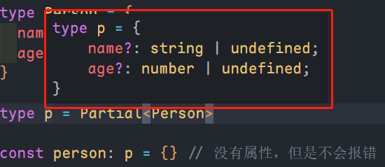
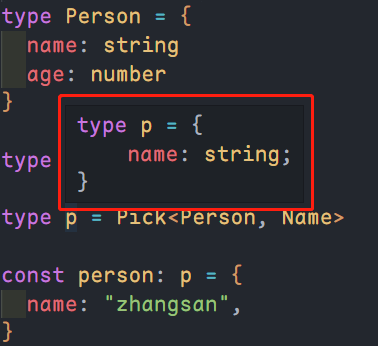
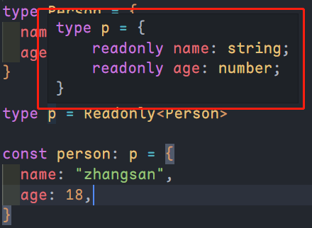

# Partial、Pick、Record、Readonly

这几个是 ts 中内置的高级类型

## Partial

将传入的类型中的所有属性都设置为可选。

`Partial`源码定义如下：

```ts
/**
 * Make all properties in T optional
 * 将传入的类型 T 中的所有属性都设置为可选
 */
type Partial<T> = {
    [P in keyof T]?: T[P];
};
```

示例如下：

```ts
type Person = {
	name: string
	age: number
}

type p = Partial<Person>

const person: p = {} // 没有属性，但是不会报错
```

::: center



:::

## Pick

传入两个类型，第二个类型应是第一个类型的属性的子集。

`Pick`的源码定义如下：

```ts
/**
 * From T, pick a set of properties whose keys are in the union K
 * 从类型定义 T 的属性中，选取指定一组属性，返回一个新的类型定义。
 */
type Pick<T, K extends keyof T> = {
    [P in K]: T[P];
};
```

示例如下：

```ts
type Person = {
	name: string
	age: number
}

type Name = "name"

type p = Pick<Person, Name>

const person: p = {
	name: "zhangsan",
}
```

::: center



:::

## Record

限定传入的第一个参数的类型只能是第二个参数类型。

`Record`源码定义如下：

```ts
/**
 * Construct a type with a set of properties K of type T
 * 构建一个类型，它包含的属性为 K，K 的类型只能是 T
 */
type Record<K extends keyof any, T> = {
    [P in K]: T;
};
```

示例如下：

```ts
type Name = "name" | "gender"

type p = Record<Name, string>

const person: p = {
	name: "zhangsan",
	gender: "male",
}
```

## Readonly

与`Partial`类似，只不过`Partial`是将所有属性改为而可选，但是`Readonly`是将所有属性改为`readonly`。

`Readonly`源码定义如下：

```ts
/**
 * Make all properties in T readonly
 * 将所有属性变为 readonly
 */
type Readonly<T> = {
    readonly [P in keyof T]: T[P];
};
```

示例如下：

```ts
type Person = {
	name: string
	age: number
}

type p = Readonly<Person>

const person: p = {
	name: "zhangsan",
	age: 18,
}
```

::: center



:::
