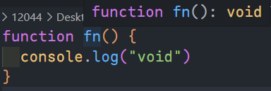
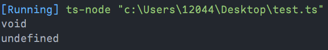

# any 和 void 和 never

## any

`any`表示可以是任何类型。

在一些情况下，当我们无法确定类型或者不需要确定类型时，就可以指定其为`any`类型。被指定为`any`类型的变量可以被赋值为任何类型。

未声明的变量虽然开始会被识别为`any`，但是当其被赋值后，ts 就会根据赋值的类型来标识这个变量的类型。如：

::: code-tabs

@tab ts

```ts
let value1 // 隐式的 any

value1 = "seven"
console.log(value1 - 1)
// error TS2362: The left-hand side of an arithmetic operation must be of type 'any', 'number', 'bigint' or an enum type.

let value2: any // 显式的 any

value2 = "seven"
console.log(value2 - 1) // NaN
```

@tab js

```js
let value

value = "seven"
console.log(value - 1) // NaN
```

:::

::: warning 注意

当声明一个变量为`any`后，对它的任何操作，返回的内容的类型都是`any`，所以一旦使用了`any`后，可能会导致某一块代码变得难以维护。**而就算使用了断言，也丧失了在静态类型检查阶段发现错误的可能。**

:::

## void

`void`表示没有任何类型。

声明为`void`类型的变量，只能赋予`undefined`。

```ts
let value: void
value = undefined
value = null // 报错
value = 1 // 报错
```

没有返回值的函数，其返回值类型为`void`。

```ts
function fn() {
    console.log('void')
}
```

::: center



:::

## never

`never`表示永远不会有值的一种类型。

上面的解释看起来很难理解，大概会觉得`void`不也是没有值的类型吗？

:::: tip 

其实`void`类型的返回值为`undefined`，可以理解为没有返回值的函数实际上是`return undefined`。

```ts
function fn() {
	console.log("void")
}

let value = fn()

console.log(value)
```

::: center



:::

::::

never类型是那些总是会抛出异常或根本就不会有返回值的函数表达式或箭头函数表达式的返回值类型。简单理解就是返回`never`的函数必须存在无法到达的重点，如直接抛出错误或者在函数中有一个死循环等。

```ts
// 因为总是抛出异常，所以 error 将不会有返回值
function error(message: string): never {
    throw new Error(message);
}

// 因为存在死循环，所以 infiniteLoop 将不会有返回值
function infiniteLoop(): never {
    while (true) {
    }
}
```

::: details never 的应用场景

在`switch`中，`default`通常用于兜底，一般我们默认代码不应该进入`default`这个分支，一旦进入了，就表示程序存在某种异常情况，因此就可以在这里进行抛出错误。

```ts
type A = 'A' | 'B' | 'C' 
 
function isXiaoMan(value: A) {
   switch (value) {
     case "A":
       break 
     case "B":
       break 
     case "C":
       break 
     default:
       // 是用于场景兜底逻辑
       // 因为任何类型都不能赋值给 never，所以当存在进入 default 这个分支的可能性时，ts 就会及时帮我们发现这个问题
       const error: never = value;
       return error
   }
}
```

:::