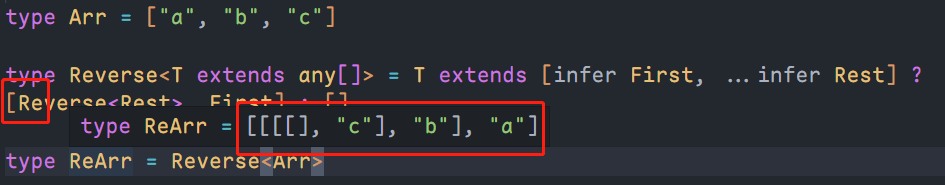

# infer

## 介绍

`infer`表示在`extends`条件语句中待推断的类型变量。示例如下：

```ts
type ParamType<T> = T extends (arg: infer P) => any ? P : T

interface User {
	name: string
	age: number
}

type Func = (user: User) => void

type Param1 = ParamType<Func> // User
type Param2 = ParamType<string> // string
```

::: tip

上面代码第一行中的`T extends (arg: infer P) => any ? P : T`中的`inter P`表示**待推断**的函数参数。

整个语句表达的意思是：传入的参数`T`如果是继承自`(arg: infer P) => any`，或者说`T`能赋值给它，则返回类型`P`（函数中的参数类型），否则返回传入的参数`T`。

:::

## 其他用法

### 提取函数类型的返回值类型

在上面的示例中，我们使用`infer`获取的是函数类型中参数的类型，这里我们使用它获取返回值的类型。如下：

```ts
type ReturnType<T> = T extends (...args: any[]) => infer R ? R : T

type Func = (arg: any) => boolean

type R = ReturnType<Func> // boolean
```

可以看到，上面的这个代码只是将`infer R`换到了`=>`之后，即返回值的地方，这样我们就能获取到函数类型的返回值的类型了。

### 提取构造函数中参数或示例类型

构造函数一般都使用`new`来实例化，因此它的类型通常表示如下：

```ts
type Constructor = new (...args: any[]) => any
```

因此，其实`infer`在构造函数中使用时也有两个地方可以放，如：

1. 参数处：`new (...args: infer P) => any`，这个其实就是获取的参数类型
2. 返回值处：`new (...args: any[]) => infer R`，我们知道，构造函数一般表示的就是类本身，因此这个其实就是获取的实例类型，即类本身

示例如下：

```ts
// 获取参数类型
type ConstructorParameters<
    T extends new (...args: any[]) => any
> = T extends new (...args: infer P) => any ? P : never

// 获取实例类型
type InstanceType<
    T extends new (...args: any[]) => any
> = T extends new (...args: any[]) => infer R ? R : any

class TestClass {
	constructor(public name: string, public age: number) {}
}

type Params = ConstructorParameters<typeof TestClass> // [string, number]

type Instance = InstanceType<typeof TestClass> // TestClass
```

### 提取数组元素的类型

如我们这里有个需求，一个类型如果传入的是数组，则获取数组的元素类型，否则返回传入的参数类型。

一般我们可以有如下写法：

```ts
// T[number] 表示返回数组中元素的类型，一般我们读取数组某个元素的方式都是 arr[1]，这里就表示返回这个数组中所有元素的类型
type ReturnArrayType<T> = T extends Array<any> ? T[number] : T

type ArrA = (string | number)[]

type RAT = ReturnArrayType<ArrA> // string | number
type RAT1 = ReturnArrayType<string> // string
```

有了`infer`后，我们就可以简化写法，如：

```ts
type ReturnArrayType<T> = T extends Array<infer P> ? P : T

type ArrA = (string | number)[]

type RAT = ReturnArrayType<ArrA> // string | number
type RAT1 = ReturnArrayType<string> // string
```

其实上面的`type ArrA`就是一个元组类型，因此我们也可以看作它能将元组类型转换为联合类型：

```ts
type ReturnArrayType<T> = T extends Array<infer P> ? P : T

type TTuple = [string, number]

type RAT = ReturnArrayType<TTuple> // string | number
```

::: tip 拓展题目

这是一个 github 上的 LeetCode TypeScript 的面试题，链接如下：

[LeetCode TypeScript](https://github.com/LeetCode-OpenSource/hire/blob/master/typescript_zh.md) 

:::

### 提取头部元素类型

```ts
type Arr = ["a", "b", "c"]

type GetFirst<T extends any[]> = T extends [infer First, ...any[]] ? First : []

type a = GetFirst<Arr> // "a"
```

::: tip

`GetFirst`通过`extends`约束`T`只能是数组类型，然后通过`infer`推断数组中第一个元素的类型，其他元素使用扩展运算符(`...`)收集，最后返回。

:::

### 提取尾部元素类型

与头部类型反过来即可。

```ts
type GetLast<T extends any[]> = T extends [...any[], infer Last] ? Last : []
```

### 剔除第一个元素

```ts
type Arr = ["a", "b", "c"]

type GetRest<T extends any[]> = T extends [unknown, ...infer Rest] ? Rest : []

type a = GetRest<Arr> // ["b", "c"]
```

### 剔除最后一个元素

与剔除第一个反过来即可。

```ts
type GetRest<T extends any[]> = T extends [...infer Rest, unknown] ? Rest : []
```

### 反转类型，递归

如我们有一个类型`type Arr = ["a", "b", "c"]`，我们想让它变成`["c", "b", "a"]`。

这样我们就可以使用递归：

```ts
type Arr = ["a", "b", "c"]

type Reverse<T extends any[]> = T extends [infer First, ...infer Rest] ? [...Reverse<Rest>, First] : []

type ReArr = Reverse<Arr> // ["c", "b", "a"]
```

:::: tip

使用`extends`约束`T`的类型，然后使用`infer`分别获取第一个元素和剩余其他元素，然后递归调用自己(`Reverse<>`)，并展开所有元素。

在递归调用自己后如果不展开的会得到如下类型：

::: center



:::

::::
