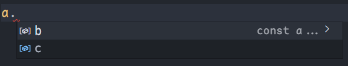

# namespace 命名空间

我们在编写项目时，无法避免全局变量造成的污染，ts 为了避免这个问题，提供了`namespace`：

- 内部模块，主要用于组织代码，避免命名冲突
- **命名空间内的类默认私有** 
- 通过`export`暴露
- 通过`namespace`关键字定义

::: tip

ts 与 es2015 一样，任何包含顶级`import`和`export`的文件都将被当成一个模块。反之，如果一个文件没有顶级`import`或者`export`声明，则它的内容被视为全局可见的（对模块也是可见的）。

:::

::: details 例子

`namespace`中通过`export`将暴露内容，如果不使用`export`，则无法读取其值。

```ts
namespace nameA {
	export const Time: number = 1000
	export const fn = <T>(arg: T): T => {
		return arg
	}
	fn(Time)
}

namespace nameB {
	const Time: number = 1000
	const fn = <T>(arg: T): T => {
		return arg
	}
	fn(Time)
}

console.log(nameA.Time) // 1000
console.log(nameA.fn(2000)) // 2000

console.log(nameB.Time) // 类型“typeof nameB”上不存在属性“Time”。
console.log(nameB.fn(2000)) // 类型“typeof nameB”上不存在属性“fn”。
```

:::

## 嵌套命名空间

```ts
namespace a {
	export namespace b {
		export class Vue {
			parameters: string
			constructor(parameters: string) {
				this.parameters = parameters
			}
		}
	}
}

let v = a.b.Vue

new v("1")
```

## 抽离命名空间

- `a.ts`：导出命名空间

  ```ts
  export namespace V {
  	export const a = 1
  }
  ```

- `b.ts`：导入命名

  ```ts
  import { V } from '../observer/index'
   
  console.log(V) // { a: 1 }
  ```

## 简化命名空间

```ts
namespace A {
	export namespace B {
		export const C = 1
	}
}

import X = A.B.C

console.log(X) // 1
```

## 合并命名空间

重名的命名空间会合并为一个命名空间。如下：

```ts
namespace a {
	export const b = 1
}

namespace a {
	export const c = 2
}
```

::: center



:::
