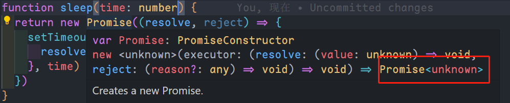
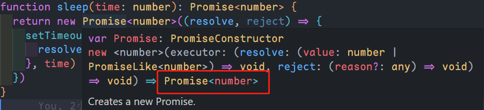

如果我们不指定返回的类型，ts 是推断不出来`Promsie`返回的是什么类型的，会返回`unkonwn`。

```ts
function sleep(time: number) {
	return new Promise((resolve, reject) => {
		setTimeout(() => {
			resolve(time)
		}, time)
	})
}
```



把上面的代码改为如下即可：

```ts
function sleep(time: number): Promise<number> {
	return new Promise<number>((resolve, reject) => {
		setTimeout(() => {
			resolve(time)
		}, time)
	})
}
```



> 当我们在 ts 文件中使用`Promise`时，可能会报如下错误：
>
> - <span style="color: red">“Promise” 仅指类型，但在此处用作值。是否需要更改目标库? 请尝试将 “lib” 编译器选项更改为 es2015 或更高版本。</span>
> - <span style="color: red">'Promise' only refers to a type, but is being used as a value here. Do you need to change your target library? Try changing the 'lib' compiler option to es2015 or later.</span>
>
> 当出现这样的错误时，可以修改`tsconfig.json`配置文件，如下：
>
> ```json
> {
> 	"compilerOptions": {
> 		// 方式一，指定 target 为 ES6 或者 ES2015
> 		"target": "ES6", // 指定TS被编译为的JS版本
>
> 		// 方式二，添加 ES2015.Promise
> 		"lib": ["ES2015.Promise", "ES5", "DOM"] // 用来指定项目中要使用的库，这里可以解决 ts 中使用 Promise 报错的问题
> 	}
> }
> ```
