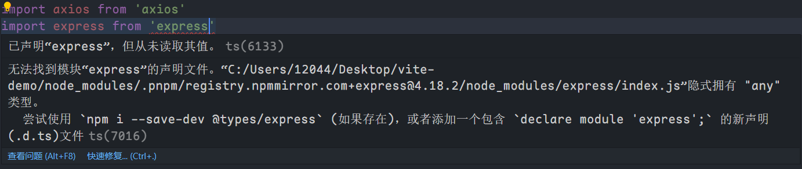
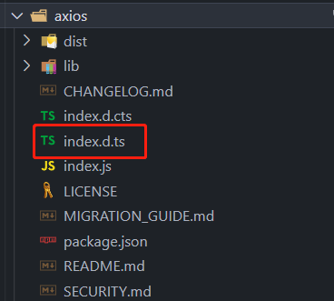
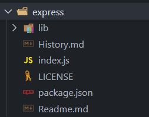

# 声明文件 d.ts

## 声明文件 declare

当使用第三方库时，我们需要引用它的声明文件，这样才能获得对应的代码补全、接口提示等功能。如下这些全局声明：

```ts
declare var 声明全局变量
declare function 声明全局方法
declare class 声明全局类
declare enum 声明全局枚举类型
declare namespace 声明(含有子属性的)全局对象
interface 和 type 声明全局类型
/// <reference /> 三斜线指令
```

:::: details 一个 axios 和 express 的例子

1. 我们先安装`express`和`axios`

2. 使用 import 导入，会发现有如下报错

   ::: center

   

   :::

   这里它提示没有找到`express`的声明文件，需要安装，那我们先看看`node_modules`中`axios`和`express`文件的区别：

   ::: center

   

   

   :::

   可以看到，`axios`有`index.d.ts`文件，而`express`没有，这就会导致我们使用`axios`时有代码提示等功能，而`express`没有，且导入它还会提示我们需要下载声明文件。

   以上，我们就知道了`.d.ts`文件的作用。

::::

## 自己书写声明文件

有时候有些第三方库就是没有声明文件，且使用`npm`额外下载时也发现没有，这时候我们就可以自己简单书写这个第三方库的声明文件，以便后续使用。如我们这里简单写一个`express`的声明文件(**社区里面已经有`express`的声明文件，下载使用即可，这里只是为了做演示**)：

1. 在`src`下创建一个文件夹`typings` 

2. 在这个文件夹中给要编写声明文件的第三方库创建声明文件，如这里给`express`编写，则文件名为`express.d.ts`：

   ```ts
   /* express.d.ts */
   // 这里只是做示例，并不代表只能这么写
   
   declare module "express" {
   	interface Router {
   		get(path: string, cb: (req: any, res: any) => void): void
           // ... 其他方法如 post 等
   	}
   
   	interface App {
   		use(path: string, router: any): void
   		listen(port: number, cb?: () => void): void
           // ... 其他方法
   	}
   
   	interface Express {
   		(): App
   		Router(): Router
   	}
   
   	const express: Express
   	export default express
   }
   ```

3. 完成以上两步后，我们就会发现`import express from 'express'`的报错消失了


