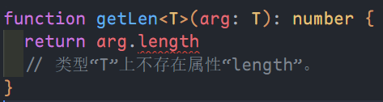

# 泛型

在定义函数或类时，如果遇到类型不明确时就可以使用泛型。

## 函数泛型

当某些函数实现的功能是一样的，只是参数或者返回的类型不同时，就可以使用泛型来进行优化。如下：

```ts
function num(a: number, b: number): Array<number> {
	return [a, b]
}

function str(a: string, b: string): Array<string> {
	return [a, b]
}

// 使用泛型进行优化
function reArr<T>(a: T, b: T): Array<T> {
	return [a, b]
}

// 使用
console.log(reArr<number>(1, 2)) // [ 1, 2 ]
console.log(reArr<string>('1', '2')) // [ '1', '2' ]
```

当然，泛型的参数名并不是只能使用一个，也可以使用多个，只要在数量上和使用方式上能对应即可。

```ts
function Sub<T, U>(a: T, b: U): Array<T | U> {
	const params: Array<T | U> = [a, b]
	return params
}

Sub<Boolean, number>(false, 1)
```

## 定义泛型接口

声明接口时，在接口名字后面加上`<参数>`。使用时就像函数泛型一样传递类型即可。

```ts
interface MyInter<T> {
	(arg: T): T
}

function fn<T>(arg: T): T {
	return arg
}

let result: MyInter<number> = fn

console.log(result(123))
```

## 对象字面量泛型

```ts
let foo: {
	<T>(arg: T): T
}

foo = function <T>(arg: T): T {
	return arg
}

foo(123)
```

## 泛型约束

当我们希望在一个泛型的变量上面获取其`length`属性时，就可以使用泛型约束。因为有些数据类型是没有`length`属性的。如下：

::: center



:::

于是我们可以采用如下写法：

```ts
interface Len {
	length: number
}

/** 这里表示的意思是泛型 T 必须是 Len 的一个实现类(子类) **/
function getLen<T extends Len>(arg: T): number {
	return arg.length
}
```

## 使用 keyof 约束对象

```ts
/** 这里规定泛型 K 必须是泛型 T 的键(key) 的子类 */
function prop<T, K extends keyof T>(obj: T, key: K) {
	return obj[key]
}

const obj = {
	a: 1,
	b: 2,
	c: 3,
}

prop(obj, "a")
prop(obj, "b")
prop(obj, "c")
prop(obj, "d")
//类型“"d"”的参数不能赋给类型“"a" | "b" | "c"”的参数。
```

::: tip 

首先定义了 T 类型并使用`extends`关键字继承 object 类型的子类型，然后使用`keyof`操作符获取 T 类型的所有键，它的返回类型是联合类型，最后利用`extends`关键字约束 K 类型必须为`keyof T`联合类型的子类型。

:::

## 泛型类

声明泛型类的方法跟函数类似，也是名称后面使用`<参数>`。

使用：`new 类名<类型>()`。

```ts
class MyClass<T> {
  name: T
  constructor(name: T) {
    this.name = name
  }
}

const mc = new MyClass<string>(name: '张三')
```

