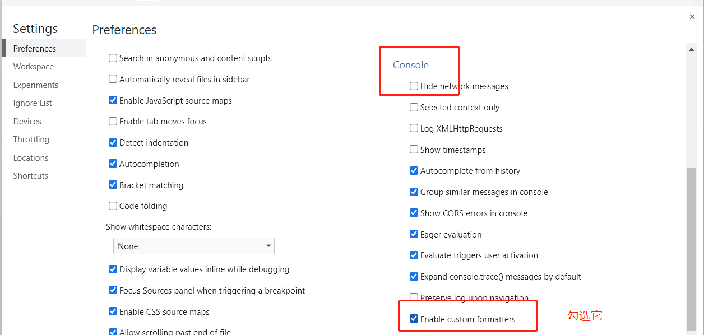

# 第一篇 框架设计概览

## 第一章 权衡的艺术

### 1.3 虚拟 DOM 的性能到底如何

[1.3 虚拟 DOM 的性能到底如何](https://weread.qq.com/web/reader/c5c32170813ab7177g0181aek16732dc0161679091c5aeb1)

上面一点（`1.2 性能与可维护性的权衡`）讲到`声明式代码`性能并不会优于`命令式代码`，但是`声明式代码`有着更好的维护性，因此我们需要做的就是在保持这种好的可维护性的同时将`声明式代码`的性能损失降到最小。

`声明式代码`的更新性能消耗公式如下：**声明式代码的更新性能消耗 = 找出差异的性能消耗 + 直接修改的性能消耗**，`声明式代码`与`命令式代码`相比，多出的性能消耗在**找出差异的性能消耗**。

所谓的`虚拟DOM`，就是为了最小化**找出差异的性能消耗**而出现的。

由以上，我们可以得知：理论上，`虚拟DOM`的更新技术的性能不可能比原生 JS 操作 DOM 更好。至于为什么是理论上，因为我们**几乎不会写出绝对优化的命令式代码**，这是非常耗费精力的，而且也不划算。

原生的 JS 操作 DOM 的方式有两种，一种是使用`document.createElement`之类的方式，另一种则是使用`innerHTML`。第二种方式很常见，例如我们使用`JQuery`编写页面时，就使用得非常多，但是它极其消耗性能，因为每次更新 DOM，它都需要先清空原始的 DOM，然后创建新的 DOM，这种方式会浪费很多性能，因为哪怕我们只是修改了一点点内容，它都会销毁所有的旧的 DOM，然后设置新的 DOM。`虚拟DOM`的优势在于，它会找出需要更新的 DOM，然后只对它进行更新，其他没有变化的则保持不变。

综上，原生 JS：心智负担大、可维护性差、性能最好；虚拟 DOM：心智负担小、可维护性好、性能不错；innerHTML(模板)：心智负担中等、性能差。因此，Vue 选择使用虚拟 DOM。

::: tip 注

上面的结论主要是针对项目代码量很大的情况而定的，实际上原生 JS 操作 DOM、虚拟 DOM 和 innerdHTML 这三者操作页面的性能不能简单地下定论，这与**页面大小、变更部分的大小**都有关系，除此之外，还与**创建页面还是更新页面**也有关系，选择哪种更新策略需要结合心智负担、可维护性等因素综合考虑。Vuejs 经过一番权衡后，觉得虚拟 DOM 是个不错的选择。

:::

## 第二章 框架设计的核心要素

### 2.1 提升用户的开发体验

[2.1 提升用户的开发体验](https://weread.qq.com/web/reader/c5c32170813ab7177g0181aek8f132430178f14e45fce0f7) 

1. 提供良好的警告信息是判断一个框架好坏的一个至关重要的标准，如我们使用 Vuejs 时，如果将一个 Vue 实例挂载到一个不存在的 DOM 节点时，它给我们提供的警告信息是这个节点不存在，这就有助于我们快速定位问题所在，如果 Vue 不帮我们处理这些问题，那么很可能就会得到一个类似这样的 JS 报错：`Uncaught TypeError:Cannot read property 'xxx' of null`。很显然，这种错误提示是在开发中是很不友好的，很难让我们知道问题所在。

2. 除了警告等，控制台输出也是其中一个点，比如我们在 Vue3 中输出一个`ref`对象是，需要点开几层才能得到它的`value`，这显然是浪费时间的，因此，Vue3 提供了一个浏览器允许的自定义的`formatter`，我们可以通过如下方式打开：

   

   

   然后我们就能看到如下的输出：

   ```js
   const count = ref(0)
   console.log(count)
   ```

   

### 2.3 框架要做到良好的 Tree-Shaking

[2.3 框架要做到良好的 Tree-Shaking](https://weread.qq.com/web/reader/c5c32170813ab7177g0181aek8f132430178f14e45fce0f7?) 

在 2.2 中有提到一个`__DEV__`预定义常量，它用来控制在生产环境的框架代码不包含用于打印警告信息的代码，从而使框架自身的代码量不随警告信息的增加而增加，但是这也是不够的。

Vue 中有很多内置的组件，如`<Transition></Transition>`，当我们项目中没有用到这些内置的组件时，应该在生产环境的代码中将其去除，这就需要用到`Tree-Shaking`：消除那些永远不会执行的代码。`Tree-Shaking`依赖 ESM（ES Module），因此要实现这个功能，模块必须是 ESM。

### 2.5 特性开关

[2.5 特性开关](https://weread.qq.com/web/reader/c5c32170813ab7177g0181aek8f132430178f14e45fce0f7) 

特性开关用来使用户决定这个特性的代码是否需要出现在生产环境的代码中，这也有助于实现减小生产环境的代码。

Vue3 中有一个特性开关`__VUE_OPTIONS_API__`，它用来控制在 Vue3 中，用户是否使用 Vue2 的[选项式 API](https://cn.vuejs.org/guide/introduction.html#api-styles)写法（在[webpack5 | vuecli | 二师弟的学习笔记](../../build-tools/webpack5.html#vuecli)的第六点中有提到配置），在 Vue3 中，更推荐使用组合式写法。

### 2.6 错误处理

[2.6 错误处理](https://weread.qq.com/web/reader/c5c32170813ab7177g0181aek8f132430178f14e45fce0f7) 

错误处理是框架开发过程中非常重要的环节，它直接决定用户应用程序的健壮性，还决定了用户开发时处理错误的心智负担。

当用户使用一个模块的回调函数时出现了错误，那么我们有两种错误处理办法：

1. 用户自己去使用`try...catch`处理错误
2. 框架统一替用户处理错误

很明显，第二种方式对用户而言更加友好，因为第一种方式会明显的增加用户的心智负担。下面是一个错误处理示例：

```js
// utils.js

// 用户注册的统一处理错误的函数
let handleError = null

export default {
  foo(fn) {
    callWithErrorHandling(fn)
  },
  // 用户可以调用该函数注册统一的错误处理函数 handleError = fn
  registerErrorHandler(fn) {
    handleError = fn
  }
}

// 错误处理函数
function callWithErrorHandling(fn) {
  try {
    fn && fn()
  } catch (e) {
    // 将捕获到的错误传递给用户的错误处理程序
    handleError(e)
  }
}
```

```js
// 调用使用时
import utils from 'utils.js'

// 注册错误处理程序
utils.registerErrorHandler((e) => {
  console.log(e)
})
utils.foo(() => {/*...*/})
utils.bar(() => {/*...*/})
```

这种方式处理错误的能力由用户控制，他可以处理，也可以忽视错误。

::: tip

在 Vue 中的错误处理函数是：`callWithErrorHandling`。

统一注册错误处理函数方式如下：

```js
import App from 'App.vue'
const app = createApp(App)
app.config.errorHandler = () => {
  // 错误处理程序
}
```

:::

## 第三章 Vue.js3 的设计思路

### 3.2 初识渲染器

[3.2 初识渲染器](https://weread.qq.com/web/reader/c5c32170813ab7177g0181aekc9f326d018c9f0f895fb5e4) 

`虚拟DOM`实际上就是用 JS 对象来描述真实的 DOM 结构。这种描述的方式多种多样，我们这里提供一种示例：

```js
const vnode = {
  // 标签元素名
  tag: 'div',
  // 它的一些事件、属性等
  props: {
    onClick: () => alert('hello')
  },
  // 它的子节点，它可以是一个字符串表示内容，也可以是一个数组，其中包含其他的子节点的虚拟DOM结构
  children: 'click me'
}
```

渲染器的作用就是把虚拟 DOM 渲染为真实 DOM，它包含两个参数：虚拟DOM对象、挂载这个虚拟DOM的真实DOM节点。

**渲染器 renderer 的实现思路**，总体来说分为三步：

1. 创建元素：将`vnode.tag`作为标签名创建 DOM 元素
2. 为元素添加属性和事件：以`on`开头的 key 就是事件，给它绑定事件处理函数，其他都是属性，添加属性即可。
3. 处理`children`，如果是字符串则创建文本节点，然后直接添加内容，如果是数组则递归调用 renderer。

**渲染器的精髓都在更新节点的阶段**：即当 vnode 对象变更后，它需要精准找到变更点，并只更新这里的内容。

渲染器的工作原理其实很简单，归根结底，都是使用一些我们熟悉的 DOM 操作 API 来完成渲染工作。

### 3.3 组件的本质

[3.3 组件的本质](https://weread.qq.com/web/reader/c5c32170813ab7177g0181aekc9f326d018c9f0f895fb5e4) 

组件的本质是什么，一句话总结：**组件就是一组 DOM 元素的封装，这组DOM 元素就是组件要渲染的内容，因此我们可以定义一个函数来代表组件，而函数的返回值就代表组件要渲染的内容**。如下：

```js
const Component = function () {
  return {
    tag: "div",
    props: {
      onClick: () => alert("hello")
    },
    children: "click me"
  }
}
```

从上面代码可以看到，组件的返回值也是虚拟DOM。那么我们就可以用虚拟DOM的格式存储这个组件。如下：

```js
const vnode = {
  tag: Component
}
```

这样我们就只需要在渲染器 renderer 中判断`vnode.tag`是字符串还是函数，以区分标签和组件。然后调用不同的渲染方法函数来渲染即可。其实两种渲染方式的区别就在于渲染组件前先执行`vnode.tag`这个函数，然后再调用渲染器 renderer 进行渲染即可。

::: tip 注

当然，组件也不一定非得是一个函数，也可以是一个对象，如下：

```js
const Component = {
  render() {
    return {
      tag: "div",
      props: {
        onClick: () => alert("hello")
      },
      children: "click me"
    }
  }
}
```

这里组件就是一个对象，它包含一个`render()`方法，这个方法返回组件的虚拟DOM。这种方式下，渲染器的判断条件和渲染组件的方式都需要进行修改。

但是，总的来说，不论是哪种方式描述组件，整体的思路都大差不差，自己发挥想象选择最适合最喜欢的方式即可。

:::

### 3.4 模板的工作原理

[3.4 模板的工作原理](https://weread.qq.com/web/reader/c5c32170813ab7177g0181aekc9f326d018c9f0f895fb5e4) 

编译器的作用其实就是将模板编译为渲染函数，如：

```html
<!-- 模板 -->
<div @click="handler">
  click me
</div>
```

```js
// 编译后的渲染函数
render() {
  return h('div', { onClick: handler }, 'click me')
}
```

Vue 中的`.vue`文件最终经过编译之后会以如下方式在浏览器中运行：

```js
export default {
  data() {/* ... */},
  methods: {
    handler: () => {/* ... */}
  },
  render() {
    return h('div', { onClick: handler }, 'click me')
  }
}
```

无论是使用模板还是直接手写渲染函数，对于一个组件来说，它要渲染的内容最终都是通过渲染函数产生的，然后渲染器再把渲染函数返回的虚拟DOM渲染为真实DOM，这就是模板的工作原理。

### 3.5 Vue.js是各个模块组成的有机整体

[3.5 Vue.js是各个模块组成的有机整体](https://weread.qq.com/web/reader/c5c32170813ab7177g0181aekc9f326d018c9f0f895fb5e4) 

通过上面几节，我们了解到渲染器和编译器：

- 渲染器的作用是，把虚拟DOM对象渲染为真实DOM元素。它的工作原理是，递归地遍历虚拟DOM对象，并调用原生DOM API来完成真实DOM的创建。渲染器的精髓在于后续的更新，它会通过`Diff算法`找出变更点，并且只会更新需要更新的内容。
- 编译器的作用其实就是将模板（或者简单理解为`.vue`文件之类的）编译为渲染函数。

渲染器的作用之一就是找到虚拟DOM中的变更点，然后进行针对性的更新，但是这要花费一些气力，因为需要递归的遍历DOM对象等。但是目前我们有了编译器，在编译的阶段中是很容易找到变更点的，如在 Vue 中我们通过`v-bind`绑定的属性，它是很可能发生变化的，因此我们就可以在编译过程中让代码附带一些信息来区分静态属性和动态属性，这样在渲染器中寻找变更点时就能更加轻松一些，对性能而言是有提示作用的。

上面这个例子就很好的体现了编译器和渲染器之间的信息交流，它们互相直接的配合能使得性能进一步提升，而且交流的媒介就是虚拟DOM，它们三个部分就组成了一个相互关联的有机整体。
