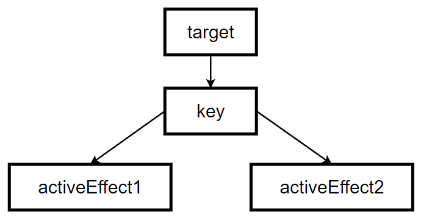
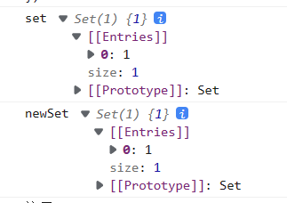
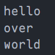
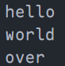
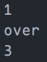
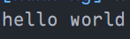

# 第二篇 响应系统

## 第四章 响应系统的作用与实现

### 4.1 响应式数据与副作用函数

[4.1 响应式数据与副作用函数](https://weread.qq.com/web/reader/c5c32170813ab7177g0181aekd3d322001ad3d9446802347?) 

`副作用函数`：当一个函数的执行会直接或间接影响其他函数的执行时，这个函数就是一个副作用函数。例子如下：

```js
function effect() {
  document.body.innerText = "body"
}
```

上面的代码中，*effect()* 函数的执行会修改 body 的文本内容，但是这个文本内容并不是只有 *effect()* 函数才能修改的，因此这个函数的执行会直接或间接的影响其他函数的执行，它产生了副作用。其他例子如一个函数修改了一个全局变量，那么这个函数也是一个副作用函数。

`响应式数据`：当这个数据变化时，依赖于它的函数或者说副作用函数会自动的重新执行，那么这个数据就是响应式数据。如：

```js
let count = 0
function effect() {
  document.body.innerText = count
}
```

当 *count* 的值变化时，*effect()* 函数如果会自动执行的话，那么 *count* 就是一个响应式数据。

### 4.2 响应式数据的基本实现

[4.2 响应式数据的基本实现](https://weread.qq.com/web/reader/c5c32170813ab7177g0181aekd3d322001ad3d9446802347?) 

整体思路分为两步，以上面的代码举例：

1. 读取到 *count* 时，将函数 *effect* 保存起来
2. 当再次设置 *count* 时，将函数 *effect* 取出来执行

这两步的关键点就在于拦截数据，即我们能手动控制数据的读取(`get`)和设置(`set`)两个操作。在 ES2015 前，我们只能通过[Object.defineProperty()](../../js/属性描述符.md)函数实现，也就是 Vue2 采用的方式，但是在 ES2015+ 后，我们可以使用代理对象[Proxy](../../ts/Proxy和Reflect.md)来实现了，也就是 Vue3 采用的方式。

这里我们采用`Proxy`来实现：

```js
// 原始数据
const data = {
  text: 'hello'
}

// 存储副作用函数
const bucket = new Set()

// 对数据进行代理
const dataProxy = new Proxy(data, {
  // 拦截数据的读取操作
  get(target, key, receiver) {
    // 保存副作用函数
    bucket.add(effect)
    // 返回读取的属性值，Reflect 可以查看上面 Proxy 链接
    return Reflect.get(target, key, receiver)
  },

  // 拦截数据的赋值操作
  set(target, key, value, receiver) {
    const result = Reflect.set(target, key, value, receiver)
    // 取出副作用函数并执行
    bucket.forEach(fn => fn())
    // set 方法需要返回一个 boolean
    return result
  }
})

// 副作用函数
function effect() {
  console.log(dataProxy.text)
}

console.log(dataProxy.text) // hello
dataProxy.text = "world" // world
```

这个代码还有很多缺陷，但是也是一个简单的实现了。

### 4.3 设计一个完善的响应系统

[4.3 设计一个完善的响应系统](https://weread.qq.com/web/reader/c5c32170813ab7177g0181aekd3d322001ad3d9446802347?) 

根据上一节的代码，我们要解决的第一个问题就是副作用函数，因为它不一定就是*effect*，也可能是别的名字，因此我们需要正确的收集副作用函数。

```js
// 存储副作用函数
const bucket = new Set()
// 用来存储被注册的副作用函数
let activeEffect = null
// effect 函数用来注册副作用函数
function effect(fn) {
  // 当调用 effect 时，注册副作用函数
  activeEffect = fn
  // 执行一次副作用函数
  fn()
}
```

完成这一步后，我们就需要使用这个*effect*函数来注册副作用函数了。

```js{7}
// 对数据进行代理
const dataProxy = new Proxy(data, {
  // 拦截数据的读取操作
  get(target, key, receiver) {
    if (activeEffect) {
      // 保存副作用函数
      bucket.add(activeEffect)
    }
    // 返回读取的属性值，Reflect 可以查看上面 Proxy 链接
    return Reflect.get(target, key, receiver)
  },

  // 拦截数据的赋值操作
  set(target, key, value, receiver) {
    const result = Reflect.set(target, key, value, receiver)
    // 取出副作用函数并执行
    bucket.forEach(fn => fn())
    // set 方法需要返回一个 boolean
    return result
  }
})
```

ok，完成这两步后，我们先试试看：

```js{5}
// 副作用函数
function myEff() {
  console.log(dataProxy.text)
}
effect(myEff)

console.log(dataProxy.text) // hello
dataProxy.text = "world" // world
```

可以看到，目前这个副作用函数的名字为*myEff*，我们使用*effect*函数去注册它后，代码依然能正常运行。但是，它并不是没有问题，如下：

```js
// dataProxy 中并没有 name 属性
dataProxy.name = "world" // 还是会输出 hello
```

可见，当我们给一个并不存在的属性赋值时，还是会触发副作用函数，这显然是不合理的，因此，我们需要对存储副作用函数的`const bucket = new Set()`进行重新设计。

:::: details 设计 bucket 数据结构的一点思考

```js
function myEff() {
  console.log(dataProxy.text)
}
```

这段代码中存在三个角色：

1. 被操作的对象：`dataProxy`
2. 被操作的属性，或者说字段：`text`
3. 副作用函数：`myEff`

它们之间的关系应该是如下的：`dataProxy -> text -> myEff`，即**由 target 保存 key，由 key 保存 activeEffect**（这里的 target 是`Proxy`中`get`和`set`的第一个参数，即代理的对象本身，key 是第二个参数，即操作的对象中的哪个字段，activeEffect 是副作用函数）。

如果是多个函数操作同一个字段的话，关系就是如下：`target -> key -> (activeEffect1, activeEffect2, ...)`，有点像一个树形结构：

::: center



:::

如果是多个字段对应同一个副作用函数、多个字段对应多个副作用函数等情况都与此类似。

总的来说，一个 target 可以对应 0-∞ 个字段，每个字段可以对应 0-∞ 个副作用函数，是一个此类的属性结构。

由此，我们来处理整个数据的结构如下，我们这里做个假设，代理的对象为`target`，每个字段为`key`，每个字段对应的所有副作用函数为`activeEffects`：

1. 我们知道，`Set`类型是没有键只有值的，且没有重复项，因此我们用它来保存每个`key`的对应的`activeEffects`
2. 让每个`key`和上面第一步中`activeEffects`的`Set`对应起来的数据我们使用`Map`类型来存储，因为`Map`可以让键值一一对应起来。
3. 最后让每个`target`和它所有的`key`对应起来的数据我们使用`WeakMap`类型来存储，这里不使用`Map`类型的原因如下，(这个下面的`key`与上面的不一样，下面这里指的是`WeakMap`这个数据类型中笼统的键)：
   - `WeakMap`的`key`是弱引用，不会影响垃圾回收器的工作，一旦它的`key`被垃圾回收了，那么对应的`key: value`就访问不到了，因此它经常用于存储之后当`key`所引用的对象存在时（没有被垃圾回收）才有价值的信息，就如这里。当被代理的数据被垃圾回收后，它所对应的一系列关系就没有价值了。

::::

综合上面设计 bucket 数据的思考，我们得到了这个保存`target -> key -> activeEffects`的数据结构如下：

| 数据类型  | 变量名  | 作用                                                         |
| --------- | ------- | ------------------------------------------------------------ |
| `WeakMap` | bucket  | 保存`target`和它的所有`key`的关系，保存的是一个`Map`类型数据 |
| `Map`     | depsMap | 保存`key`和它的所有`activeEffects`的关系，保存的是一个`Set`类型数据 |
| `Set`     | deps    | 保存每个`key`的所有`activeEffects`，只有所有的副作用函数     |

::: details 改造完的代码完整如下：

```js{7,24-39,47-53}
// 原始数据
const data = {
  text: 'hello'
}

// 存储 target 和 key，保存的是一个 Map 类型
const bucket = new WeakMap()
// 用来存储被注册的副作用函数
let activeEffect = null
// effect 函数用来注册副作用函数
function effect(fn) {
  // 当调用 effect 时，注册副作用函数
  activeEffect = fn
  // 执行一次副作用函数
  fn()
}

// 对数据进行代理
const dataProxy = new Proxy(data, {
  // 拦截数据的读取操作
  get(target, key, receiver) {
    // 没有 activeEffect，直接 return
    if (!activeEffect) return Reflect.get(target, key, receiver)
    // 根据 target 从 bucket 中取 depsMap，它也是一个 Map 类型
    // key -> effects
    let depsMap = bucket.get(target)
    // 如果 depsMap 不存在，根据 target 新建一个
    if (!depsMap) {
      bucket.set(target, (depsMap = new Map()))
    }
    // 再根据 key 从 depsMap 中取得 deps，它是一个 Set 类型
    // 里面存储着所有与当前 key 相关联的副作用函数
    let deps = depsMap.get(key)
    // 如果 deps 不存在，根据 key 新建一个
    if (!deps) {
      depsMap.set(key, (deps = new Set()))
    }
    // 最后将当前激活的副作用函数存入 deps 中
    deps.add(activeEffect)
    // 返回读取的属性值，Reflect 可以查看上面 Proxy 链接
    return Reflect.get(target, key, receiver)
  },

  // 拦截数据的赋值操作
  set(target, key, value, receiver) {
    const result = Reflect.set(target, key, value, receiver)
    // 根据 target 取出 depsMap
    const depsMap = bucket.get(target)
    if (!depsMap) return
    // 根据 key 取出所有副作用函数
    const effects = depsMap.get(key)
    // 取出副作用函数并执行
    effects && effects.forEach(fn => fn())
    // set 方法需要返回一个 boolean
    return result
  }
})
```

再来验证下这个代码能否正确运行：

```js
// 副作用函数
function myEff() {
  console.log(dataProxy.text) // hello
}
effect(myEff)

console.log(dataProxy.text) // hello
dataProxy.text = "world" // world
dataProxy.name = "world" // 无输出
```

可以看到，当我们调用奴存在的字段时，并不会有输出了。

最后我们可以对上面的代码做一下封装，将`get`中处理数据的部分封装到`track`函数中，将`set`中处理数据的部分封装到`trigger`函数中：

```js{1-32}
// 在 get 方法中调用，追踪变化
function track(target, key, receiver) {
  // 没有 activeEffect，直接 return
  if (!activeEffect) return Reflect.get(target, key, receiver)
  // 根据 target 从 bucket 中取 depsMap，它也是一个 Map 类型
  // key -> effects
  let depsMap = bucket.get(target)
  // 如果 depsMap 不存在，根据 target 新建一个
  if (!depsMap) {
    bucket.set(target, (depsMap = new Map()))
  }
  // 再根据 key 从 depsMap 中取得 deps，它是一个 Set 类型
  // 里面存储着所有与当前 key 相关联的副作用函数
  let deps = depsMap.get(key)
  // 如果 deps 不存在，根据 key 新建一个
  if (!deps) {
    depsMap.set(key, (deps = new Set()))
  }
  // 最后将当前激活的副作用函数存入 deps 中
  deps.add(activeEffect)
}

// 在 set 方法中调用，追踪变化
function trigger(target, key) {
  // 根据 target 取出 depsMap
  const depsMap = bucket.get(target)
  if (!depsMap) return
  // 根据 key 取出所有副作用函数
  const effects = depsMap.get(key)
  // 取出副作用函数并执行
  effects && effects.forEach(fn => fn())
}

// 对数据进行代理
const dataProxy = new Proxy(data, {
  // 拦截数据的读取操作
  get(target, key, receiver) {
    track(target, key)
    // 返回读取的属性值，Reflect 可以查看上面 Proxy 链接
    return Reflect.get(target, key, receiver)
  },

  // 拦截数据的赋值操作
  set(target, key, value, receiver) {
    const result = Reflect.set(target, key, value, receiver)
    trigger(target, key)
    // set 方法需要返回一个 boolean
    return result
  }
})
```

:::

### 4.4 分支切换与cleanup

[4.4 分支切换与cleanup](https://weread.qq.com/web/reader/c5c32170813ab7177g0181aekd3d322001ad3d9446802347?) 

`分支切换`：例如一个三元表达式`res.data ? true : false`，根据`res.data`值的不同，会执行不同的代码分支，这就是分支切换。

分支切换可能会产生遗留的副作用函数。如下面这个代码：

```js{11}
cosnt data = {
  ok: true,
  text: "hello"
}

const dataProxy = new Proxy(data, {
  // ... 一些代理的代码
})

effect(function () {
  document.body.innerText = dataProxy.ok ? dataProxy.text : 'not'
})
```

这段代码中，`dataProxy.ok`和`dataProxy.text`都绑定了`effectFn`，但是实际上，`dataProxy.text`由`dataProxy.ok`决定触发与否，即这里的理想情况为`dataProxy.text`的依赖集合中不应该收集这个`effectFn`，但是目前代码的实际情况却并不是如此的，即产生了遗留的副作用函数。它导致的问题为：当`dataProxy.ok`为 false 时，我们修改`dataProxy.text`的值也会触发这个`effectFn`。

**要解决这个问题的整体思路是：每次副作用函数执行时，我们先将它从所有与之关联的以来集合中删除，当副作用函数执行完毕后，重新建立联系，但在新的联系中不会包含遗留的副作用函数。**

因此我们首先需要修改注册副作用函数的`effect`函数，如下：

```js{5-11}
// 用来存储被注册的副作用函数
let activeEffect = null
// effect 函数用来注册副作用函数
function effect(fn) {
  const effectFn = () => {
    // 当 effectFn执行时，将其设置为当前激活的副总用函数
    activeEffect = effectFn
    fn()
  }
  // activeEffect.deps 用来存储所有与该副作用函数相关联的依赖集合
  effectFn.deps = []
  // 执行副作用函数
  effectFn()
}
```

这个修改的主要思路是添加了`effectFn.deps`，它是一个数组，用来存储所有包含当前副作用函数的依赖集合。然后我们修改上面提取出来的`track`函数，让`effectFn.deps`能收集这些依赖集合：

```js{21-22}
// 在 get 方法中调用，追踪变化
function track(target, key, receiver) {
  // 没有 activeEffect，直接 return
  if (!activeEffect) return Reflect.get(target, key, receiver)
  // 根据 target 从 bucket 中取 depsMap，它也是一个 Map 类型
  // key -> effects
  let depsMap = bucket.get(target)
  // 如果 depsMap 不存在，根据 target 新建一个
  if (!depsMap) {
    bucket.set(target, (depsMap = new Map()))
  }
  // 再根据 key 从 depsMap 中取得 deps，它是一个 Set 类型
  // 里面存储着所有与当前 key 相关联的副作用函数
  let deps = depsMap.get(key)
  // 如果 deps 不存在，根据 key 新建一个
  if (!deps) {
    depsMap.set(key, (deps = new Set()))
  }
  // 最后将当前激活的副作用函数存入 deps 中
  deps.add(activeEffect)
  // 将 deps 添加到 effectFn.deps 数组中。这里的 deps 就是我们想要的依赖集合
  activeEffect.deps.push(deps)
}
```

完成`track`函数的改造后，我们就收集到了我们想要的依赖集合，它们保存在`effectFn.deps`中，因此我们就可以继续修改`effect`函数了，添加一个`cleanup`函数，用来将副作用函数从依赖集合中清除：

```js
// cleanup 用来将副作用函数从依赖集合中清除
function cleanup(effectFn) {
  const len = effectFn.deps.length
  for (let i = 0; i < len; i++) {
    // 取出依赖集合
    const deps = effectFn.deps[i]
    // 将 effectFn 从这个集合中清除
    deps.delete(effectFn)
  }
  // 重置 effectFn.deps 数组
  effectFn.deps = []
}
```

在`effect`函数中调用`cleanup`方法：

```js{4}
function effect(fn) {
  const effectFn = () => {
    // 调用 cleanup 方法
    cleanup(effectFn)
    // ... 其他代码
  }
  // ... 其他代码
}
```

在完成以上步骤后，此时运行代码会发现进入了死循环，这是因为**我们在`trigger`方法中遍历了`Set`类型，即遍历了有`effectFn`的依赖集合，但是在`effectFn`的运行时将其从这个集合中去掉了，完成后又添加了进去。**可以简单理解为如下这个代码：

```js
const set = new Set([1])

set.forEach((item) => {
	set.delete(1)
	set.add(1)
	console.log("遍历set")
})
```

这就会造成死循环。

::::: warning

这个问题在语言规范中描述如下：

**在调用 forEach 遍历 Set 集合时，如果一个值已经被访问过了，但该值被删除并重新添加到集合，如果此时 forEach 遍历没有结束，那么该值会重新被访问。**

:::: details 解决办法如下：

再构造一个`Set`并遍历它

```js{2,4}
const set = new Set([1])
const newSet = new Set(set)

newSet.forEach((item) => {
	set.delete(1)
	set.add(1)
	console.log("遍历set")
})
```

这里大家肯定会有点疑问，这个新的`Set`套了一个旧的`Set`，它俩数据结构都不一样，这个新的代替旧的遍历有什么用呢？其实不是啊，当我们把一个`Set`作为参数传递给另一个`Set`时，它俩的数据结构都是一样的，如下是上面`set`和`newSet`的输出：

::: center



:::

::::

:::::

现在我们来改造`trigger`函数解决这个死循环问题：

```js{8-10}
// 在 set 方法中调用，追踪变化
function trigger(target, key) {
  // 根据 target 取出 depsMap
  const depsMap = bucket.get(target)
  if (!depsMap) return
  // 根据 key 取出所有副作用函数
  const effects = depsMap.get(key)
  const newEffects = new Set(effects)
  // 代替 effects 进行遍历
  newEffects.forEach(effectFn => effectFn())
}
```

现在，这套代码就可以按照预期运行了。

### 4.5 嵌套的 effect 与 effect 栈

[4.5 嵌套的 effect 与 effect 栈](https://weread.qq.com/web/reader/c5c32170813ab7177g0181aekd3d322001ad3d9446802347?) 

`effect`是可以发生嵌套的，如`effect(function() { effect(function() {}) })`。具体场景如：在 Vue 中，一个组件里面使用了另一个组件，这就会造成`effect`的嵌套，**因为 Vue 的渲染函数就是在一个`effect`中执行的**。所以`effect`需要设计成可嵌套的，但是目前我们实现的代码并不能支持这一功能，原因就在于`activeEffect`这个变量上。

`activeEffect`这个变量是我们用来存储通过`effect`注册的副作用函数的，但是，它目前是一个全局变量，因此就导致我们每次存储的副作用函数只能有一个，当产生`effect`嵌套时，内层的副作用函数就会覆盖外层的，所以，我们需要一个栈类型的变量来存储这些要注册的副作用函数，因此，我们对`effect`和`activeEffect`的改造如下：

```js{3-4,12-13,15-18}
// 用来存储被注册的副作用函数
let activeEffect = null
// 这是一个副作用函数栈，用来存储要注册的副作用函数
let effectStack = []
// effect 函数用来注册副作用函数
function effect(fn) {
  const effectFn = () => {
    // 调用 cleanup 方法
    cleanup(effectFn)
    // 当 effectFn执行时，将其设置为当前激活的副总用函数
    activeEffect = effectFn
    // 将注册的副作用函数压入栈内
    effectStack.push(effectFn)
    fn()
    // 在这个副作用函数执行完后，将其从栈内取出，
    // 这是为了解决嵌套 effect 时，内层的副作用函数执行完后能正确使用外层的副作用函数
    effectStack.pop() // 当前副作用函数执行后弹出
    activeEffect = effectStack[effectStack.length - 1] // 还原 activeEffect 为原值
  }
  // activeEffect.deps 用来存储所有与该副作用函数相关联的依赖集合
  effectFn.deps = []
  // 执行副作用函数
  effectFn()
}
```

### 4.6 避免无限递归循环

[4.6 避免无限递归循环](https://weread.qq.com/web/reader/c5c32170813ab7177g0181aekd3d322001ad3d9446802347?) 

这个问题简单来说就是避免`effect`函数自动的无线嵌套导致栈溢出。这种情况其实在使用时很容易遇到，如下：

```js{7-8}
const data = {
  count: 1
}

const dataProxy = new Proxy(data, { /* 其他代码 */ })

effect(() => dataProxy.count++)
// dataProxy.count++ 相当于 dataProxy.count = dataproxy.count + 1
```

这里我们在`effect`中使`dataProxy.count`自增，这就会导致我们我们读取`count`时触发`get`将副作用函数收集到栈中，然后给`count`赋值时触发`set`将副作用函数取出来执行，但是目前它本身就还在执行过程中，因此就又触发了`dataProxy.count++`，这就会无限递归下去，导致栈溢出。

这个 bug 其实不难解决，因为我们能发现这里问题的关键就在于在`get`和`set`中执行的都是同一个副作用函数，因此，我们只要在`set`中添加一个判断条件：当这个副作用函数正在执行时，就不在`set`中执行它。代码如下：

```js{9-16}
// 在 set 方法中调用，追踪变化
function trigger(target, key) {
  // 根据 target 取出 depsMap
  const depsMap = bucket.get(target)
  if (!depsMap) return
  // 根据 key 取出所有副作用函数
  const effects = depsMap.get(key)
  const newEffects = new Set()
  // 循环判断副作用函数
  effects && effects.forEach(effectFn => {
    // 如果目前 trigger 触发的这个副作用函数不在执行，则继续它的执行步骤
    // 否则不执行任何操作
    if (effectFn !== activeEffect) {
      newEffects.add(effectFn)
    }
  })
  // 代替 effects 进行遍历
  newEffects.forEach(effectFn => effectFn())
}
```

### 4.7 调度执行

[4.7 调度执行](https://weread.qq.com/web/reader/c5c32170813ab7177g0181aekd3d322001ad3d9446802347?) 

`可调度性`：当`trigger`方法触发时，或者说当被`Proxy`中的`set`行为被触发从而导致副作用函数执行时，我们有能力决定它执行的**时机、次数和方式**。这对于一个响应式系统来说是很重要的特性。

因此，我们在不改变当前代码结构的情况下，需要实现这个需求，则需要修改`effect`这个函数：给它设计一个选项参数 *options*，允许用户指定调度器。大致如下：

```js{3-9}
effect(
	() => {},
	{
	  // options
	  // 调度器 scheduler 是一个函数
	  scheduler(fn) {
	    // ...
	  }
	}
)
```

在有了大致的修改框架后，我们就需要在`effect`函数内部将 *options* 挂载到对应的副作用函数上：

```js{15-16}
function effect(fn, options = {}) {
  const effectFn = () => {
    // 调用 cleanup 方法
    cleanup(effectFn)
    // 当 effectFn执行时，将其设置为当前激活的副总用函数
    activeEffect = effectFn
    // 将注册的副作用函数压入栈内
    effectStack.push(effectFn)
    fn()
    // 在这个副作用函数执行完后，将其从栈内取出，
    // 这是为了解决嵌套 effect 时，内层的副作用函数执行完后能正确使用外层的副作用函数
    effectStack.pop() // 当前副作用函数执行后弹出
    activeEffect = effectStack[effectStack.length - 1] // 还原 activeEffect 为原值
  }
  // 将 options 挂载到 effectFn 上
  effectFn.options = options
  // activeEffect.deps 用来存储所有与该副作用函数相关联的依赖集合
  effectFn.deps = []
  // 执行副作用函数
  effectFn()
}
```

::: tip

我们这里设定 *options* 中的可能有一个方法`scheduler`，它的参数应该为副作用函数，用来帮助用户控制副作用函数的执行。

如果这个方法存在，则直接将副作用函数传递给它，否则副作用函数直接执行。

:::

有了调度函数，我们在`trigger`函数中触发副作用函数重新执行时，就可以直接调用用户传递的调度器函数，这样就可以将控制副作用函数执行的能力给到用户了：

```js{17-24}
function trigger(target, key) {
  // 根据 target 取出 depsMap
  const depsMap = bucket.get(target)
  if (!depsMap) return
  // 根据 key 取出所有副作用函数
  const effects = depsMap.get(key)
  const newEffects = new Set()
  // 循环判断副作用函数
  effects && effects.forEach(effectFn => {
    // 如果目前 trigger 触发的这个副作用函数不在执行，则继续它的执行步骤
    // 否则不执行任何操作
    if (effectFn !== activeEffect) {
      newEffects.add(effectFn)
    }
  })
  // 代替 effects 进行遍历
  newEffects.forEach(effectFn => {
    // 如果一个副作用函数存在调度器，则调用这个调度器，并将副作用函数作为参数传递
    if (effectFn.options.scheduler) {
      effectFn.options.scheduler(effectFn)
    } else {
      effectFn()
    }
  })
}
```

这里我们在`trigger`中就添加了判断调度器`scheduler`是否存在的代码，存在则向它传递副作用函数，不存在则直接执行副作用函数。这个调度器就是用来帮用户控制副作用执行的。

::: details 验证一下以上代码：

```js
effect(
  () => {
    console.log(dataProxy.text)
  },
  // options
  {
    scheduler(fn) {
      setTimeout(fn)
    }
  }
)

dataProxy.text = "world"
console.log("over")
```

输出如下：



没有 *options* 的如下：

```js
effect(
  () => {
    console.log(dataProxy.text)
  }
)

dataProxy.text = "world"
console.log("over")
```



:::

这里其实也有一个问题，比如我们这里有`dataProxy.count = 1`这个数据，我们在多次使其自增后，只想获取到它最后一次自增的结果，那么很明显我们现在的代码并不能满足这个需求。因为它会输出所有自增的结果。

那你也许会问，这有什么意义吗？其实是有的，就比如在 Vue 中，当我们连续多次修改了一个响应式数据后，它只会触发一次更新，因为它的中间过渡状态其实是我们不需要的。

我们先来看实现这个功能的代码：

```js
// 定义一个任务队列
const jobQueue = new Set()
// 使用 Promise.resolve() 创建一个 promise 实例
// 用它将一个任务添加到微任务队列
const p = Promise.resolve()
// 用来标志是否正在刷新队列
let isFlushing = false
// 用来刷新队列
function flushJob() {
  // 如果正在刷新，则直接返回
  if (isFlushing) return false
  // 设置 isFlushing 为 true，表示正在刷新
  isFlushing = true
  // 在微任务队列中刷新 JobQueue 队列
  p.then(() => {
    jobQueue.forEach(job => job())
  }).finally(() => {
    // 结束后重置 isFlushing
    isFlushing = false
  })
}

/*
	下面是验证功能的代码
*/
effect(
  () => {
    console.log(dataProxy.count)
  },
  {
    scheduler(fn) {
      // 每次调度时，将副作用函数添加到 jobQueue 队列中
      jobQueue.add(fn)
      // 调用 flushJob 刷新队列
      flushJob()
    }
  }
)

dataProxy.count++
dataProxy.count++
console.log("over")
```

输出如下：

::: center



:::

::: tip 详解

上面我们定义`JobQueue`这个队列为`Set`，主要是利用`Set`的自动去重能力。

然后定义一个微任务(`Promise.resolve()`)，它用来添加任务到微任务队列。

然后定义一个用于控制队列刷新的锁(`isFlushing`)，主要是控制队列不能重复刷新。

最后就是完成刷新队列方法(`flushJob`)。

我们在使用中，如果有 *options* 这个选项，则在`scheduler`方法中先将副作用函数添加到`JobQueue`队列中，然后调用刷新队列的方法`flushJob`。

:::

### 4.8 计算属性 computed 与 lazy

[4.8 计算属性 computed 与 lazy](https://weread.qq.com/web/reader/c5c32170813ab7177g0181aekd3d322001ad3d9446802347?) 

首先，我们先总结下通过上面这些小节，我们目前拥有的函数方法：

1. `effect`：用来注册副作用函数的方法，它可以传入`options`，例如使用`scheduler`控制副作用函数的执行
2. `track`：用来追踪和收集依赖
3. `trigger`：用来重新触发副作用函数执行

有了这些方法后，我们就可以实现 Vue 中的一个很有特色的功能：计算属性`computed`。

但是，在完成这个功能之前，我们首先来完成`effect`的懒执行。当前我们的`effect`函数是会立刻执行的，但是在某些情况下，我们不希望它立即执行，我们更希望它在该执行的时候执行，这就是懒执行。在使用时，我们可以通过给`options`提供参数`lazy: true`来开启这个功能。下面我们来实现这个功能：

```js{19-25}
function effect(fn, options = {}) {
  const effectFn = () => {
    // 调用 cleanup 方法
    cleanup(effectFn)
    // 当 effectFn执行时，将其设置为当前激活的副总用函数
    activeEffect = effectFn
    // 将注册的副作用函数压入栈内
    effectStack.push(effectFn)
    fn()
    // 在这个副作用函数执行完后，将其从栈内取出，
    // 这是为了解决嵌套 effect 时，内层的副作用函数执行完后能正确使用外层的副作用函数
    effectStack.pop() // 当前副作用函数执行后弹出
    activeEffect = effectStack[effectStack.length - 1] // 还原 activeEffect 为原值
  }
  // 将 options 挂载到 effectFn 上
  effectFn.options = options
  // activeEffect.deps 用来存储所有与该副作用函数相关联的依赖集合
  effectFn.deps = []
  // 判断是否懒执行
  if (!options.lazy) {
    // 未开启懒执行功能，则直接执行副作用函数
    effectFn()
  }
  // 返回副作用函数
  return effectFn
}
```

在添加了懒执行的代码后，我们就可以在使用`effect`方法注册副作用函数后，在想让其执行的地方调用`effect`的返回值来执行副作用函数。如下：

```js{1,11}
const effectFn = effect(
  () => {
    console.log(dataProxy.text)
  },
  {
    // 开启懒执行功能
    lazy: true
  }
)

effectFn()
```

但是，其实能手动执行副作用函数这个功能意义并不大，因为我们直接在想执行的地方调用`effect`也是一样。但是，这个功能实现的意义在于，我们能获取到副作用函数返回的值了，如：

```js
const effectFn = effect(
  () => dataProxy.text + " world",
  { lazy: true }
)

const text = effectFn()
console.log(text)
```

当然，目前它返回的是 undefined，为了实现获取返回值的功能，我们还需要对`effect`做一些修改：

```js{9-10,15-16}
function effect(fn, options = {}) {
  const effectFn = () => {
    // 调用 cleanup 方法
    cleanup(effectFn)
    // 当 effectFn执行时，将其设置为当前激活的副总用函数
    activeEffect = effectFn
    // 将注册的副作用函数压入栈内
    effectStack.push(effectFn)
    // 将副作用函数的执行结果保存
    const res = fn()
    // 在这个副作用函数执行完后，将其从栈内取出，
    // 这是为了解决嵌套 effect 时，内层的副作用函数执行完后能正确使用外层的副作用函数
    effectStack.pop() // 当前副作用函数执行后弹出
    activeEffect = effectStack[effectStack.length - 1] // 还原 activeEffect 为原值
    // 返回副作用函数的执行结果
    return res
  }
  // 将 options 挂载到 effectFn 上
  effectFn.options = options
  // activeEffect.deps 用来存储所有与该副作用函数相关联的依赖集合
  effectFn.deps = []
  // 判断是否懒执行
  if (!options.lazy) {
    // 未开启懒执行功能，则直接执行副作用函数
    effectFn()
  }
  // 返回副作用函数
  return effectFn
}
```

现在，我们再执行上面获取返回值的代码即可有正确的返回结果了：

::: center



:::

好了，目前我们终于实现了懒执行的副作用函数，也能拿到它的执行结果了。那么现在就让我们来完成`computed`吧：[getter | MDN](https://developer.mozilla.org/zh-CN/docs/Web/JavaScript/Reference/Functions/get)  

```js
// 计算属性方法
function computed(getter) {
  // 把 getter 作为副作用函数，创建一个 lazy 的 effect
  const effectFn = effect(getter, {
    lazy: true
  })

  const obj = {
    // 当读取 value 时才是行 effectFn
    // 在 vue3 中，computed 返回的是一个 ref 对象，要使用 .value 才能读取具体值
    get value() {
      return effectFn()
    }
  }

  return obj
}
```

验证下`computed`方法：

```js
const comText = computed(() => dataProxy.text + " world")
console.log(comText.value) // hello world
```

::: warning 注

这个时候我们已经实现了简单的计算属性功能，但是，我们知道，vue 中的计算属性是可以缓存的，但是我们这里的值并不能缓存，因为我们目前实现的`computed`是只有读取`.value`时，它才会进行计算并得到值，所以每次调用`.value`，都会进行计算，即使`dataProxy.text`的值没有变化。

:::

为了解决这个问题，我们就需要在实现`computed`方法时，添加对值进行缓存的功能，如下：

```js{7-24}
function computed(getter) {
  // 把 getter 作为副作用函数，创建一个 lazy 的 effect
  const effectFn = effect(getter, {
    lazy: true
  })

  // 用来缓存上一次计算的值
  let value
  // 用来标记是否需要重新计算，默认为 true，以便第一次进行计算
  let isRecalculate = true

  const obj = {
    // 当读取 value 时才是行 effectFn
    get value() {
      if (isRecalculate) {
        // 缓存值
        value = effectFn()
        isRecalculate = false
      }
      return value
    }
  }

  return obj
}
```

但是，很明显，这样会有一个问题，就是`isRecalculate`这个变量外部无法读取到，导致第一次计算后它就一直是 false，会导致后续即使`dataProxy.text`的值改变了，它也不会重新计算。

那么解决这个问题的关键就在于将`isRecalculate`设置为 true 就行了，那么怎么才能更改呢？不要忘了，`options`中可是有一个`scheduler`方法的，我们只要在这里面更改就可以解决问题啦：

```js{10-12}
function computed(getter) {
  // 用来缓存上一次计算的值
  let value
  // 用来标记是否需要重新计算，默认为 true，以便第一次进行计算
  let isRecalculate = true

  // 把 getter 作为副作用函数，创建一个 lazy 的 effect
  const effectFn = effect(getter, {
    lazy: true,
    scheduler() {
      isRecalculate = true
    }
  })

  const obj = {
    // 当读取 value 时才是行 effectFn
    get value() {
      if (isRecalculate) {
        value = effectFn()
        isRecalculate = false
      }
      return value
    }
  }

  return obj
}
```

验证如下：

```js
const comText = computed(() => dataProxy.text + " world")
console.log(comText.value) // hello world
console.log(comText.value) // hello world
console.log(comText.value) // hello world

dataProxy.text = "hi"
console.log(comText.value) // hi world
```

::: tip 注

当`dataProxy.text`变化时，触发`trigger`方法，并进入到`effect.options.scheduler`存在的分支，触发`computed`中的这个`scheduler`，将`isRecalculate`置为 true，最后我们调用`.value`时，重新计算值并将其存储。

:::

现在，这个`computed`已经近乎完美，但是确实还存在一个缺陷，也就是当我们在另一个`effect`中读取计算属性的值后，我们在其他地方修改这个计算属性依赖的值时，它应该会触发副作用函数的重新执行，但其实这里并没有，如下：

```js
const comText = computed(() => dataProxy.count + dataProxy.text)

effect(() => {
  console.log(comText.value) // 1hello
})

dataProxy.count++ // 我们期望这个地方输出 2hello，但实际这里没有任何输出
```

要解决这个问题，我们首先观察下上面的代码，可以发现，这是一个`effect`嵌套的问题，这个计算属性内部有自己的`effect`，然后我们在外部给他又套了一层`effect`，因此对于`computed`中的`getter`来说，它只会将`computed`内部的`effect`收集为依赖，而外部嵌套的它则不会收集。

因此，要解决这个问题其实也不难。就是**当读取计算属性的值时，我们手动调用`track`函数进行追踪，当计算属性依赖的响应式数据改变时，手动调用`trigger`函数进行触发响应**：

```js{11-15,26-28}
function computed(getter) {
  // 用来缓存上一次计算的值
  let value
  // 用来标记是否需要重新计算，默认为 true，以便第一次进行计算
  let isRecalculate = true

  // 把 getter 作为副作用函数，创建一个 lazy 的 effect
  const effectFn = effect(getter, {
    lazy: true,
    scheduler() {
      if (!isRecalculate) {
        isRecalculate = true
        // 当计算属性依赖的响应式数据变化时，手动调用 trigger 方法触发响应
        trigger(obj, "value")
      }
    }
  })

  const obj = {
    // 当读取 value 时才是行 effectFn
    get value() {
      if (isRecalculate) {
        value = effectFn()
        isRecalculate = false
      }
      // 当读取 value 时，手动调用 track 函数进行追踪
      track(obj, "value", obj)
      return value
    }
  }

  return obj
}
```

现在我们再来验证下上面的代码：

```js
const comText = computed(() => dataProxy.count + dataProxy.text)

effect(() => {
  console.log(comText.value) // 1hello
})

dataProxy.count++ // 2hello
```

现在，它就是正确符合我们预期的了。

### 4.9 watch 的实现原理

[4.9 watch 的实现原理](https://weread.qq.com/web/reader/c5c32170813ab7177g0181aekd3d322001ad3d9446802347?) 

`watch`本质上就是观测响应式数据，当数据变化时通知并执行相应的回调函数。

格式如下：`watch(obj, () => {/* 其他代码 */})`，obj 是观测的响应式数据，回调函数是当数据变化时执行的。

**实际上，`watch`的实现本质上就是利用了`effect`以及`options.scheduler`选项**。如下代码所示是一个简单的`watch`的实现：

```js
function watch(obj, cb) {
  effect(
    () => obj.count,
    {
      scheduler() {
        cb && cb()
      }
    }
  )
}

watch(dataProxy, () => {
  console.log("响应式数据改变了")
})

dataProxy.count++ // 响应式数据改变了
```

当然，我们能很容易的看出来，这是个代码是有问题的，因为上面我们硬编码观测的是`dataProxy.count`，所以，首先我们先解决传入的问题是一个对象，如`dataProxy`时，我们需要递归读取它上面的属性，从而当任意属性发生变化时都能触发回调函数执行，这个递归的方法我们将其命名为`traverse`，如下：

```js{13-27}
// watch方法，观测数据
function watch(obj, cb) {
  effect(
    () => traverse(obj),
    {
      scheduler() {
        cb && cb()
      }
    }
  )
}

// 递归方法，用来读取 watch 中传入的对象的属性
function traverse(value, seen = new Set()) {
  // seen 用来保存已经读取过的属性
  // 如果传入的数据是原始数据类型，或者已经被读取过了，则什么都不做
  if (typeof value !== 'object' || value === null || seen.has(value)) return
  // 将读取了的属性存储到 seen 中，避免循环引用
  seen.add(value)
  // 暂时不考虑数组等其他结构
  // 假设 value 是一个对象，使用 for...in 读取对象的每一个值，并递归调用 traverse 方法
  for (const key in value) {
    traverse(value[key], seen)
  }

  return value
}

watch(dataProxy, () => {
  console.log("响应式数据改变了")
})

dataProxy.count++ // 响应式数据改变了
```

> 目前，我们实现了非硬编码观测对象的能力，但是，我们知道，`watch`不仅能传入一个对象，也能传入一个`getter`函数，如：
>
> ```js
> watch(
> 	() => dataProxy.count,
>   () => {
>     console.log("dataProxy.count改变了")
>   }
> )
> ```

因此，`watch`函数修改如下：

```js{3-11,14-15}
// watch方法，观测数据
function watch(source, cb) {
  // 定义 getter
  let getter
  // 如果 source 是函数，则说明用户传递的是 getter 函数
  if (typeof source === 'function') {
    getter = source
  } else {
    // 否则调用 traverse 方法
    getter = () => traverse(source)
  }

  effect(
    // 执行 getter
    () => getter(),
    {
      scheduler() {
        cb && cb()
      }
    }
  )
}

watch(
  () => dataProxy.count,
  () => {
    console.log("响应式数据改变了")
  })

dataProxy.count++ // 响应式数据改变了
```

> ok，目前，我们也完成了传递`getter`函数的功能，现在，还有一个功能我们没有完成，也就是`watch`中获取到被观测数据改变前后的值，即`oldValue`和`newValue`。
>
> 现在我们来完成这个功能：

```js{12-31}
function watch(source, cb) {
  // 定义 getter
  let getter
  // 如果 source 是函数，则说明用户传递的是 getter 函数
  if (typeof source === 'function') {
    getter = source
  } else {
    // 否则调用 traverse 方法
    getter = () => traverse(source)
  }

  // 定义新值和旧值
  let oldValue, newValue
  // 使用 effect 注册副作用函数时，开启 lazy 选项，并把返回值存储到 effectFn 中以便后续手动调用
  const effectFn = effect(
    // 执行 getter
    () => getter(),
    {
      lazy: true,
      scheduler() {
        // 在 scheduler 中重新执行副作用函数，得到的是新值
        newValue = effectFn()
        // 将旧值和新值作为回调函数的参数
        cb && cb(oldValue, newValue)
        // 更新旧值，以便下一次获取旧值时时正确的
        oldValue = newValue
      }
    }
  )
  // 手动调用副作用函数，得到的就是旧值
  oldValue = effectFn()
}

watch(
  () => dataProxy.count,
  (oldValue, newValue) => {
    console.log("响应式数据改变了", oldValue, newValue)
  })

dataProxy.count++ // 响应式数据改变了 1 2
```

以上就是这个`watch`方法的基本实现了。

### 4.10 立即执行的 watch 与回调执行时机

[4.10 立即执行的 watch 与回调执行时机](https://weread.qq.com/web/reader/c5c32170813ab7177g0181aekd3d322001ad3d9446802347?) 

上节我们完成了`watch`方法的基本实现，其本质就是对`effect`的二次封装。本节我们继续完成`watch`的两个特性：

1. 立即执行的回调函数
2. 回调函数的执行时机

默认情况下，`watch`方法的回调函数只在被观测的数据变化时才会触发，但是，在 vue 中，`watch`可以通过传入`immediate`参数来指定回调是否需要立即执行：

```js
watch(obj, () => {
 console.log("变化了") 
}, {
  immediate: true
})
```

为了完成这个功能，我们需要改造`watch`函数，在其中添加`options.immediate`的判断：

```js{14-22,30,34-40}
function watch(source, cb, options = {}) {
  // 定义 getter
  let getter
  // 如果 source 是函数，则说明用户传递的是 getter 函数
  if (typeof source === 'function') {
    getter = source
  } else {
    // 否则调用 traverse 方法
    getter = () => traverse(source)
  }

  // 定义新值和旧值
  let oldValue, newValue
  // 提取 scheduler 调度函数为一个独立的函数 job
  const job = () => {
    // 在 scheduler 中重新执行副作用函数，得到的是新值
    newValue = effectFn()
    // 将旧值和新值作为回调函数的参数
    cb && cb(oldValue, newValue)
    // 更新旧值，以便下一次获取旧值时时正确的
    oldValue = newValue
  }

  // 使用 effect 注册副作用函数时，开启 lazy 选项，并把返回值存储到 effectFn 中以便后续手动调用
  const effectFn = effect(
    // 执行 getter
    () => getter(),
    {
      lazy: true,
      scheduler: job
    }
  )

  // 判断 immediate 是否为 true
  if (options.immediate) {
    job()
  } else {
    // 手动调用副作用函数，得到的就是旧值
    oldValue = effectFn()
  }
}

watch(
  () => dataProxy.count,
  (oldValue, newValue) => {
    console.log("响应式数据改变了", oldValue, newValue)
  },
  {
    immediate: true
  }
) // 响应式数据改变了 undefined 1
```

这样，我们就完成了回调函数立即执行的功能。

现在，我们就来完成执行回调函数执行时机的功能，同样的，我们也需要使用一个`options`参数来实现，在 vue 中，这个参数是`flush`，它有三个值：`pre | post | sync`。

要实现控制执行时机，其实我们在[4.7 调度执行](./第二篇响应系统.md#_4-7-调度执行)中提到过，使用`Promise.resolve()`方法，将要执行的方法添加到微队列中即可。实现如下：

```js{31-37}
function watch(source, cb, options = {}) {
  // 定义 getter
  let getter
  // 如果 source 是函数，则说明用户传递的是 getter 函数
  if (typeof source === 'function') {
    getter = source
  } else {
    // 否则调用 traverse 方法
    getter = () => traverse(source)
  }

  // 定义新值和旧值
  let oldValue, newValue
  // 提取 scheduler 调度函数为一个独立的函数 job
  const job = () => {
    // 在 scheduler 中重新执行副作用函数，得到的是新值
    newValue = effectFn()
    // 将旧值和新值作为回调函数的参数
    cb && cb(oldValue, newValue)
    // 更新旧值，以便下一次获取旧值时时正确的
    oldValue = newValue
  }

  // 使用 effect 注册副作用函数时，开启 lazy 选项，并把返回值存储到 effectFn 中以便后续手动调用
  const effectFn = effect(
    // 执行 getter
    () => getter(),
    {
      lazy: true,
      scheduler: () => {
        // 在调度函数中判断 flush 是否为 'post'，如果是，则将其放到微任务队列中执行
        if(options.flush === "post"){
          const p = Promise.resolve()
          p.then(job)
        } else {
          job()
        }
      }
    }
  )

  // 判断 immediate 是否为 true
  if (options.immediate) {
    job()
  } else {
    // 手动调用副作用函数，得到的就是旧值
    oldValue = effectFn()
  }
}
```

如上述代码，我们实现了`flush === 'post'`的情况，而剩下的`sync`就是同步执行，至于`pre`，它涉及到组件的更新时机，目前没办法模拟。

### 4.11 过期的副作用

[4.11 过期的副作用](https://weread.qq.com/web/reader/c5c32170813ab7177g0181aekd3d322001ad3d9446802347?) 

举个例子，我们发送了一次网络请求，那么在这一次请求的结果还没有返回时，我们又重新发送了一次请求，那么，前一次的请求就是过期的。拿副作用函数来说就是前一次的副作用函数还没有执行完成时，有了新的副作用函数执行，那么前一次的就是过期的副作用。

因此我们就需要一个让副作用过期的手段，不执行过期的副作用。

## 第五章 非原始值的响应式方案


## 第六章 原始值的响应式方案


