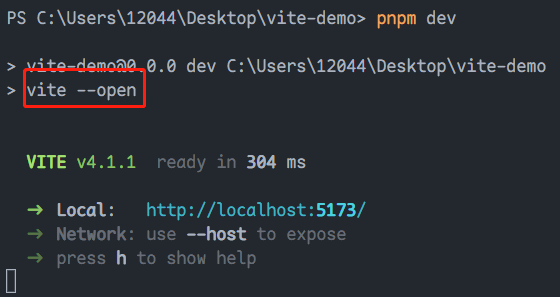
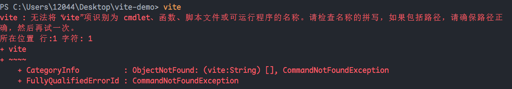
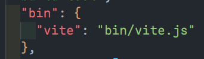
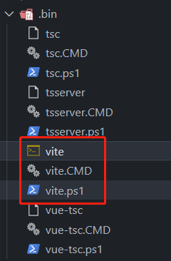
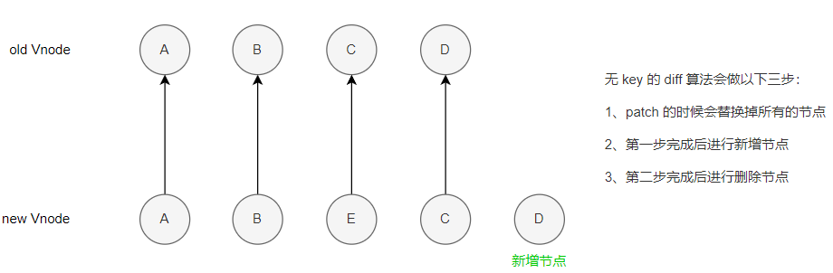
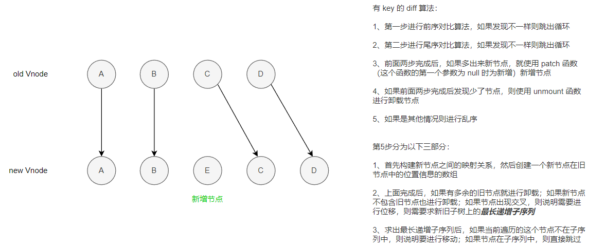
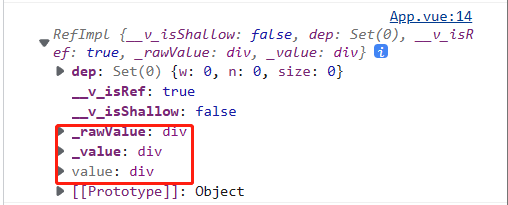
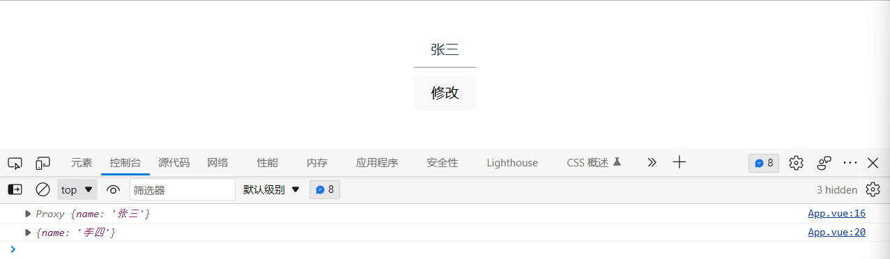
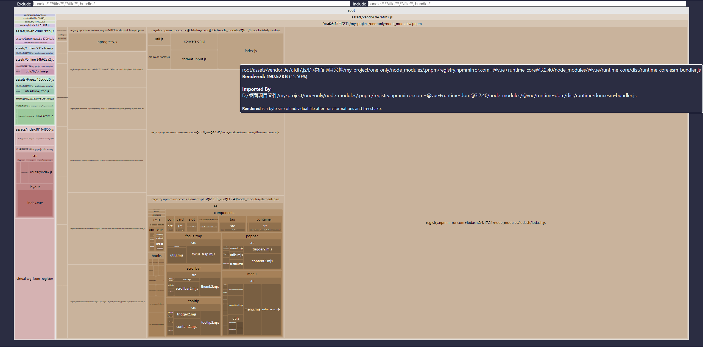

## 创建项目

1. 使用`pnpm create vite@latest`创建一个使用`vite`构建的`vue3`项目，这里选择语言为`typescript`。
2. 使用`pnpm i`安装项目的依赖
3. 使用`pnpm dev`运行项目

> **拓展：**
>
> 我们运行项目时使用了`pnpm dev`这个命令，其实相当于是`npm run dev`这个命令，而这个命令会启动`package.json`中的`scripts`下的`dev`命令，即启动了`vite`。但是我们自己在终端中使用`vite`时是会报错的。
>
> 
>
> 
>
> 这就说明我们使用`pnpm dev`时它启动的`vite`命令是做过一些配置的，因此我们可以在`node_modules`下的`vite`文件夹下面看到`vite`的源码中的`package.json`中有如下配置：
>
> 
>
> 那么此时我们去到`node_modules/.bin`文件夹下查看，有如下几个文件：
>
> 
>
> 这三个文件作用如下：
>
> 1. `vite`：给`unix`系统使用
> 2. `vite.CMD`：给`windows`系统使用
> 3. `vite.ps1`：这个是跨平台的，在`windows | mac | unix`等各种平台都能使用
>
> <span style="color: orange">执行`npm run dev`后的查找规则：</span>
>
> 1. 先从本地的`node_modules`中查找`bin`中有无`vite`可执行的
> 2. 如果没有就会去`npm install -g`全局包中查找有无`vite`可执行的
> 3. 如果没有就去**环境变量**
> 4. 如果以上都没有，则报错

## vue 指令

- `v-text`：跟`{{}}`类似，可以展示文本

- `v-html`：可以展示文本，也可以展示富文本，或者说节点`<div>123</div>`这种，但是它不能展示组件

- `v-bind`：可以简写为`:`，用来绑定元素的属性 Attr，如动态绑定一些`class | style : id`等

- `v-on`：可以简写为`@`，用来绑定元素的事件。它可以支持动态绑定的用法，如下

  ```vue
  <template>
  	<div @[event]="() => a++">
  		{{ a }}
  	</div>
  </template>

  <script setup lang="ts">
  	import { ref } from "vue"

  	const event = "click"
  	let a = ref(1)
  </script>

  <style scoped></style>
  ```

- `v-on.[修饰符]`：[事件修饰符](https://cn.vuejs.org/guide/essentials/event-handling.html#event-modifiers) ，这些修饰符都有一些特殊的功能，如`.stop`可以禁用冒泡，`.once`可以让事件只触发一次

- `v-model`：双向数据绑定，一般用来绑定表单

- `v-for`：遍历元素

- `v-once`：性能优化，只渲染一次

- `v-memo`：性能优化，会有缓存。[v-memo](https://juejin.cn/post/7180973915580137527)

## 虚拟 dom 和 diff 算法

### 虚拟 dom

虚拟 dom 就是通过 js 来生成一个 AST 节点树

[Vue Template Explorer (vue-next-template-explorer.netlify.app)](https://vue-next-template-explorer.netlify.app/#eyJzcmMiOiI8ZGl2PlxyXG4gICAgPGRpdj4gXHJcbiAgICAgICAgIDxzZWN0aW9uPnRlc3Q8L3NlY3Rpb24+XHJcbiAgICAgIDwvZGl2PiAgXHJcbjwvZGl2PiIsIm9wdGlvbnMiOnt9fQ==)

```
<div>
    <div>
         <section>test</section>
      </div>
</div>

/*
	虚拟 dom 就是将上面我们写的真实的 dom 节点转换为下面这种使用 js 来描述的 AST 树。
*/

import { createElementVNode as _createElementVNode, openBlock as _openBlock, createElementBlock as _createElementBlock } from "vue"

export function render(_ctx, _cache, $props, $setup, $data, $options) {
  return (_openBlock(), _createElementBlock("div", null, [
    _createElementVNode("div", null, [
      _createElementVNode("section", null, "test")
    ])
  ]))
}
```

<span style="color: orange">为什么要使用虚拟 dom：</span>[Vue.js 设计与实现-霍春阳](https://weread.qq.com/web/reader/c5c32170813ab7177g0181aek16732dc0161679091c5aeb1)

### diff 算法

#### 无 key 的 diff 算法



#### 有 key 的 diff 算法



| 数据                                           | 10  | 9   | 2   | 5   | 3   | 7   | 101 | 18  |
| ---------------------------------------------- | --- | --- | --- | --- | --- | --- | --- | --- |
| dp(先全部默认为 1)                             | 1   | 1   | 1   | 1   | 1   | 1   | 1   | 1   |
| <span style="color: green">dp(最后结果)</span> | 1   | 1   | 1   | 2   | 2   | 3   | 4   | 4   |
| index                                          | 0   | 1   | 2   | 3   | 4   | 5   | 6   | 7   |

> 上面的结果算法为：
>
> 1. 首先 10 的前面没有可比较的数字，因此为 1
> 2. 9 与前面的数字进行比较，发现小于 10，则也为 1
> 3. 2 与前面的数字进行比较，小于 9、小于 10，因此也为 1
> 4. 5 与前面的数字进行比较，大于 2、小于 9、小于 10，因此为 1+1=2
> 5. 3 与前面的数字进行比较，小于 5、大于 2、小于 9、小于 10，因此也为 1+1=2
> 6. 7 与前面的数字进行比较，发现大于 3、5、2，而这里面最大的为 5 和 3 的结果 2，因此 7 的结果为 1+2=3
> 7. 101 和 18 的算法也和前面类似，得出结果为 4

## ref 全家桶

### ref

ref 有两个作用：

1. 第一可以接受一个内部值并返回一个响应式且可变的 ref 对象。这个 ref 对象仅有一个`.value`property，指向该对象的内部值。

   ```js
   import { ref } from "vue"

   const num = ref(1)
   console.log(num.value) // 1
   ```

2. ref 可以用于注册元素或子组件的引用。

   ```vue
   <template>
   	<div ref="divA" @click="clickEvent">
   		{{ a }}
   	</div>
   </template>

   <script setup lang="ts">
   	import { ref } from "vue"

   	let a = ref(1)
   	const divA = ref(null)
   	const clickEvent = () => {
   		console.log(divA)
   	}
   </script>

   <style scoped></style>
   ```

   

### isRef

用来判断一个对象是不是 ref 对象。

```js
import { isRef } from "vue"

const num1 = ref(1)
const num2 = 2
console.log(isRef(num1)) // true
console.log(isRef(num2)) // false
```

### shallowRef

创建一个跟踪自身 `.value` 变化的 ref，但不会使其值也变成响应式。即使用`shallowRef()`创建的对象，只能监听到`.value`的变化，若有如`.value.name`类的变化，这是监听不到的。

```vue
<template>
	<div @click="clickEvent">
		{{ obj.name }}
		<!-- 点击后页面展示为 '张三' -->
	</div>
</template>

<script setup lang="ts">
	import { shallowRef } from "vue"

	const obj = shallowRef({ name: "张三" })
	const clickEvent = () => {
		obj.value.name = "李四"
		console.log(obj.value.name) // 李四
	}
</script>
```

### triggerRef

强制更新页面。这样也是可以改变值的。

```vue
<template>
	<div>
		<button @click="changeMsg">change</button>
		<div>{{ message }}</div>
		<!-- 点击后变为大满 -->
	</div>
</template>

<script setup lang="ts">
	import { Ref, shallowRef, triggerRef } from "vue"
	type Obj = {
		name: string
	}
	let message: Ref<Obj> = shallowRef({
		name: "小满",
	})

	const changeMsg = () => {
		message.value.name = "大满"
		triggerRef(message)
	}
</script>
```

### customRef

用于自定义 ref。

`customRef()`是一个工厂函数，要求为我们返回一个对象，并且实现`get`和`set`，适合用于做防抖之类的。

```vue
<template>
	<div>
		{{ name }}
	</div>
	<hr />
	<button @click="change">修改 customRef</button>
	<!-- 点击多次只会触发一次 -->
</template>

<script setup lang="ts">
	import { customRef } from "vue"

	function myRef<T = any>(value: T) {
		let timer: any
		return customRef((track, trigger) => {
			return {
				get() {
					track()
					return value
				},
				set(newVal) {
					clearTimeout(timer)
					timer = setTimeout(() => {
						console.log("触发了set")
						value = newVal
						trigger()
					}, 500)
				},
			}
		})
	}

	const name = myRef<string>("小满")

	const change = () => {
		name.value = "大满"
	}
</script>
```

## Reactive 全家桶

`reactive`与`ref`类似，都是接收一个内部值，并返回一个响应式的对象，不同点在于：

1. `reactive`只能接收一个对象（Array、Object、Set、Map）做内部值，而`ref`支持所有类型。

2. `reactive`定义的值不需要`.value`。

   ```js
   import { reactive } from "vue"

   const obj = reactive({
   	name: "张三",
   })
   console.log(obj.name) // 张三
   ```

3. `reactive`返回的是一个`proxy`对象，如果给他直接赋值会破坏对象的响应式。

   ```vue
   <template>
   	<div>
   		{{ list.name }}
   	</div>
   	<hr />
   	<button @click="change">修改</button>
   </template>

   <script setup lang="ts">
   	import { reactive } from "vue"

   	let list = reactive({
   		name: "张三",
   	})
   	console.log(list)

   	const change = () => {
   		list = { name: "李四" }
   		console.log(list)
   	}
   </script>
   ```

   

### readonly

复制一份 proxy 对象，将其设置为只读

```js
import { reactive, readonly } from "vue"
const person = reactive({ count: 1 })
const copy = readonly(person)

copy.count++
// [Vue warn] Set operation on key "count" failed: target is readonly. Proxy {count: 1}
```

### shallowReactive

是`reactive()`的浅层作用形式。浅层响应式对象里只有根级别的属性是响应式的。

```js
const state = shallowReactive({
	foo: 1,
	nested: {
		bar: 2,
	},
})

// 更改状态自身的属性是响应式的
state.foo++

// ...但下层嵌套对象不会被转为响应式
isReactive(state.nested) // false

// 不是响应式的
state.nested.bar++
```

## 认识 to 系列全家桶

### toRef

只针对响应式对象的值，如果响应式对象的值修改了，视图也会相应的发生变化；如果是非响应式的对象，虽然值的变化能监听到，但是视图并不会变化。

```vue
<template>
	<div>
		{{ nameReac }}
	</div>
	<hr />
	<div>
		{{ nameNorm }}
	</div>
	<hr />
	<button @click="change">修改</button>
	<!-- 点击多次只会触发一次 -->
</template>

<script setup lang="ts">
	import { reactive, toRef } from "vue"

	let dataReac = reactive({
		name: "张三",
	})
	let nameReac = toRef(dataReac, "name")

	let dataNorm = { name: "张三" }
	let nameNorm = toRef(dataNorm, "name")

	const change = () => {
		// 这两个值的变化不能放在一起，否则响应式对象值的更改会影响非响应式的
		nameReac.value = "李四" // 响应式对象的更改
		// nameNorm.value = "李四" // 非响应式对象的更改
	}
</script>
```

应用场景：如我们有一个响应式的对象，现在有一个函数，它的参数是这个响应式对象中的某个属性，那么我们就可以使用`toRef`去将这个属性单独拿出来进行使用。

### toRefs

与`toRef`类似，但是它是将整个响应式对象中的每个属性都进行了转换，因此我们可以用它来做响应式对象的解构，因为响应式对象直接进行解构的话，单独拿出来的属性并不是响应式的。

```vue
<template>
	<div>
		{{ age }}
	</div>
	<hr />
	<button @click="change">修改</button>
	<!-- 点击多次只会触发一次 -->
</template>

<script setup lang="ts">
	import { reactive, toRefs } from "vue"

	let dataReac = reactive({
		name: "张三",
		age: 18,
	})

	// let { age } = dataReac
	let { age } = toRefs(dataReac)

	const change = () => {
		// age = 19 // 视图不会变化
		age.value = 19
	}
</script>
```

应用场景：将响应式对象中的值解构出来后也是响应式的。

### toRaw

将一个响应式对象变为非响应式的对象。

```vue
<template>
	<div>
		{{ dataRaw.age }}
	</div>
	<hr />
	<button @click="change">修改</button>
	<!-- 点击多次只会触发一次 -->
</template>

<script setup lang="ts">
	import { reactive, toRaw } from "vue"

	let dataReac = reactive({
		name: "张三",
		age: 18,
	})

	let dataRaw = toRaw(dataReac)

	const change = () => {
		dataRaw.age = 19
		// {name: '张三', age: 19}
		// 这个对象脱去了外层的 proxy
	}
</script>
```

## 认识 computed 计算属性

`computed()` 方法期望接收一个 `getter` 函数，返回值为一个**计算属性 ref**，其和其他一般 ref 类似。

计算属性会自动追踪响应式依赖，它会检测计算属性依赖的变量的改变，当这个变量改变时，任何依赖于这个计算属性的绑定都会同时更新。

```vue
<template>
	<p>Has published books:</p>
	<span>{{ publishedBooksMessage }}</span>
</template>

<script setup>
	import { reactive, computed } from "vue"

	const author = reactive({
		name: "John Doe",
		books: ["Vue 2 - Advanced Guide", "Vue 3 - Basic Guide", "Vue 4 - The Mystery"],
	})

	// 一个计算属性 ref
	const publishedBooksMessage = computed(() => {
		return author.books.length > 0 ? "Yes" : "No"
	})
</script>
```

计算属性默认仅能通过计算函数得出结果。当尝试修改一个计算属性时，会出现一个运行时警告。只有在某些特殊场景中通过同时提供 `getter` 和 `setter` 来创建一个**可写的**计算属性。

```vue
<script setup>
	import { ref, computed } from "vue"

	const firstName = ref("John")
	const lastName = ref("Doe")

	const fullName = computed({
		// getter，读取计算属性的值
		get() {
			return firstName.value + " " + lastName.value
		},
		// setter，修改计算属性的值
		set(newValue) {
			// 注意：我们这里使用的是解构赋值语法
			;[firstName.value, lastName.value] = newValue.split(" ")
		},
	})

	fullName.value = "John Doe"
	// 调用 fullName 的 setter，firstName 和 lastName 会同时更新
</script>
```

> #### 注
>
> 计算属性只应做计算而不做其他功能。如，不要在计算函数中进行异步请求或者修改 DOM。
>
> 如果要通过一个变量的变动来进行其他修改可以使用[监听器](https://cn.vuejs.org/guide/essentials/watchers.html) 。
>
> 计算属性中以来的属性的值发生变化时，会触发它的更改，如果依赖的值不变，则使用的是缓存中的属性值。

## 认识 watch 侦听器

`watch`函数接收三个参数，分别是要监听的数据、回调函数、options 配置项。`watch`对数据进行监听，并在回调函数中执行相应的操作。

- `options`：

  ```js
  {
      immediate: true, // 是否立即调用一次
      deep: true, // 是否开启深度监听
  }
  ```

```
watch(value, function(newValue, oldValue) {
	// newValue 监听的数据变化后的值
	// oldValue 监听的数据变化前的值
}, {
	immediate: true, // 是否立即调用一次
    deep: true, // 是否开启深度监听
})
```

> `watch`监听单一的`ref`对象时直接传入这个对象即可，若监听多个`ref`对象，第一个参数需要传入一个数组`[ref1, ref2, ...]`。
>
> `wathc`监听`reactive`时，`deep`配置开启与不开启的效果一致（因为在`watch`的源码中已经做了隐式的开启 ）。`watch`监听`reactive`中的某一个值时，第一个参数需要传入一个函数`watch(() => reactive.[attrName], function() {}, {})`。

## 高级侦听器 watchEffect

[watchEffect](https://cn.vuejs.org/api/reactivity-core.html#watcheffect) 立即运行一个函数，同时响应式地追踪其依赖，并在依赖更改时重新执行。

1. 基本使用

   ```js
   let message1 = ref("")
   let message2 = ref("")

   watchEffect(() => {
   	console.log(message1.value)
   	console.log(message2.value)
   })
   ```

2. 清除副作用：就是在触发监听前，会调用一个函数，可以处理一些逻辑，如防抖。

   ```js
   let message1 = ref('')
   let message2 = ref('')

   watchEffect((onInvalidate) => {
       onInvalidate() {

       }
       console.log(message1.value)
       console.log(message2.value)
   })
   ```

3. 停止跟踪：`watchEffect`会返回一个函数，这个函数用于中止监听。

   ```js
   let stop = watchEffect(() => {})

   stop()
   ```

## 父子组件传参

[defineProps 和 defineEmits](https://cn.vuejs.org/api/sfc-script-setup.html#defineprops-defineemits)

### 父组件向子组件传参

使用`defineProps()`方法。

1. js 写法

   ```js
   // 在子组件中接收父组件通过 v-bind 传递过来的值
   const props = defineProps({
   	title: {
   		type: string,
   		default: "默认值",
   	},
   })
   ```

2. ts 写法

   ```typescript
   // 在子组件中接收父组件通过 v-bind 传递过来的值
   /* 
   	第一种写法，不规定默认值
   */
   const props = defineProps<{
   	title: string
   	arr: number[]
   }>()

   /*
   	第二种写法，规定默认值。
   	要规定默认值，则需要使用 withDefaults() 方法，它是 typescript 写法中独有的
   */
   const props = withDefaults(
   	defineProps<{
   		title: string
   		arr: number[]
   	}>(),
   	{
   		arr: () => [123, 456], // 如果是引用类型，则需要使用函数返回默认值
   	}
   )
   ```

### 子组件向父组件传参

使用`defineEmits()`方法。

1. js 写法

   ```js
   // 在子组件中使用 defineEmits() 注册方法，来给父组件传值
   const emits = defineEmits(["click1", "click2"])

   const send = () => {
   	emits("click1", "我是子组件传递的值")
   }
   ```

   ```js
   // 在父组件中使用 v-on 给子组件绑定事件
   // <son @click="getData"> 子组件 </son>

   const getData = (data) => {
   	console.log("子组件传递过来的值", data)
   }
   ```

2. ts 写法：ts 中只是在子组件中使用`defineEmits`传值写法不同

   ```typescript
   const emits = defineEmits<{
   	(e: "click1", data: string): void
   	(e: "click2", data: string): void // 多个事件
   }>()
   ```

### 子组件给父组件暴露一些属性或方法

使用 [defineExpose()](https://cn.vuejs.org/api/sfc-script-setup.html#defineexpose) 方法，这样也能达到子组件给父组件传参的效果。

1. 在子组件中使用`defineExpose()`

   ```js
   defineExpose({
   	name: "我是子组件暴露给父组件的值",
   	open: () => {
   		console.log("我是子组件暴露给父组件的方法")
   	},
   })
   ```

2. 在父组件中使用

   ```vue
   <template>
   	<son-vue ref="sonRef"></son-vue>
   </template>

   <script setup lang="ts">
   	import { ref, onMounted } from "vue"
   	import sonVue from "./components/SonVue.vue"

   	/* 
       这是 js 的写法
     	*/
   	// const sonRef = ref(null) // 获取子组件

   	/*
       这是 ts 的写法
       <InstanceType<typeof sonVue>> 用来推断 sonRef 的类型
     	*/
   	const sonRef = ref<InstanceType<typeof sonVue>>()

   	onMounted(() => {
   		console.log("子组件传递过来的值", sonRef.value?.name)
   		sonRef.value?.open()
   	})
   </script>
   ```

## 全局组件、局部组件、递归组件

### 全局组件

一些在项目中使用频率非常高的的组件，几乎每个页面都在使用的，就可以将其封装为全局组件。

配置方法：在`main`文件中使用`component()`方法进行注册，这个方法可以链式调用。

```js
import { createApp } from "vue"
import App from "./App.vue"
import Card from "./components/Card/index.vue"

createApp(App).component("Card", Card).mount("#app")
```

> `component`方法**不能**放到`mount`后面。在注册之前要导入这个组件。
>
> 有多个全局组件时可以使用`for`循环来批量注册。
>
> ```js
> import { createApp } from 'vue'
> import App from './App.vue'
>
> const app = createApp(App)
> for (循环条件) {
>  app.component(key, component)
> }
> ```

### 局部组件

使用频率不那么高的一些组件，就可以封装为局部组件，这些组件不需要在`main`文件中进行配置，直接在需要使用的组件中进行导入使用即可。

### 递归组件

[递归组件 | vue 官方文档](https://cn.vuejs.org/api/sfc-script-setup.html#recursive-components)

简单来说，递归组件就是在组件内部调用自己。下面是一个简单的递归组件的例子。

- 父组件

  ```vue
  <template>
  	<tree-vue :list="list"></tree-vue>
  </template>

  <script setup lang="ts">
  	import { reactive } from "vue"
  	import TreeVue from "./components/TreeVue.vue"
  	// 导入子组件中定义的数据类型
  	import { tree } from "./components/TreeVue.vue"

  	const list = reactive<tree[]>([
  		{
  			title: "1",
  			children: [
  				{
  					title: "1-1",
  				},
  			],
  		},
  		{
  			title: "2",
  			children: [
  				{
  					title: "2-1",
  					children: [
  						{
  							title: "2-1-1",
  						},
  					],
  				},
  				{
  					title: "2-2",
  				},
  			],
  		},
  		{
  			title: "3",
  		},
  	])
  </script>
  ```

- 子组件

  ```vue
  <template>
  	<div v-for="item in list">
  		<div>{{ item.title }}</div>
  		<!-- 自己调用自己，这里使用这个组件的文件名，如果不想使用文件名，则可以再添加一个没有 setup 的 script，在其中使用 export default { name: ''} 去自定以名字，或者使用 defineOptions({name: ''})，但是这个需要装插件 -->
  		<TreeVue :list="item?.children" v-if="item?.children?.length"></TreeVue>
  	</div>
  </template>

  <script setup lang="ts">
  	export interface tree {
  		title: string
  		children?: any[]
  	}

  	const props = defineProps<{
  		list?: tree[]
  	}>()
  </script>

  <style scoped></style>
  ```

> 在递归组件中处理事件时，会有冒泡导致事件触发多次，因此建议**在递归组件中处理事件时使用`.stop`阻止冒泡。**

## 动态组件

有些场景会需要在几个组件间来回切换，如 [Tab](https://sfc.vuejs.org/#eNqNVNFu2yAU/RXkPqSVYrtdpz2wpFrf9riHvdXTRDBOaG1AgNNWUf59B3BcZ13WxFLEvfdwOOfa3F12b0yx7UVGs4XjVhpPnPC9uauU7Iy2nnzXnSCN1R2ZFWUIAnw2ln9o591Yj9Ex4N7yjdy+UQzxMWhHrGjIfgClEqkU18p5wntrhfI/2YosA+5yFmTMrip1QHi2cqjtsCnqnYdF1BJXw5GV2ldqUSabMIjAi860zAtEhCxquSW8Zc4tq6wWna6ymEdl1XuvsSEE+G3zRluALn/Pw9lXRKqoocpGCH0Sr0AgO00e2B9mKOSJdTaHfcY9FNIjr8tlICX7XxOGb7yV/AkMR02ZnjJIJmS3S9thOnoo03HBuEfINVqvQEGoDJKC/oc3Vhw69iLS3y3KcUtqV4l+YbUoJ11E6PxrG5ZFaGF6J41WPm9YJ9tXShxTLnfCyuZrqK20rYWl5Ma8EKdbWZMLIcSklFtWy95R8sm8xLRhdS3VGolr7LnFX0x3zK6lyr02IBPdNLfScN5R8vmA7XE+NLSCe0oUPMWs3grbtPo5f6GE9V4jiebBydvLSn5GBV8g4OZAOsiFgLwVjR91376vW7nenAIctYJzHkt4MU6jZLRUXtgEZ/xpbXWvakoumuvw/Mt0DrppPp49pmFwYo9uQg+SySN6cR2ed/gifbdnbBggpx2OPR36me5q/JayeZbmRN4xUzw6rTCuIl81FHDzaDoh5DA/QlxlG++No2XpGh7mzaMrtF2XWBW2V15ilgnX5Surn/E9gLjK4rwYOEok0Y0cNwKihf0f51/Qd7yBFo72sHKYoWHknp4/6c4lNXEEj5fvxN0D8zh9z6dO4/sM7snYPp/9MPs/5N//ARljNdU=) 页面，这种时候，就可以使用 [<component> 动态组件 </component>](https://cn.vuejs.org/guide/essentials/component-basics.html#dynamic-components) 。

```html
<!-- currentTab 改变时组件也改变 -->
<component :is="tabs[currentTab]"></component>
```

## 插槽 slot

插槽大致可以分为：匿名插槽、具名插槽、作用域插槽、动态插槽。

### 匿名插槽

1. 在子组件(Dialog)中放置一个插槽

   ```html
   <template>
   	<div>
   		<slot></slot>
   	</div>
   </template>
   ```

2. 在父组件中填充插槽的内容

   ```html
   <dialog>
   	<template v-slot>
   		<div>插槽内容</div>
   	</template>
   </dialog>
   ```

### 具名插槽

顾名思义，它有一个专门的`name`，以便父组件在填充内容时标明要往哪个插槽中填充内容。

1. 在子组件(Dialog)中防止具名插槽

   ```html
   <div>
   	<slot name="header"></slot>
   	<slot></slot>
   	<slot name="footer"></slot>
   </div>
   ```

2. 在父组件中填充内容

   ```html
   <dialog>
   	<!-- 向具名插槽 header 中填充内容 -->
   	<!-- v-slot 可以简写为 #，如 <template #header> -->
   	<template v-slot:header>
   		<div>1</div>
   	</template>

   	<!-- 向匿名插槽中填充内容 -->
   	<!-- 这里的 v-slot 可以写为 #default -->
   	<template v-slot>
   		<div>2</div>
   	</template>

   	<!-- 向具名插槽 footer 中填充内容 -->
   	<template v-slot:footer>
   		<div>3</div>
   	</template>
   </dialog>
   ```

### 作用域插槽

在子组件中动态绑定参数，派发给父组件的 slot 使用。

1. 在子组件(Dialog)中绑定参数

   ```html
   <div>
   	<div v-for="(item, index) in 100">
   		<slot :data="item" :index="index"></slot>
   	</div>
   </div>
   ```

2. 在父组件中通过解构的方式取值进行使用

   ```html
   <dialog>
   	<template #default="{ data, index }">
   		<div>{{ item }} -- {{ index }}</div>
   	</template>
   </dialog>
   ```

### 动态插槽

即即具名插槽中的`name`可以是一个变量名，表明这个插槽的名称是动态的。

```html
<dialog>
	<template #[name]>
		<div>{{ name }}</div>
	</template>
</dialog>

<!-- const name = ref('header') -->
```

## 异步组件&代码分包&suspense

在大型应用中，我们可能需要将应用分割成小一些的代码块，并且较少主包的体积，这时候就可以使用异步组件。

`vue`提供了`defineAsyncComponent`方法来实现这个功能。

```js
import { defineAsyncComponent } from "vue"

const AsyncComp = defineAsyncComponent(() => {
	return new Promise((resolve, reject) => {
		// ...从服务器获取组件
		resolve(/* 获取到的组件 */)
	})
})
// ... 像使用其他一般组件一样使用 `AsyncComp`
```

从上面的代码可以看出，`defineAsyncComponent`方法接收一个`Promise`。也就是说，如果我们需要使用的组件为异步组件，则这个组件需要返回一个`Promise`，而在`setup`语法糖中，当我们使用 [顶层 await](https://cn.vuejs.org/api/sfc-script-setup.html#top-level-await)，则这个代码会被编译成`async setup()`，这样这个组件就会返回一个`Promise`。例子如下：

1. 使用**顶层 await** 封装一个异步组件

   ```vue
   <!-- AsyncCom -->
   <template>
   	<div>{{ data }}</div>
   </template>

   <script setup lang="ts">
   	import { axios } from "axios"

   	interface Data {
   		data: {
   			name: string
   			age: number
   			url: string
   			desc: string
   		}
   	}

   	const { data } = await axios.get<Data>("./data.json")
   </script>
   ```

2. 在父组件中使用异步的子组件

   ```vue
   <template>
   	<!-- 异步组件必须搭配 Suspense 使用 -->
   	<Suspense>
   		<!-- 异步组件加载完成后展示异步组件 -->
   		<template #default>
   			<async-com></async-com>
   		</template>

   		<!-- 异步组件加载时展示其他组件，如展示骨架屏 -->
   		<template #fallback>
   			<skeleton-com></skeleton-com>
   		</template>
   	</Suspense>
   </template>

   <script setup lang="ts">
   	import { ref, reactive, defineAsyncComponent } from "vue"
   	import skeletonCom from "./components/SkeletCom.vue"

   	// 引入异步组件
   	const asyncCom = defineAsyncComponent(() => import("./components/AsyncCom.vue"))
   </script>
   ```

> 异步组件使用注意：
>
> 1. 异步组件引入方式与常规的组件不同，必须使用`defineAsyncComponent`方法搭配`import()`函数式的方式引入
>
> 2. 异步组件的使用必须搭配`Suspense`内置组件使用，这个内置组件提供两个`template`，一个用于展示异步组件，一个用于在异步组件加载完成前展示其他默认内容，如骨架屏
>
> 3. `Suspense`内置组件目前处于实验阶段，后续可能会有改动：[Suspense | Vue.js (vuejs.org)](https://cn.vuejs.org/guide/built-ins/suspense.html#suspense)
>
> 4. 下面的代码是`defineAsyncComponent`方法引入组件的完整写法：
>
>    ```js
>    const AsyncComp = defineAsyncComponent({
>    	// 加载函数
>    	loader: () => import("./Foo.vue"),
>
>    	// 加载异步组件时使用的组件
>    	loadingComponent: LoadingComponent,
>    	// 展示加载组件前的延迟时间，默认为 200ms
>    	delay: 200,
>
>    	// 加载失败后展示的组件
>    	errorComponent: ErrorComponent,
>    	// 如果提供了一个 timeout 时间限制，并超时了
>    	// 也会显示这里配置的报错组件，默认值是：Infinity
>    	timeout: 3000,
>    })
>    ```
>
> 5. 通过`defineAsyncComponent`加载异步配合`import()`函数模式便可以分包

## Teleport 传送组件

`Teleport`内置组件的作用就是将我们的模板渲染到指定的 dom 节点中，让其不受父级的`style | v-show`等属性影响，但是`data | props`数据依然能够共用的技术。

使用方法：

```html
<Teleport to="body" :disabled="false">
	<Loading></Loading>
</Teleport>
```

`Teleport`接收两个参数：

1. `to`：指定要将`Teleport`中的内容传送到哪个节点中，它支持`tagName | className | id`等选择器
2. `disabled`：接收布尔值，表示`Teleport`是否生效

> 注意：`<Teleport>` 挂载时，传送的 `to` 目标必须已经存在于 DOM 中。理想情况下，这应该是整个 Vue 应用 DOM 树外部的一个元素。如果目标元素也是由 Vue 渲染的，你需要确保在挂载 `<Teleport>` 之前先挂载该元素。

## keep-alive

有时我们不希望组件被重新渲染影响使用体验，或者出于性能考虑，避免多次重复渲染组件降低性能。而是希望组件可以被缓存下来，维持当前的状态，当需要时直接展示。这时候就需要用到`keep-alive`内置组件。

使用`keep-alive`时会多两个生命周期钩子：

1. `onActivated()`：首次挂载时，以及每次从缓存中取出使用时调用

   > 首次挂载组件时，`onMounted> onActivated`。

2. `onDeactivated()`：在从 dom 上移除时，进入缓存时，以及组件卸载时调用

### include & exclude

`include`和`exclude`允许组件有条件地缓存。二者都可以用逗号分隔字符串、正则表达式或一个数组来表示：

```html
<keep-alive :include="" :exclude=""></keep-alive>
```

### max

`max`表示`keep-alive`最大可以缓存的组件数量。

```html
<keep-alive :max="10">
	<component :is="view"></component>
</keep-alive>
```

> 注：`<keep-alive>`不能保存滚动条的位置，如果要保存滚动条的信息，则需要自行保存信息，然后在组件展示时，即`onActivated()`生命周期中将其滚动条定位到上次保存的位置。
>
> 保存这个信息可以保存在`vuex | pinia`这类状态管理器中，也可以保存在`localStorage`中，这些保存的位置仅凭个人喜好或项目要求。

## Transition

`Transition`内置组件的作用是给一个元素添加进入和离开 dom 时的过渡效果。

进入或离开可以由以下条件之一触发：

- `v-if`
- `v-show`
- 特殊元素 `<component>` 切换的动态组件

基本用法：

```vue
<template>
	<button @click="show = !show">Toggle</button>
	<Transition>
		<p v-if="show">hello</p>
	</Transition>
</template>

<style scoped>
	.v-enter-active,
	.v-leave-active {
		transition: opacity 0.5s ease;
	}

	.v-enter-from,
	.v-leave-to {
		opacity: 0;
	}
</style>
```

[Transition 其他用法](https://cn.vuejs.org/guide/built-ins/transition.html)

[完整内容](https://xiaoman.blog.csdn.net/article/details/123000653)

## TransitionGroup

[TransitionGroup](https://cn.vuejs.org/guide/built-ins/transition-group.html) 是一个内置组件，用于对`v-for`列表中的元素或组件的插入、移除和顺序改变添加动画效果。

## Provide 和 Inject

简单来说就是我们在父组件中使用`provide`指定我们要提供给后代组件使用的数据或方法，然后在后代组件中使用`inject`接收这些数据或方法。

它的好处在于如果我们的数据需要隔代相传，则不需要使用类似`defineProps`的方式一层层的传递下去，而是在后代组件中只要想用则直接使用`inject`接收即可。这样让我们写代码时传递数据和方法变得更加方便。


例子如下：

- 父组件中传值

  ```vue
  <template>
  	<div class="App">
  		<button>我是App</button>
  		<A></A>
  	</div>
  </template>

  <script setup lang="ts">
  	import { provide, ref } from "vue"
  	import A from "./components/A.vue"
  	let flag = ref<number>(1)
  	provide("flag", flag)
  </script>
  ```

- 子组件中接收

  ```vue
  <template>
  	<div style="background-color: green;">
  		我是B
  		<button @click="change">change falg</button>
  		<div>{{ flag }}</div>
  	</div>
  </template>

  <script setup lang="ts">
  	import { inject, Ref, ref } from "vue"

  	const flag = inject<Ref<number>>("flag", ref(1))
  	const change = () => {
  		flag.value = 2
  	}
  </script>
  ```

> 如果传递的值是非响应式的，则需要使用`ref | reactive`添加响应式

## 兄弟组件间传值

1. 方式一：在 SonA 组件中使用`defineEmits`派发事件给父组件传值，然后在父组件中使用`:props`给 SonB 组件传值，以达到在 SonA 和 SonB 这两个兄弟组件中进行传值。这种方式很麻烦，不推荐。

2. 方式二：使用**全局事件总线**，在 vue2 中，我们可以使用`$emit`和`$on`来传递和监听事件，这个原理其实是运用了 JS 设计模式的发布订阅模式。这里写一个简易版的。

   ```typescript
   type Bus = {
   	emit: (name: string) => void
   	on: (name: string, callback: Function) => void
   }

   type PramsKey = string | number | symbol

   type List = {
   	[key: PramsKey]: Array<Function>
   }

   class EventBus implements Bus {
   	list: List // 保存注册的事件

   	constructor() {
   		this.list = {}
   	}

   	emit(name: string, ...args: Array<any>) {
   		// 先获取全部的已注册为 name 的事件
   		let eventName: Array<Function> = this.list[name]
   		eventName.forEach((fn) => {
   			fn.apply(this, args)
   		})
   	}

   	on(name: string, callback: Function) {
   		// 如果 name 这个事件已经注册过了，就直接返回，没有注册过，就返回一个空数组
   		let fn: Array<Function> = this.list[name] || []
   		fn.push(callback)
   		this.list[name] = fn
   	}
   }

   // 导出实例
   export default new EventBus()
   ```

   在 vue3 中`$on`，`$off` 和 `$once` 实例方法已被移除，组件实例不再实现事件触发接口，原因在于在短期内`EventBus`往往是最简单的解决方案，但从长期来看，它维护起来总是令人头疼，于是不再提供官方支持。如果非要使用`EventBus`，那么这里有一个推荐的第三方库 [Mitt | 小满 zs 博客](https://xiaoman.blog.csdn.net/article/details/125453908) 。

   > 这种方式，如果是个人的小项目中，可以使用，但是如果是多人合作开发的大型项目，那么不推荐使用，因为它维护起来实在令人头疼。请关爱亲爱的同事。。。。。。

3. 可以使用`vuex`或者`pinia`这种状态管理器。

## TSX

[TSX | 小满 zs 博客](https://xiaoman.blog.csdn.net/article/details/123172735)

[TSX 完整用法官方参考](https://www.npmjs.com/package/@vue/babel-plugin-jsx)

## v-model

我们都知道`v-model`可以用于表单元素的双向数据绑定，因此这里就不做赘述。下面主要说明`v-model`在自定义组件中如何使用，即如何给自定义组件做双向数据绑定。

### 给自定义组件绑定数据

1. 父组件

   ```vue
   <template>
   	<son-a v-model="dataToSonA"></son-a>
   	<hr />
   	<button @click="dataToSonA = !dataToSonA">点击{{ dataToSonA }}</button>
   </template>

   <script setup lang="ts">
   	import { ref } from "vue"
   	import SonA from "./components/SonA.vue"

   	const dataToSonA = ref<boolean>(true)
   </script>
   ```

2. 子组件

   ```vue
   <template>
   	<div>SonA</div>
   	<div>{{ modelValue }}</div>
   	<button @click="clickEvent">{{ `点击${modelValue}` }}</button>
   </template>

   <script setup lang="ts">
   	const props = defineProps<{
   		modelValue: boolean
   	}>()

   	const emits = defineEmits(["update:modelValue"])

   	const clickEvent = (): void => {
   		emits("update:modelValue", false)
   	}
   </script>

   <style scoped></style>
   ```

上面的案例运行后点击父组件的 button 会看到子组件中的值发生变化，点击子组件中的 button 也能看到父组件中的值发生变化，说明这里的双向数据绑定确实生效了。但是有个问题是，为什么我们传递过去的值是 _dataToSonA_，但是在子组件中使用的却是 _modelValue_ 呢？原因是当我们使用`v-model`给子组件绑定值时，其实实际代码是这样的：

```vue
<son-a :modelValue="dataToSonA" @update:modelValue="(newValue) => (dataToSonA = newValue)" />
```

所以我们在子组件中使用时是`modelValue`。

### 绑定多个值

上面的例子我们只给子组件传递了一个值，那如果我们有多个值要传递，但是在子组件中使用时名字都是`modelValue`，那岂不是冲突了？其实不然，当我们要传递多个值的时候，可以用如下写法：

1. 父组件

   ```vue
   <template>
   	<son-a v-model="dataToSonA" v-model:title="title"></son-a>
   	<hr />
   	<button @click="dataToSonA = !dataToSonA">点击{{ dataToSonA }}</button>
   	<div>{{ title }}</div>
   </template>

   <script setup lang="ts">
   	import { ref } from "vue"
   	import SonA from "./components/SonA.vue"

   	const dataToSonA = ref<boolean>(true)
   	const title = ref<string>("我是标题")
   </script>
   ```

2. 子组件

   ```vue
   <template>
   	<div>SonA</div>
   	<div>{{ modelValue }}</div>
   	<div>{{ title }}</div>
   	<button @click="clickEvent">{{ `点击${modelValue}` }}</button>
   </template>

   <script setup lang="ts">
   	const props = defineProps<{
   		modelValue: boolean
   		title: string
   	}>()

   	const emits = defineEmits(["update:modelValue", "update:title"])

   	const clickEvent = (): void => {
   		emits("update:modelValue", false)
   		emits("update:title", "我是标题，我变了")
   	}
   </script>

   <style scoped></style>
   ```

从上面的例子可以看到，我们使用`v-model`给子组件传递值的时候，也可以使用`v-model:变量名`的方法指定子组件使用时的变量名。这样以达到我们传递多个值的需求。

### 自定义 v-model 修饰符

我们知道，`v-model`是有一些 [内置的修饰符](https://cn.vuejs.org/guide/essentials/forms.html#modifiers) 的，在某些场景下，我们可能需要一个自定义的修饰符来完成一些特定的需求，因此这里我们创建一个自定义修饰符`firstToUpper`将`v-model`绑定输入的字符串的第一个字母转换为大写。

1. 父组件

   ```vue
   <template>
   	<son-a v-model:title.firstToUpper="title"></son-a>
   	<!-- <son-a v-model.firstToUpper="title"></son-a> -->
   </template>

   <script setup lang="ts">
   	import SonA from "./components/SonA.vue"
   	import { ref } from "vue"

   	const title = ref<string>("")
   </script>
   ```

2. 子组件

   ```vue
   <template>
   	<div>SonA</div>
   	<!-- <input type="text" :value="modelValue" @input="changeTitle" /> -->
   	<input type="text" :value="title" @input="changeTitle" />
   </template>

   <script setup lang="ts">
   	const props = defineProps<{
   		// modelValue?: string
   		title?: string
   		// 这个是 modelValue 使用自定义的修饰符时使用的
   		modelModifiers?: { default: () => {} }
   		titleModifiers?: { default: () => {} }
   	}>()

   	const emit = defineEmits(["update:title"])

   	const changeTitle = (e: any) => {
   		let value = e.target.value
   		// @ts-ignore
   		// 这个 firstToUpper 会报错，但是效果能实现，因此使用 @ts-ignore 让它忽略这个报错
   		// if (props.modelModifiers?.firstToUpper) {
   		if (props.titleModifiers?.firstToUpper) {
   			value = value.charAt(0).toUpperCase() + value.slice(1)
   		}
   		// emit("update:modelValue", value)
   		emit("update:title", value)
   	}
   </script>

   <style scoped></style>
   ```

## 自定义指令 directive

vue 的内置组件有`v-bind | v-model | v-if`等，但是有时候我们需要一些特定的功能，又不想重复的在组件中书写这些功能，这时就可以将其封装为自定义指令，如可以将上搜索框出现时自动聚焦的功能封装为自定义指令`v-focus`，这样就非常方便。

```js
const vFocus = {
	mounted: (el) => el.focus(),
}
```

从上面实现`v-focus`的代码中，可以看到这里使用了一个`mounted`钩子，这是 vue3 的指令的钩子，与生命周期类似，有如下七个：

```js
const myDirective = {
	// 在绑定元素的 attribute 前
	// 或事件监听器应用前调用
	created(el, binding, vnode, prevVnode) {
		// 下面会介绍各个参数的细节
	},
	// 在元素被插入到 DOM 前调用
	beforeMount(el, binding, vnode, prevVnode) {},
	// 在绑定元素的父组件
	// 及他自己的所有子节点都挂载完成后调用
	mounted(el, binding, vnode, prevVnode) {},
	// 绑定元素的父组件更新前调用
	beforeUpdate(el, binding, vnode, prevVnode) {},
	// 在绑定元素的父组件
	// 及他自己的所有子节点都更新后调用
	updated(el, binding, vnode, prevVnode) {},
	// 绑定元素的父组件卸载前调用
	beforeUnmount(el, binding, vnode, prevVnode) {},
	// 绑定元素的父组件卸载后调用
	unmounted(el, binding, vnode, prevVnode) {},
}
```

指令的钩子中各项参数的说明可以参考官方文档：[自定义指令 | 钩子参数](https://cn.vuejs.org/guide/reusability/custom-directives.html#directive-hooks)

上一节中输入框中的首字母转变为大写的功能改造为自定义指令代码如下：

```ts
/* VUpper.ts */
// 自定义指令，input 的第一个英文字母转变为大写

import { Directive, DirectiveBinding } from "vue"

export const vUpper: Directive = {
	mounted: (el, binding, vNode, prevNode) => {
		let value = vNode.target?.value
		value = value?.charAt(0).toUpperCase() + value?.slice(1)
	},
}
```

## vue3 定义全局函数和变量

在 vue2 中，可以使用`prototype`去定义全局函数或变量以便使用：

```js
vue.prototype.$http = () => {}
```

但是在 vue3 中没有`prototype`属性，但是我们可以使用`app.config.globalProperties`进行代替：

```js
const app = createApp({})

app.config.globalProperties.$http = () => {}
```

[其他在 TS 中使用 | 小满 zs 博客](https://xiaoman.blog.csdn.net/article/details/123292042)

## 编写 vue3 插件

这里先声明一下文件结构：

```
├─components
│  │
│  └─Loading
           Loading.ts
           Loading.vue
```

1. `Loading.vue`

   ```vue
   <template>
   	<div v-if="isShow" class="loading">
   		<div class="loading-content">Loading...</div>
   	</div>
   </template>

   <script setup lang="ts">
   	import { ref } from "vue"
   	const isShow = ref(false) //定位loading 的开关

   	const show = () => {
   		isShow.value = true
   	}
   	const hide = () => {
   		isShow.value = false
   	}
   	// 对外暴露当前组件的属性和方法
   	// 为什么使用这个方法在 Loading.ts 文件中有写
   	defineExpose({
   		isShow,
   		show,
   		hide,
   	})
   </script>
   ```

2. `Loading.ts`

   ```ts
   import { createVNode, render, VNode, App } from "vue"
   import Loading from "./Loading.vue"

   export default {
   	install(app: App) {
   		// createVNode：vue 提供的底层方法，可以给组件创建一个虚拟 DOM，也就是 VNode
   		const vnode: VNode = createVNode(Loading)
   		// render：vue提供的渲染函数，可以将虚拟 DOM 渲染为真实 DOM
   		// 这里将 vnode 挂载到 body 上
   		render(vnode, document.body)
   		// vue提供的全局配置，可以自定义
   		app.config.globalProperties.$loading = {
   			// 这里的 vnode.component?.exposed? 是组件使用 defineExpose 方法暴露出来的变量或函数
   			// 这里之所以要使用这种方法，是因为本身组件中的方法或属性可以通过 vnode.component?.setupState 查看到，这个我们可以输出 vnode 在控制台中查看
   			// 但是当我们在这里使用的时候，代码会报错，因为在 vue 源码中的 VNode 类型中，确实没有声明 setupState 这个属性，说明 vue 本身不想让我们直接去使用这个属性
   			// 所以我们这里通过自己在组件中使用 defineExpose 来暴露
   			show: vnode.component?.exposed?.show,
   			hide: vnode.component?.exposed?.hide,
   		}
   	},
   }
   ```

3. `main.ts`

   ```ts
   import { createApp } from "vue"
   import "./style.css"
   import App from "./App.vue"
   // 注意这里导入时不需要写上 .vue 或者 .ts 之类的文件后缀
   import Loading from "./components/Loading/Loading"

   let app = createApp(App)

   app.use(Loading)

   // 声明 $loading 的类型
   type Load = {
   	show: () => {}
   	hide: () => {}
   }

   //编写ts loading 声明文件放置报错 和 智能提示
   declare module "vue" {
   	export interface ComponentCustomProperties {
   		$loading: Load
   	}
   }

   app.mount("#app")
   ```

4. 使用

   ```js
   import { ref, getCurrentInstance } from "vue"

   // getCurrentInstance()：这个方法用来获取当前组件的实例
   const instance = getCurrentInstance()
   // instance.proxy 在开发环境和生产环境中都能获取到
   instance?.proxy?.$loading.show()
   ```

## css style 完整特性

### :deep()

在 vue 中，处于`scoped`样式中的选择器如果想要做更深度的选择，即影响子组件，可以使用`:deep()`。

```css
:deep(.b) {
	color: red;
}
```

### 插槽选择器

默认情况下，作用域样式不会影响`<slot/>`渲染出来的内容。即我们在父组件中向插槽插入内容时，在子组件的`<style>`中书写样式进行修改是行不通的，但是我们可以使用`:slotted()`进行修改。

```css
:slotted(.b) {
	color: red;
}
```

### 全局选择器

如果想让一个样式应用到全局，以前我们都是在组件中不使用`scoped`，或者在`main`文件中导入一个公共的`css`样式文件，现在可以使用`:global()`，哪怕`<style>`加了`scpoed`，它也可以全局生效。

```css
:global(.b) {
	color: red;
}
```

### v-bind

在组件的`<style>`中，我们可以使用`v-bind()`动态绑定样式。

```vue
<template>
	<div class="change-class">哈哈</div>
	<hr />
	<button @click="color = 'green'">改变颜色</button>
</template>

<script setup lang="ts">
	import { ref } from "vue"

	const color = ref<string>("red")
</script>

<style scoped>
	.change-class {
		color: v-bind(color);
	}
</style>
```

### CSS Module

`<style module>`标签会被编译为 [CSS Modules](https://github.com/css-modules/css-modules) 并且将生成的 CSS 类作为 `$style` 对象的键暴露给组件。

可以通过给`module`一个值来自定义注入的类对象的 property 键。

使用时也可以传入一个数组，一使用多个 module。

```vue
<template>
	<div :class="$style.red">红色</div>
	<hr />
	<div :class="class1.green">绿色</div>
	<hr />
	<div :class="[$style.red, class1.green]">绿色</div>
</template>

<script setup lang="ts"></script>

<style module>
	.red {
		color: red;
		font-size: 20px;
	}
</style>

<style module="class1">
	.green {
		color: green;
	}
</style>
```

`CSS Module`使用场景一般是 tsx 和 render 函数居多。

## vue 开发移动端

以前开发移动端一般使用`% | font-size + rem | flex`，现在我们可以使用`vw & vh`。

在 vue 项目中，我们为了让一些 css 新特性兼容旧版本浏览器，一般会使用一个第三方库`postcss`，使用它里面的一些预设方案来进行适配。其实`postcss`有一个插件(`postcss-px-to-viewport`)能对我们的项目进行移动端适配，它可以将`px`单位转换为`vw | vh`。我们需要做的就是在其配置文件中配置**设计稿的宽度、要将 px 转换为 vw、转换单位后保留几位小数等等一些配置**，然后我们在书写样式时按照设计稿的大小和单位`px`即可，`postcss`会将这些单位都转换为`vw`。使用方式如下：

1. 安装依赖

   ```
   npm install postcss-px-to-viewport -D
   ```

2. vue3 的项目推荐使用 vite 进行搭建，在 vite 中已经内置了`postcss`，因此可以不用额外创建`postcss.config.js`配置文件，直接在 vite 的配置文件中书写即可，当然，配置`postcss.config.js`文件也是可以的，全凭个人喜好，具体在 vite 的笔记中有

   ```ts
   /* vite.config.ts */

   import { fileURLToPath, URL } from "url"
   import { defineConfig } from "vite"
   import vue from "@vitejs/plugin-vue"
   import vueJsx from "@vitejs/plugin-vue-jsx"
   import postcsspxtoviewport from "postcss-px-to-viewport" //插件
   // https://vitejs.dev/config/

   export default defineConfig({
   	plugins: [vue(), vueJsx()],
   	css: {
   		postcss: {
   			plugins: [
   				postcsspxtoviewport({
   					unitToConvert: "px", // 要转化的单位
   					viewportWidth: 750, // UI设计稿的宽度
   					unitPrecision: 6, // 转换后的精度，即小数点位数
   					propList: ["*"], // 指定转换的css属性的单位，*代表全部css属性的单位都进行转换
   					viewportUnit: "vw", // 指定需要转换成的视窗单位，默认vw
   					fontViewportUnit: "vw", // 指定字体需要转换成的视窗单位，默认vw
   					selectorBlackList: ["ignore-"], // 指定不转换为视窗单位的类名，
   					minPixelValue: 1, // 默认值1，小于或等于1px则不进行转换
   					mediaQuery: true, // 是否在媒体查询的css代码中也进行转换，默认false
   					replace: true, // 是否转换后直接更换属性值
   					landscape: false, // 是否处理横屏情况
   				}),
   			],
   		},
   	},
   	resolve: {
   		alias: {
   			"@": fileURLToPath(new URL("./src", import.meta.url)),
   		},
   	},
   })
   ```

   > 如果 vite 的配置文件是 ts 书写的，那么就需要进行额外配置，因为在 ts 中，这个插件并没有提供声明文件
   >
   > ```ts
   > /* postcss-px-to-viewport.d.ts */
   >
   > declare module "postcss-px-to-viewport" {
   > 	type Options = {
   > 		unitToConvert: "px" | "rem" | "cm" | "em"
   > 		viewportWidth: number
   > 		viewportHeight: number // not now used; TODO: need for different units and math for different properties
   > 		unitPrecision: number
   > 		viewportUnit: string
   > 		fontViewportUnit: string // vmin is more suitable.
   > 		selectorBlackList: string[]
   > 		propList: string[]
   > 		minPixelValue: number
   > 		mediaQuery: boolean
   > 		replace: boolean
   > 		landscape: boolean
   > 		landscapeUnit: string
   > 		landscapeWidth: number
   > 	}
   >
   > 	export default function (options: Partial<Options>): any
   > }
   > ```
   >
   > 本节书写时间为`2023/02/24`，在`vite.config.ts`中引入插件不会报错，但是书写配置时并没有代码提示，因此需要第三步。

3. 修改`tsconfig.config.json`文件，如果项目中没有这个文件可以手动创建。这一步完成后，书写这个插件的配置时就有代码提示了。

   ```json
   {
   	"extends": "@vue/tsconfig/tsconfig.web.json",
   	"include": ["env.d.ts", "src/**/*", "src/**/*.vue", "postcss-px-to-viewport.d.ts"],
   	"exclude": ["src/**/__tests__/*"],
   	"compilerOptions": {
   		"composite": true,
   		"baseUrl": ".",
   		"paths": {
   			"@/*": ["./src/*"]
   		}
   	}
   }
   ```

[参考博客 | 小满 zs | 其中包含 hybrid 混合开发的一部分内容](https://xiaoman.blog.csdn.net/article/details/125490078)

## vue 开发桌面程序 Electron

[Vue 开发桌面程序 Electron | 小满 zs 的博客](https://xiaoman.blog.csdn.net/article/details/126063804)

## vue3 + vite 开发中的环境变量

vite 中的环境变量的使用在 vite 的笔记中有写到。

## vite 分析打包后的各个文件夹大小

因为 vite 打包是基于`rollup`的，因此我们可以使用`rollup-plugin-visualizer`插件来生成打包后的内容大小。如图：



1. 下载依赖

   ```
   npm install rollup-plugin-visualizer
   ```

2. 在 vite 文件中进行配置

   ```js
   /* vite.config.js */

   import { visualizer } from 'rollup-plugin-visualizer'

   plugins: [
       visualizer({
         	open:true
    	})
   ],
   ```

上面两步完成后，使用`npm run build`类似的命令后，项目就会自动打开上图的页面到浏览器，以便我看查看哪些文件打包后偏大，可以针对性进行优化。
