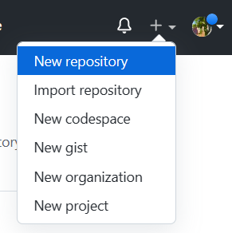
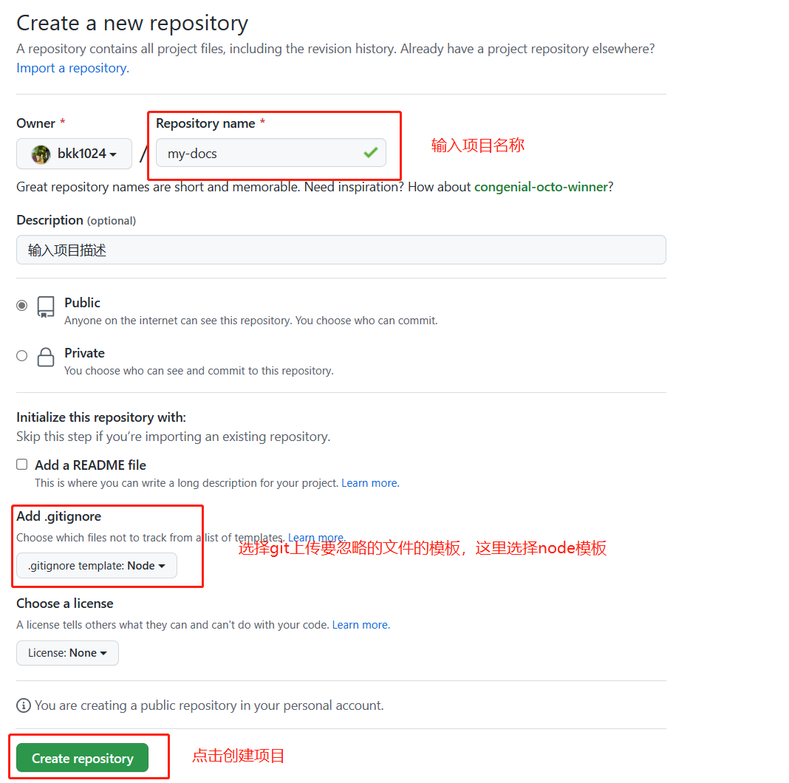

## 创建项目

1. 在`github`上创建一个项目

   

   

2. `git clone 项目地址`

3. 编辑器打开项目，在终端输入如下命令：

   ```
   // 这里使用 pnpm 管理包，使用 yarn 或者 npm 都一样
   pnpm init
   pnpm add -D vuepress@next @vuepress/client@next vue
   ```

4. 在`package.json`文件中添加如下命令

   ```json
   {
       "scripts": {
           // 官方是这么写的
       	// "docs:dev": "vuepress dev docs",
       	// "docs:build": "vuepress build docs"
           // 我不想敲 docs:
           "dev": "vuepress dev docs",
       	"build": "vuepress build docs"
     	}
   }
   ```

5. 向`.gitignnore`文件添加如下两个文件：

   ```
   .cache
   .temp
   ```

6. 根目录创建目录：`docs`，然后在其中创建`.vuepress`目录，这个目录中要包含`config.js`用来书写`VuePress`的配置；`public`文件用来存放静态文件，一般是文档的图标，如`icon.png`；最后是`README.md`文件，这是文档的首页。

7. 现在使用`pnpm dev`就能看到文档了。

## 添加内容

在`docs`文件夹下添加目录来存放`.md`文件，或者直接创建`.md`文件也行，随自己开心，如下：


## 编写配置

```js
import { defineUserConfig, defaultTheme } from 'vuepress'

export default defineUserConfig({
  // 这是后续将文档部署到 github 的免费服务器上是的路径，一般就填写项目的名称，如我这个项目的名称就叫 docs
  base: '/docs/',
  // 语言
  lang: 'zh-CN',
  // 网站title
  title: '二师弟的学习笔记',
  // 描述
  description: '二师弟的学习笔记',
  // 这是往 index.html 文件的头部添加的内容，我这里添加了网站的图标，也就是存放在 public 中的 icon 图片
  head: [
    [
      'link', { rel: 'icon', href: '/icon.png' }
    ]
  ],
  // 这里使用的是官方默认主题
  theme: defaultTheme({
    // 这是侧边栏标题的图标
    logo: '/icon.png',
    // 顶部导航栏，这里只展示了部分配置，具体配置可以参考官方内容
    navbar: [
      {
        text: 'JavaScript',
        link: '/js/js方法.md'
      },
      {
        text: '打包工具',
        children: [
          {
            text: 'vite3',
            link: '/build-tools/vite3.md'
          },
          {
            text: 'webpack5',
            link: '/build-tools/webpack5.md'
          }
        ]
      },
    ],
    // 侧边栏，这里只展示了部分配置，具体配置可以参考官方内容
    sidebar: {
      '/js/': [
        {
          text: 'javascript',
          collapsible: true,
          children: ['js方法', 'js知识要点', '浏览器渲染原理', '事件循环', '属性描述符',],
        }
      ],
      '/build-tools/': [
        {
          text: 'vite',
          collapsible: true,
          children: ['vite3']
        },
        {
          text: 'webpack',
          collapsible: true,
          children: ['webpack5']
        },
      ],
    },
    // 侧边栏展示的层级深度
    sidebarDepth: 4
  })
})
```

[narbar | VuePress](https://v2.vuepress.vuejs.org/zh/reference/default-theme/config.html#navbar) 

[sidebar | VuePress](https://v2.vuepress.vuejs.org/zh/reference/default-theme/config.html#sidebar) 

[默认主题完整配置 | VuePress](https://v2.vuepress.vuejs.org/zh/reference/default-theme/config.html) 

## 创建工作流文件，这里参考的是官方 github pages 的配置

```yml
name: docs

on:
  # 每当 push 到 main 分支时触发部署
  push:
    branches: [main]
  # 手动触发部署
  workflow_dispatch:

jobs:
  docs:
    runs-on: ubuntu-latest

    steps:
      - uses: actions/checkout@v3
        with:
          # “最近更新时间” 等 git 日志相关信息，需要拉取全部提交记录
          fetch-depth: 0

      - name: Setup pnpm
        uses: pnpm/action-setup@v2
        with:
          # 选择要使用的 pnpm 版本
          version: 7
          # 使用 pnpm 安装依赖
          run_install: true

      - name: Setup Node.js
        uses: actions/setup-node@v3
        with:
          # 选择要使用的 node 版本
          node-version: 18
          # 缓存 pnpm 依赖
          cache: pnpm

      # 运行构建脚本
      - name: Build VuePress site
        run: pnpm docs:build

      # 查看 workflow 的文档来获取更多信息
      # @see https://github.com/crazy-max/ghaction-github-pages
      - name: Deploy to GitHub Pages
        uses: crazy-max/ghaction-github-pages@v2
        with:
          # 部署到 gh-pages 分支
          target_branch: gh-pages
          # 部署目录为 VuePress 的默认输出目录
          build_dir: docs/.vuepress/dist
        env:
          # @see https://docs.github.com/cn/actions/reference/authentication-in-a-workflow#about-the-github_token-secret
          GITHUB_TOKEN: ${{ secrets.GITHUB_TOKEN }}
```

[完整的部署配置，如果你想部署到别的平台可以参考这里 | VuePress](https://v2.vuepress.vuejs.org/zh/guide/deployment.html) 

## 最后就可以上传到 github 中去了

上传完成后，我们可以在`actions`中查看站点是否部署成功


## 修改仓库配置

这里修改部署到`github`服务器上的是仓库中的哪个分支，因为我们上面的`docs.yml`中配置了当我们`git push`后，它自动将执行`pnpm build`命令将文件打包并保存到`gh-pages`分支中，因此这里要进行更改。


## 部分踩坑

1. 与我们平时书写`md`文件不同，`VuePress`默认主题的侧边栏只会展示**一个一级标题，从第二个一级标题开始都不会在侧边栏展示**，因此我们书写要在`VuePress`中展示的内容最好只有一个一级标题，当然如果你不介意写了也不展示，就当没看见这个。

2. 关于图片引入，最好都使用相对路径引入，如下：

   

   这个`./`不要掉了，否则会导致在`github`的`actions`中部署时报错。

3. 如果`actions`中报如下错误：<span style="color: red">The process '/usr/bin/git' failed with exit code **128**</span> 。出现上面的报错是因为***默认情况下，新存储库没有适当的工作流权限。*** 可进行如下操作：

   

   

4. 在`md`文件中书写时，尽量不要书写没有闭合的标签元素，可能会导致报错。

   