# VuePress

## 创建项目

1. 在`github`上创建一个项目

   

   

2. `git clone 项目地址`

3. 编辑器打开项目，在终端输入如下命令：

   ```
   // 这里使用 pnpm 管理包，使用 yarn 或者 npm 都一样
   pnpm init
   pnpm add -D vuepress@next @vuepress/client@next vue
   ```

4. 在`package.json`文件中添加如下命令

   ```json
   {
   	"scripts": {
   		// 官方是这么写的
   		// "docs:dev": "vuepress dev docs",
   		// "docs:build": "vuepress build docs"
   		// 我不想敲 docs:
   		"dev": "vuepress dev docs",
   		"build": "vuepress build docs"
   	}
   }
   ```

5. 向`.gitignnore`文件添加如下两个文件：

   ```
   .cache
   .temp
   ```

6. 根目录创建目录：`docs`，然后在其中创建`.vuepress`目录，这个目录中要包含`config.js`用来书写`VuePress`的配置；`public`文件用来存放静态文件，一般是文档的图标，如`icon.png`；最后是`README.md`文件，这是文档的首页。

7. 现在使用`pnpm dev`就能看到文档了。

## 添加内容

在`docs`文件夹下添加目录来存放`.md`文件，或者直接创建`.md`文件也行，随自己开心，如下：

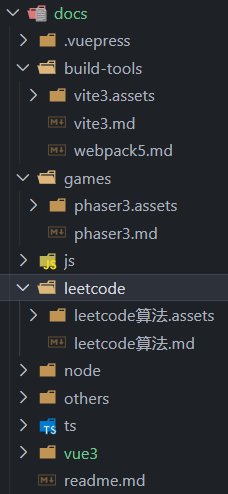

## 编写配置

```js
import { defineUserConfig, defaultTheme } from "vuepress"

export default defineUserConfig({
	// 这是后续将文档部署到 github 的免费服务器上是的路径，一般就填写项目的名称，如我这个项目的名称就叫 docs
	base: "/docs/",
	// 语言
	lang: "zh-CN",
	// 网站title
	title: "二师弟的学习笔记",
	// 描述
	description: "二师弟的学习笔记",
	// 这是往 index.html 文件的头部添加的内容，我这里添加了网站的图标，也就是存放在 public 中的 icon 图片
	head: [["link", { rel: "icon", href: "/icon.png" }]],
	// 这里使用的是官方默认主题
	theme: defaultTheme({
		// 这是侧边栏标题的图标
		logo: "/icon.png",
		// 顶部导航栏，这里只展示了部分配置，具体配置可以参考官方内容
		navbar: [
			{
				text: "JavaScript",
				link: "/js/js方法.md",
			},
			{
				text: "打包工具",
				children: [
					{
						text: "vite3",
						link: "/build-tools/vite3.md",
					},
					{
						text: "webpack5",
						link: "/build-tools/webpack5.md",
					},
				],
			},
		],
		// 侧边栏，这里只展示了部分配置，具体配置可以参考官方内容
		sidebar: {
			"/js/": [
				{
					text: "javascript",
					collapsible: true,
					children: ["js方法", "js知识要点", "浏览器渲染原理", "事件循环", "属性描述符"],
				},
			],
			"/build-tools/": [
				{
					text: "vite",
					collapsible: true,
					children: ["vite3"],
				},
				{
					text: "webpack",
					collapsible: true,
					children: ["webpack5"],
				},
			],
		},
		// 侧边栏展示的层级深度
		sidebarDepth: 4,
	}),
})
```

[narbar | VuePress](https://v2.vuepress.vuejs.org/zh/reference/default-theme/config.html#navbar)

[sidebar | VuePress](https://v2.vuepress.vuejs.org/zh/reference/default-theme/config.html#sidebar)

[默认主题完整配置 | VuePress](https://v2.vuepress.vuejs.org/zh/reference/default-theme/config.html)

## 创建工作流文件，这里参考的是官方 github pages 的配置

```yml
name: docs

on:
 # 每当 push 到 main 分支时触发部署
 push:
  branches: [main]
 # 手动触发部署
 workflow_dispatch:

jobs:
 docs:
  runs-on: ubuntu-latest

  steps:
   - uses: actions/checkout@v3
     with:
      # “最近更新时间” 等 git 日志相关信息，需要拉取全部提交记录
      fetch-depth: 0

   - name: Setup pnpm
     uses: pnpm/action-setup@v2
     with:
      # 选择要使用的 pnpm 版本
      version: 7
      # 使用 pnpm 安装依赖
      run_install: true

   - name: Setup Node.js
     uses: actions/setup-node@v3
     with:
      # 选择要使用的 node 版本
      node-version: 18
      # 缓存 pnpm 依赖
      cache: pnpm

   # 运行构建脚本
   - name: Build VuePress site
     run: pnpm docs:build

   # 查看 workflow 的文档来获取更多信息
   # @see https://github.com/crazy-max/ghaction-github-pages
   - name: Deploy to GitHub Pages
     uses: crazy-max/ghaction-github-pages@v2
     with:
      # 部署到 gh-pages 分支
      target_branch: gh-pages
      # 部署目录为 VuePress 的默认输出目录
      build_dir: docs/.vuepress/dist
     env:
      # @see https://docs.github.com/cn/actions/reference/authentication-in-a-workflow#about-the-github_token-secret
      GITHUB_TOKEN: ${{ secrets.GITHUB_TOKEN }}
```

[完整的部署配置，如果你想部署到别的平台可以参考这里 | VuePress](https://v2.vuepress.vuejs.org/zh/guide/deployment.html)

## 最后就可以上传到 github 中去了

上传完成后，我们可以在`actions`中查看站点是否部署成功

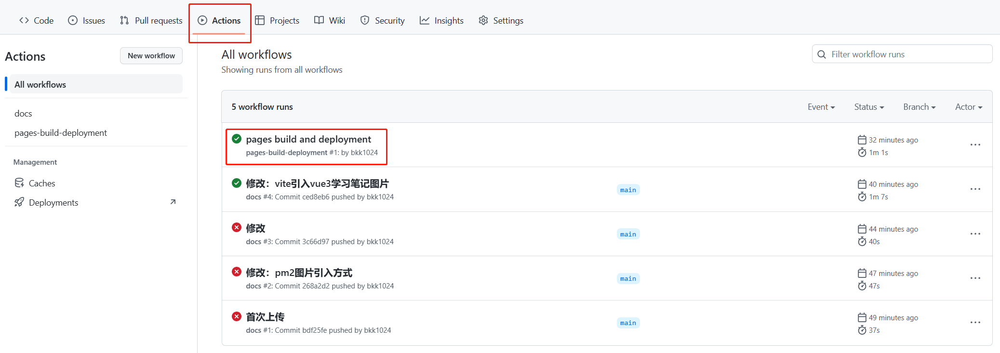

## 修改仓库配置

这里修改部署到`github`服务器上的是仓库中的哪个分支，因为我们上面的`docs.yml`中配置了当我们`git push`后，它自动将执行`pnpm build`命令将文件打包并保存到`gh-pages`分支中，因此这里要进行更改。

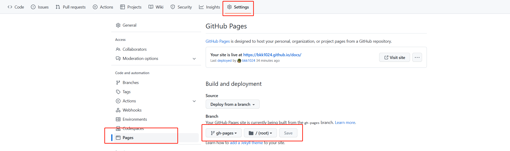

## 部分踩坑

1. 与我们平时书写`md`文件不同，`VuePress`默认主题的侧边栏只会展示**一个一级标题，从第二个一级标题开始都不会在侧边栏展示**，因此我们书写要在`VuePress`中展示的内容最好只有一个一级标题，当然如果你不介意写了也不展示，就当没看见这个。

2. 关于图片引入，最好都使用相对路径引入，如下：

   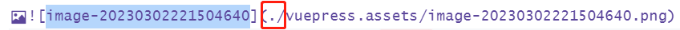

   这个`./`不要掉了，否则会导致在`github`的`actions`中部署时报错。

3. 如果`actions`中报如下错误：<span style="color: red">The process '/usr/bin/git' failed with exit code **128**</span> 。出现上面的报错是因为**_默认情况下，新存储库没有适当的工作流权限。_** 可进行如下操作：

   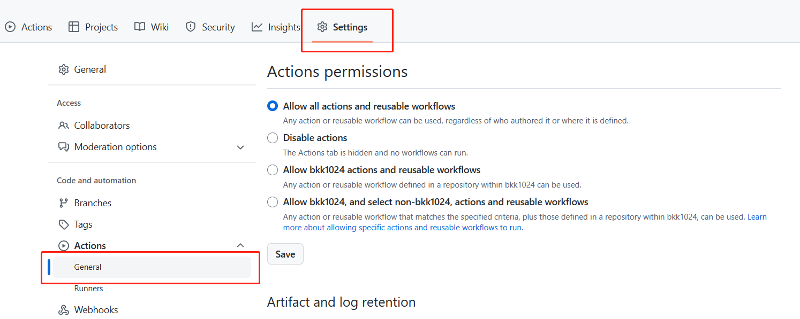

   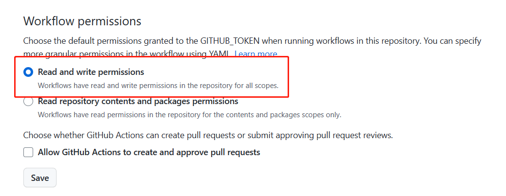

4. 在`md`文件中书写时，尽量不要书写没有闭合的标签元素，可能会导致报错。

## vuepress-theme-hope

这个文档我换了一个主题`vuepress-theme-hope`，但是这个**侧边栏**似乎有点问题，如下：

1. <span style="color: red">自动将字母转换为大写</span>

   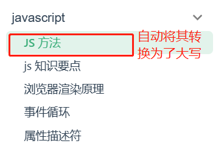

   配置如下：

   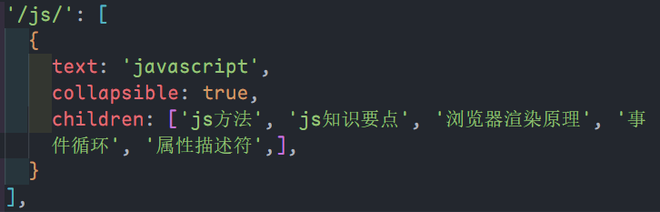

2. <span style="color: red">自动添加路径前缀</span>

   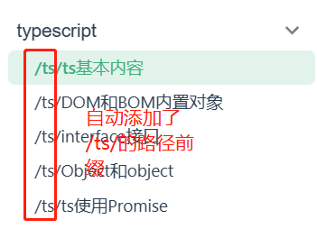

   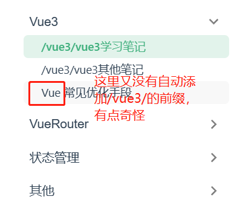

   配置如下

   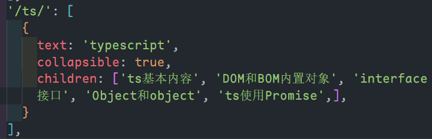

   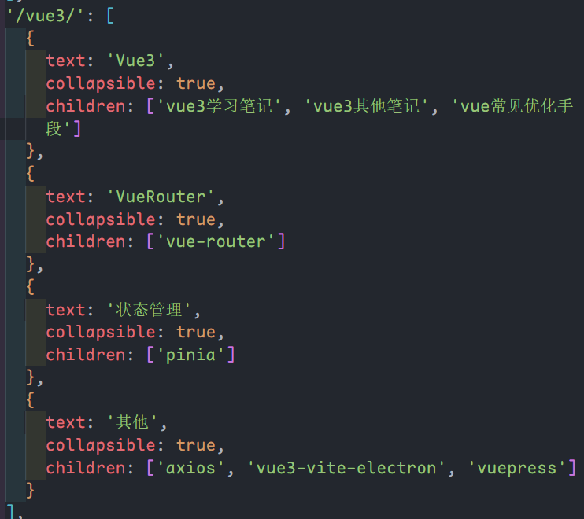

> **上述问题复现：**
>
> - 配置如下：
>
>   ```js
>   import { defineUserConfig } from "vuepress"
>   import { hopeTheme } from "vuepress-theme-hope"
>  
>   export default defineUserConfig({
>   	base: "/",
>   	theme: hopeTheme({
>   		navbar: [
>   			{
>   				text: "demo",
>   				link: "/demo/demo1.md",
>   			},
>   		],
>   		sidebar: {
>   			"/demo/": [
>   				{
>   					text: "DEMO",
>   					collapsible: true,
>   					children: ["demo1", "demo2", "demo3"],
>   				},
>   			],
>   		},
>   	}),
>   })
>   ```
>
> 当`md`文件中有一级标题，不会出现路径前缀问题
>
> ```markdown
> ## demo1.md
>
> # demo1
>
> 这个文件有一级标题，因此在侧边栏中展示为 demo1
> ```
>
> 当`md`文件中没有一级标题，则侧边栏会使用`/路径/children名称`开头
>
> ```markdown
> ## demo2.md
>
> ## demo2
>
> 这个文件以二级标题开头，在侧边栏中展示即为 /demo/demo2
> ```
>
> 从上面能看出这个主题生成文档的侧边栏是以文档中的一级标题为准的，如果没有一级标题，那么就会出现上述问题，*字母大写也是因为我文档中的标题是大写*🤣。
>
> 不知道这算不算 bug，也许是我书写文档的习惯有问题。

## vuepress-theme-hope 一些用法示例

### 从文件中导入代码块

@[code{3-10} ts{3-7}:no-line-numbers](./vue3自定义指令代码文件/VFocus.ts)
::: tip 语法详解

```
@[code{3-10} ts{3-7}:no-line-numbers](../foo.ts)
```

这句话的意思是从`../foo.js`文件中导入第`3-10`行的代码，语言为`js`，并且高亮`3-6`行，且代码块不显示行号。
:::

### 文档内部跳转

[点击这里跳转到首页](../readme.md) 

代码如下：`[点击这里跳转到首页](../readme.md)`，这里就引用的是内部页面的相对路径。

### 跳转到某个锚点

通俗点说就是跳转到某个页面的某个标题处，示例如下：

[点击这里跳转到本页面的自定义容器](./vuepress.md#自定义容器) 

代码如下：`[点击这里跳转到本页面的自定义容器](./vuepress.md#自定义容器)`。可以看到，这里就是在文件后面添加了`#标题`，因为每个标题都被设定为了`<a href="#标题名称"></a>`标签的锚点模式，如下图：

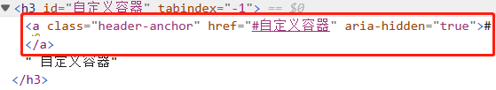

## vuepress-theme-hope 语法增强

这个功能要依靠一个插件`vuepress-plugin-md-enhance`。

1. 安装

   ::: code-tabs

   @tab pnpm

   ```bash
   pnpm add -D vuepress-theme-hope
   ```

   @tab npm

   ```bash
   npm i -D vuepress-plugin-md-enhance
   ```

   :::

2. 配置：[完整的配置请看这里](https://plugin-md-enhance.vuejs.press/zh/guide/) 

   ```js
   /* ./vuepress/config.js */
   
   import { defineUserConfig } from 'vuepress'
   import { hopeTheme } from "vuepress-theme-hope"
   import { mdEnhancePlugin } from "vuepress-plugin-md-enhance"
   
   export default defineUserConfig({
     // ...
     theme: hopeTheme({
      // ...
     }),
     plugins: [
       mdEnhancePlugin({
         tabs: true, // 开启选项卡
         container: true, // 开启自定义容器
         codetabs: true, // 开启代码分组
         align: true, // 段落对齐方式
       })
     ]
   })
   ```

### 自定义容器

示例：

::: note 自定义标题

信息容器

:::

::: info 自定义标题

信息容器

:::

::: tip 自定义标题

提示容器

:::

::: warning 自定义标题

警告容器

:::

::: danger 自定义标题

危险容器

:::

:::: details 自定义标题

这是上面这些容器的代码，如果要用这个容器包裹一些`markdown`增强的功能的代码，如这里的效果，则可以将其`:::`改为`::::`。

```
::: note 自定义标题
白色
:::

::: info 自定义标题
蓝色
:::

::: tip 自定义标题
绿色
:::

::: warning 自定义标题
黄色
:::

::: danger 自定义标题
红色
:::

::: details 自定义标题
白色，可折叠
:::
```

::::

### 选项卡

示例：

::: tabs

@tab:active 标题 1

标题 1 内容

@tab 标题 2

标题 2 内容

@tab 标题 3

标题 3 内容

:::

代码如下：[完整用法请看这里](https://plugin-md-enhance.vuejs.press/zh/guide/tabs.html) 

:::: details 代码

```\
::: tabs

@tab 标题 1

<!-- tab 1 内容 -->

@tab 标题 2

<!-- tab 2 内容 -->

@tab:active 标题 3

<!-- tab 3 将会被默认激活 -->

<!-- tab 3 内容 -->

:::
```

::::

### 代码分组

示例：

::: code-tabs

@tab js

```js
console.log('js')
```

@tab ts

```ts
console.log('ts')
```

:::

代码如下：[完整用法请看这里](https://plugin-md-enhance.vuejs.press/zh/guide/code-tabs.html) 

:::: details 代码

````
::: code-tabs

@tab js

```js
console.log('js')
```

@tab ts

```ts
console.log('ts')
```

:::
````

::::

### 对齐方式

::: center

居中对齐示例

:::

代码如下：[完整用法请看这里](https://plugin-md-enhance.vuejs.press/zh/guide/align.html) 

:::: details 代码

```
::: center
居中对齐示例
:::
```

::::
